# Dell EMC Red Hat Ready Architecture Deployment Guide

**Version 13.0**

**Dell EMC Service Provider Solutions**


<div style="page-break-after: always;"></div>

# Trademarks
Copyright © 2014-2019 Dell Inc. or its subsidiaries. All rights reserved.

Microsoft® and Windows® are registered trademarks of Microsoft Corporation in the United States and/or other countries.

Red Hat®, Red Hat Enterprise Linux®, and Ceph are trademarks or registered trademarks of Red Hat, Inc., registered in the U.S. and other countries. Linux® is the registered trademark of Linus Torvalds in the U.S. and other countries. Oracle® and Java® are registered trademarks of Oracle Corporation and/or its affiliates.

> DISCLAIMER: The OpenStack® Word Mark and OpenStack Logo are either registered trademarks/ service marks or trademarks/service marks of the OpenStack Foundation, in the United States and other countries, and are used with the OpenStack Foundation's permission. We are not affiliated with, endorsed or sponsored by the OpenStack Foundation or the OpenStack community.

<div style="page-break-after: always;"></div>

# Contents:

- [Chapter 1 Overview](#chapter-1-overview)

- [Chapter 2 Red Hat Subscriptions](#chapter-2-red-hat-subscriptions)

- [Chapter 3 Automation Configuration Files](#chapter-3-automation-configuration-files)

- [Chapter 4 Preparing and Deploying the Solution Admin Host](#chapter-4-preparing-and-deploying-the-solution-admin-host)

- [Chapter 5 Deploying the Undercloud and the OpenStack Cluster](#chapter-5-deploying-the-undercloud-and-the-openstack-cluster)

- [Appendix A Files references](#appendix-a-files-references)

- [Appendix B Updating RPMs on version locked nodes](#appendix-b-updating-rpms-on-version-locked-nodes)

- [Appendix C OpenStack operations functional test](#appendix-c-openstack-operations-functional-test)

- [Appendix D Hugepages](#appendix-d-hugepages)

- [Appendix E NUMA](#appendix-e-numa)

- [Appendix F OVS-DPDK](#appendix-f-ovs-dpdk)

- [Appendix G Neutron managed SR-IOV](#appendix-g-neutron-managed-sr-iov)

- [Appendix H Neutron DVR support in JS 13.0](#appendix-h-neutron-dvr-support-in-js-130)

- [Appendix I Performance optimization](#appendix-i-performance-optimization)

- [Appendix J Sample files](#appendix-j-sample-files)

- [Appendix K Solution validation overview](#appendix-k-solution-validation-overview)

- [Appendix M References](#appendix-m-references)


<div style="page-break-after: always;"></div>

# Chapter 1 Overview
This guide provides information necessary to deploy the Dell EMC Ready Architecture for Red Hat OpenStack platform v13.0 using an automation framework developed by Dell EMC.

### General Hardware Options

To reduce time spent on specifying hardware for an initial system, the Architecture Guide offers a full solution using validated Dell EMC PowerEdge server hardware designed to allow a wide range of configuration options, including optimized configurations for: 

* Compute nodes
* Infrastructure nodes
* Storage nodes

Dell EMC recommends starting with OpenStack software using components from this Architecture Guide -
Version 13.0 because the hardware and operations processes comprise a flexible foundation upon which to
expand as your cloud deployment grows, so your investment is protected.

As noted throughout this Architecture Guide - Version 13, Dell EMC constantly adds capabilities to expand
this offering, and other hardware may be available. [Please check the Architecture Guide for more details]("https://www.dellemc.com/resources/en-us/asset/technical-guides-support-information/solutions/dell_emc_ready_architecture_for_red_hat_openstack_platform_architecture_guide.pdf")

### Servers Options

**Dell EMC PowerEdge R640 server**

The Dell EMC PowerEdge R640 is the ideal dual-socket, 1U platform for dense scale-out cloud computing. The scalable busines architecture of the Dell EMC PowerEdge R640 is designed to maximize application performance and provide the flexibility to optimize configurations based on the application and use case. With the Dell EMC PowerEdge R640 you can create an NVMe cache pool and use either 2.5” or 3.5” drives for data storage. Combined with up to 24 DIMM’s, 12 of which can be NVDIMM’s, you have the resources to create the optimum configuration to maximize application performance in only a 1U chassis. This can simplify and speed up deployments of Dell EMC Bundle for Red Hat OpenStack Platform.

**Dell EMC PowerEdge R740/Dell EMC PowerEdge R740xd servers**

The Dell EMC PowerEdge R740/Dell EMC PowerEdge R740xd delivers a perfect balance between storage scalability and performance. The 2U two-socket platform is ideal for software defined storage. The R/740/R740xd versatility is highlighted with the ability to mix any drive type to create the optimum configuration of SSD and HDD for either performance, capacity or both.

> Note: The Dell EMC PowerEdge R740/Dell EMC PowerEdge R740xd is the platform of choice for software defined storage and is the foundation for Red Hat Ceph Storage


### Networking and network services

Network configuration is based upon using the Neutron-based options supported by the RHOSP code base, and does not rely upon third-party drivers. This reference configuration is based upon the Neutron networking services using the ML2 drivers for Open vSwitch with the VLAN option.

#### Networking includes:

* Core and layered networking capabilities
* Network Function Virtualization (NFV)
* 25GbE networking
* NIC bonding
* Redundant trunking top-of-rack (ToR) switches into core routers

This enables the Dell EMC Ready Architecture for Red Hat OpenStack Platform to operate in a full production environment. Detailed designs are available through Dell EMC consulting services. [rhosp.ra.ps@emc.com](malito:rhosp.ra.ps@emc.com)

The Dell EMC Ready Architecture for Red Hat OpenStack Platform uses the S5248-ON as the Top of Rack switches and the S3048-ON switch (S4048-ON optional) as the management switch.

**Infrastructure layouts**

The network consists of the following major network infrastructure layouts:

* Core Network Infrastructure - The connectivity of aggregation switches to the core for external connectivity.
* Data Network Infrastructure - The server NICs, top-of-rack (ToR) switches, and the aggregation switches.
* Management Network Infrastructure - The BMC management network, consisting of iDRAC ports and the out-of-band management ports of the switches, is aggregated into a 1-rack unit (RU) S3048-ON switch in one of the three racks in the cluster. This 1-RU switch in turn can connect to one of the aggregation or core switches to create a separate network with a separate VLAN.


> Note: Please contact your Dell EMC sales representative for a detailed parts list or contact Dell EMC Professional Services team for OpenStack using the email [rhosp.ra.ps@emc.com](malito:rhosp.ra.ps@emc.com)

### Version 13.0 features

**The following features are added in the JetPack Automation and the Ready Architecture for RedHat OpenStack:**

* Support for the lastest release of Red Hat OpenStack Platform 13.0 including the latest updates.
* Support for latest release of RHEL 7.6 including the latest updates.
* Support for Red Hat Ceph Storage version 3.1
* Added support for jumbo frames.
* Added support for UEFI on all Overcloud nodes.
* Added support for Cumulus Network OS.
* Added support for Dell EMC Networking S5248-ON switch.
* Added support for 25GbE networking with Intel XXV710 network interface cards.
* Added support for Red Hat Ceph Storage to use NVMe storage for OSD/Journal.
* Enhancement of Huge Pages with JetPack CSP profile.
* Enhancement of NUMA/CPU Pinning with JetPack CSP profile.
* Support of OVS-DPDK with JetPack CSP profile.
* Enhancement of SR-IOV with JetPack CSP profile.
* Added support for Distributed Virtual Router, (DVR).
* Added support for auto-generation of .ini and .properties files for use in automated deployments.
* Added support for VLAN aware VM.

## Before

> Note: This guide assumes that you have racked the servers and networking hardware, and completed power and network cabling, as per the *Dell EMC Ready Architecture_for_Red_Hat OpenStack Platform Architecture Guide – Version 13.*

The high-level steps required to install the Dell EMC Ready Architecture for Red Hat OpenStack Platform v13.0 using the automated installation procedures include:

1.  Ensure that your environment meets the [Prerequisites](#Prerequisites)
2.  Ensure that the [Dependencies](#Dependencies) are met.
3.  *Determining Pool IDs*.
4.  [Downloading and Extracting Automation Files]("https://github.com/dsp-jetpack/JetPack/").
5.  [Preparing the Solution Admin Host Deployment](#Preparing-the-Solution-Admin-Host-Deployment).
6.  [Deploying the SAH Node](#Deploying-the-SAH-Node).
7.  [Deploying the Undercloud and the OpenStack Cluster](#Deploying-the-Undercloud-and-the-OpenStack-Cluster).

## Prerequisites
The following prerequisites must be satisfied before proceeding with a Dell EMC Ready Architecture for Red Hat OpenStack platform v13.0 deployment:

> Note: All nodes in the same roles must be of the same server models, with identical HDD, RAM, and NIC configurations. So, all controller nodes must be identical to each other; all compute nodes must be identical to each other.

* Hardware racked and wired per the [Dell EMC Ready Architecture for Red Hat OpenStack Platform Architecture Guide Version 13.0](https://www.dellemc.com/resources/en-us/asset/technical-guides-support-information/solutions/dell_emc_ready_architecture_for_red_hat_openstack_platform_architecture_guide.pdf).
* Hardware configured as per the [Dell EMC Ready Architecture for Red Hat OpenStack Platform Architecture Guide Version 13.0](https://www.dellemc.com/resources/en-us/asset/technical-guides-support-information/solutions/dell_emc_ready_architecture_for_red_hat_openstack_platform_architecture_guide.pdf).
* Hardware is powered off after the hardware is configured per the [Dell EMC Ready Architecture for Red Hat OpenStack Platform Architecture Guide Version 13.0](https://www.dellemc.com/resources/en-us/asset/technical-guides-support-information/solutions/dell_emc_ready_architecture_for_red_hat_openstack_platform_architecture_guide.pdf).
* Internet access, including but not limited to, Red Hat’s subscription manager service and repositories
* Valid Red Hat subscriptions
* Workstation used to extract the JetPack-automation-13.0.tgz file and begin building the collateral for the SAH node.  Workstation must be a RHEL7.6 host.

## Dependencies
For customers performing a self-installation, these files are available upon request from Dell EMC. Please contact your account representative, or email <a href="malito: openstack@dell.com" target="_blank">openstack@dell.com</a> for instructions.

> NOTE: The files are also open sourced and can be obtained from <a href="https://github.com/dsp-jetpack/JetPack/tree/JS-13.0" target="_blank">https://github.com/dsp-jetpack/JetPack/tree/JS-13.0</a>

> NOTE: The automated install also requires that you have the ISO file “Red Hat Enterprise Linux 7.6 Binary DVD”. It can be downloaded from the Red Hat Customer Portal here: https://access.redhat.com/downloads/content/69/ver=/rhel---7/7.2/x86_64/product-software


<div style="page-break-after: always;"></div>

# Chapter 2 Red Hat Subscriptions
Once all prerequisites have been met, you must determine the Appropriate Red Hat subscription entitlements for each cluster node.

## Red Hat Subscription Manager Pool IDs
You must determine the pool ID to use for the Solution Admin Host (SAH) and each node in the cluster before proceeding with the installation. To determine the pool IDs, you must have an existing server that is registered to the Red Hat Hosted Services. This server must also be registered using the same credentials as the ones being used in this environment.


1. Once the server is correctly registered, execute the following command to see the available subscription pools.

```bash
$ subscription-manager list --all --available
```

> Note: The command will output a list of available pools. Each section of information lists what the subscription provides, its pool ID, how many are available, the type of system it is for, as well as other information.


2. Determine the correct pool ID needed for this environment.

> Note: Pay close attention to the system Type. The system type can be virtual or physical. If necessary you can use a physical license for a virtual node. However, you cannot use a virtual subscription for a physical node.

```bash
$ subscription-manager list --all --available

[OUTPUT ABBREVIATED]

Subscription Name:	Red Hat	Ceph Storage, Standard Support(8 Nodes,NFR)
Provides:	Red Hat   	OpenStack Director Deployment Tools Beta
	Red Hat	Software Collections (for RHEL server)
SKU:	Red Hat Ansible Engine
Red Hat Ceph Storage
Red Hat Enterprise Linux Scalable File System (for RHEL Server)
Red Hat OpenStack Director Deployment Tools for IBM Power LE
Red Hat OpenStack Director Deployment Tools Beta for IBM Power LE
Red Hat Storage Console Node
Red Hat Storage Console
Red Hat Enterprise Linux Server
Red Hat Ceph Storage OSD
Red Hat Ceph Storage MON
Red Hat Ceph Storage Calamari
Red Hat OpenStack Director Deployment Tools
RS00019
Contract:	11699983	
Pool ID:	Aaaa111	Bbb222ccc333ddd444eee5556
Provides Management: 	No
Available:	69	
Suggested:	1	
Service Level:	Standard	
Service Type:	L1-L3	
Subscription Type:     	Standard	
Ends:	06/22/2019	
System Type:	Physical	
		
		
[OUTPUT  ABBREVIATED]
```

> Note: The above output shows a subscription that contains the Red Hat OpenStack entitlement. The required entitlement types for each node are shown the following table.

| **Node Role**                     | **Entitlement**                 | **System Type**                   |
|-----------------------------------|---------------------------------|-----------------------------------|
| Solution Admin Host (SAH)         | Red Hat Enterprise Linux Server | Physical                          |
| Director node                     | Red Hat OpenStack               | Virtual                           |
| Red Hat Ceph Storage Dashboard VM | Red Hat Ceph Storage Dashboard  | physical (no virtual available at this time |
| Controller node                   | Red Hat OpenStack               | Physical                          |
| Compute node                      | Red Hat OpenStack               | Physical                          |
| Storage node                      | Red Hat Ceph Storage            | Physical                          |


<div style="page-break-after: always;"></div>

# Chapter 3 Automation Configuration Files
This chapter details obtaining the required configuration files.

### Downloading and Extracting Automation Files

The following procedure installs the required configuration files and scripts used to build the collateral (osp_ks.img) to begin deploying the solution. This system must be a RHEL 7.6 system and is only used to build the initial kickstart file. It will not be used again as it is a one-time use, and will not be allocated permanently in the customer's OpenStack deployment.

1.	Log into your RHEL 7.6 system as user root.
2.	Download the JetPack-automation-13.0.tgz to the /root directory.
3.	Change the working directory to /root.
4.	Extract the tar file contents:
    ``` bash
    $ tar -xvf JetPack-automation-13.0.tgz
    ```
5.	Download or copy the ISO of the Red Hat Enterprise Linux Server 7.6 installation DVD to /root/ rhel76.iso.


<div style="page-break-after: always;"></div>

# Chapter 4 Preparing and Deploying the Solution Admin Host
This topic describes preparing for, and performing, the Solution Admin Host (SAH) deployment.

## Preparing the Solution Admin Host Deployment
> ***CAUTION:*** This operation will destroy all data on the SAH, with no option for recovery.

> ***Note:*** This release uses the feature of profiles to determine the use case for a deployment. There are 2 different pre-defined profiles, CSP or xSP that can be used for a deployment. The CSP profile is designed for Telecommunications Providers, Cable TV Operators, Satellite TV, Internet Service Providers, etc. whereas the xSP profile is designed for Business & IT Services Providers such as Hosting Service Providers, Cloud Service Providers, Software-as-a-Service/Platform-as-a-Service Providers, Application Hosting Service Providers and Private Managed Cloud Service Providers.


1.	Log into your RHEL 7.6 system as the root user.
2.	Change the working directory to 
    ```bash
    /root/JetPack/src/deploy/osp_deployer/settings
    ```
    Then, 
    ```bash
    $ cd ~/JetPack/src/deploy/osp_deployer/settings
    ```

    > Note: Pick the right sample configuration files for your deployment. There are 3
    > sample configuration files available, sample_csp_profile.ini, sample_xsp_profile.ini and
    > sample_properties. Make sure you review Appendix D-F for additional information for the sample_csp_profile.ini file.
    

3.	Copy the sample settings files to the ~/ directory and rename them for your deployment
    
    ```bash
    $ cp ~/JetStream/src/deploy/osp_deployer/settings/sample.properties ~/acme.properties
    ```
    and
    
    ```bash
    $ cp ~/JetPack/src/deploy/osp_deployer/settings/sample_csp_profile.ini ~/acme.ini
    ```
    or
    ```bash
    $ cp ~/JetPack/src/deploy/osp_deployer/settings/sample_xsp_profile.ini ~/acme.ini
    ```

4.	Edit your hardware stamp’s .ini and .properties files to match your hardware stamp configuration. Use a text editor of your choice; our example uses vi:
    
    ```bash
    $ vi ~/acme.ini
    ```
    
    a. Change the pre-populated values in your stamp-specific .ini file to match your specific environment. In addition, the IP addresses and the Subscription Manager Pool IDs must be changed to match your deployment. Each section will have a brief description of the attributes.
    
    b. The nic_env_file parameter must be set to the NIC configuration to use. The default value of 5_port/nic_environment.yaml is appropriate for 10GbE or 25GbE  Intel NICs with DPDK disabled. The deployment can be done with only 4 NICs too, where in you need to use the value of 4_port/nic_environment.yaml
        
    > Note: The overcloud deployment is validated with R640 servers as the normal compute nodes [standard deployment] without any NFV features. Also validated with R740 servers. 
    
    c. The Dell EMC Ready Architecture for Red Hat OpenStack Platform version 13.0 optimizes the performance of the deployed overcloud. See [Appendix G](#Appendix-G) for instructions on how to further tune the performance Optimization parameters.

5. With CSP profile, hugepages is enabled. With XSP profile, hugepages are disabled on the deployed compute nodes. 
    > To enable hugepages, see [Appendix D](#Appendix-D). 

6.	Edit the stamp-specific .properties file:
    
    ```bash
    $ vi ~/acme.properties
    ```

7.	Change the values in your .properties file to match your specific environment. You must supply a value for IP addresses, host names, passwords, interfaces, and storage OSDs/journals.

    **The storage OSDs/journals configuration is not specified if the storage nodes are 14G servers with HBA330 controllers, but must be specified for all other storage node configurations.**

    > Note: Additional nodes can be added to your stamp-specific .properties file if your environment contains more than that supported by the base architecture, as described in the Dell EMC Ready Architecture for Red Hat OpenStack Platform Architecture Guide Version 13.


    The examples in this file are based on the Dell EMC Ready Architecture for Red Hat OpenStack Platform Architecture Guide Version 13, and the installation scripts rely on the VLAN IDs as specified in this file. For example, the Private API VLAN ID is 140. So, all addresses on the Private API network must have 140 as the third octet (e.g., 192.168.140.114). The table below lists the VLAN IDs.
    
    | **VLAN ID**           | **Name**                                                 |
    |-----------------------|----------------------------------------------------------|
    | 110                   | Management/Out of Band (OOB) network (iDRAC)             |
    | 120                   | Provisioning Network                                     |
    | 130                   | Tenant Tunnel Network                                    |
    | 140                   | Private API Network                                      |
    | 170                   | Storage Network                                          |
    | 180                   | Storage Clustering Network                               |
    | 190                   | Public API Network                                       |
    | 191                   | External Tenant Network (Used for floating IP addresses) |
    | 201-250               | Internal Tenant Network                                  |

    > ***Note:*** The anaconda__ip is used for the initial installation of the SAH node, and requires an address that can access the Internet to obtain Red Hat software. When possible, the anaconda_iface must be a dedicated interface using 1GbE that is only used for this purpose, and is not used in any other part of the configuration. For 10GbE or 25GbE Intel NICs, "em4" (the fourth NIC on the motherboard) should be used.

**Configure the overcloud nodes' iDRACs to use either DHCP or statically-assigned IP addresses. A mix of these two choices is supported.**

1.	Determine the service tag of the overcloud nodes whose iDRAC is configured to use DHCP.

2.	Determine the IP addresses of the overcloud nodes whose iDRAC is configured to use static IP addresses.

3.	When creating the automation .properties file:
    * Add the following line to each node using DHCP, substituting the service tag for the node:
    
        ```yaml
        "service_tag": "<serviceTagHere>",
        ```
    * Add the following line to each node using static IP addressing, substituting IP address:
    
        ```yaml
        "iDRAC_ip": "<iDRACIpHere>",
        ```
        Only service_tag or iDRAC_ip should be specified for each overcloud node, not both.
        
        The iDRACs using DHCP will be assigned an IP address from the management allocation pool specified in the .ini file. The parameters that specify the pool range are:

        * management_allocation_pool_start
        
        * management_allocation_pool_end

        During deployment, the iDRACs using DHCP will be automatically assigned an IP address and discovered. The IP addresses assigned to the nodes can be seen after the undercloud is deployed:

        * In /var/lib/dhcpd/dhcpd.leases on the SAH node
        * In ~/instackenv.json on the Director Node
        * By executing the following commands on the Director Node:
        
            ```bash
            $  openstack baremetal node list
            $  openstack baremetal node show <node_guid>
            ```


8. Update your python path:

    ```bash
    $ export PYTHONPATH=/usr/bin/python:/lib/python2.7:/lib/python2.7/site-packages:~/JetPack/src/deploy
    ```

9.	You can install the SAH node using either of the following methods:
    * **Using a physical USB key (key must have 8GBs minimum of capacity):**
        1. Plug your USB key into your RHEL 7.6 system.
        2. Run the setup script to prepare your USB key, passing in the USB device ID (/dev/sdb in the example below). This process can take up to 10 minutes to complete.
        
            > Note:  Use full paths.
    
            ```bash
            $ cd ~/JetPack/src/deploy/setup
            $ python setup_usb_iDRAC.py -s /root/acme.ini -usb_key /dev/sdb
            ```

    * **Using an iDRAC virtual media image file. This requires your RHEL 7.6 system to have access to the iDRAC consoles to attach the image.**
        1.	Run the setup script to generate an image file that can later be attached to the SAH node.
            > Note:  Use full paths.
            
            ```bash
            $ cd ~/JetPack/src/deploy/setup
            $ python setup_usb_iDRAC.py -s /root/acme.ini -iDRAC_vmedia_img
            ```
        2.	The output will be an image file generated in ~/ named osp_ks.img.


<br><br><br>

## Deploying the SAH node

**You can deploy the SAH node by one of two methods:**
* Using a physical USB key generated above, plugged into the SAH node, or
* Using an iDRAC virtual media image generated above, made available using the **Map Removable Media** option on the iDRAC.

    > Note: Proceed to [Presenting the Image to the RHEL OS Installation Process](#Presenting-the-Image-to-the-RHEL-OS-Installation-Process)
 

### Presenting the Image to the RHEL OS installation process

1.	Attach the Red Hat Enterprise Linux Server 7.6 ISO as a virtual CD/DVD using the Virtual Media -> Map CD/DVD option.

2.	Attach the ~/osp_ks.img created above by using either of the following methods:

    * As a removable disk using the Virtual Media -> Map Removable Disk option, or
    * Plug in the USB key created above into the SAH.

3.	Set the SAH node to boot from the virtual CD/DVD using the Next Boot -> Virtual CD/DVD/ISO option.

4.	Boot the SAH node.

    a. At the installation menu, select the Install option. 
    
    	> Note: Do not press the [Enter] key. 
    
    b. Press the Tab key.
    
    c. Move the cursor to the end of the line that begins with vmlinuz. d. Append the following to the end of the line:
    
	```bash
	ks=hd:sdb:/osp-sah.ks
	```
        
    > Note: The device sdb can change, depending upon the quantity of disks being presented to the installation environment. These instructions assume that a single disk is presented. If otherwise, adjust accordingly.
 
5.	Press the [Enter] key to start the installation.
    > Note: It may take a few minutes before progress is seen on the screen. Press the [ESC] key at the disk check to speed up the process.
 


<div style="page-break-after: always;"></div>

# Chapter 5 Deploying the Undercloud and the OpenStack Cluster
> ***Topics:*** Deploying and validating the Cluster

Now that the SAH node is installed you can deploy and validate the rest of the Dell EMC Ready Architecture for Red Hat OpenStack Platform v13.0 

> ***CAUTION:*** This operation will destroy all data on the identified servers, with no option for recovery.

**To deploy and validate the rest of the cluster:**

1.	Log in through the iDRAC console as root, or ssh into the SAH node.

2.	Mount the USB media:

    ```bash
    $ mount /dev/sdb /mnt
    ```

3.	Copy all the files locally:

    ```bash
    $ cp -rfv /mnt/* /root
    ```

4.	Start a tmux session to avoid losing progress if the connection drops:

    ```bash
    $ tmux
    ```

5.	There are some post-deployment validation options in the [Sanity Test Settings] group and [Tempest Settings] group of the stamp-specific initialization file you should consider prior to deployment:
    
    * **run_sanity** - If set to true the sanity_test.sh script will be executed that will verify the basic functionality of your overcloud deployment.
    * **run_tempest** - If set to true the Tempest integration test suite will be executed against your overcloud deployment.

    > ***Note:*** Tempest requires that the sanity test must be run first so run_sanity, above, must also be set to true. For some details on tempest results notes, please refer to Dell_EMC_Red_Hat_Ready_Architecture_Release_Notes_v13.0

    * **tempest_smoke_only** - If run_tempest, above, is set to true this option, which is set to true by default, will cause Tempest to run only a small subset of the test suite, where the tests are tagged as "smoke". If set to false the entire Tempest suite will be run, which can take an hour or more to complete.

6.	Run the deployment by executing the deployer.py command:

    ```bash
    $ cd /root/JetPack/src/deploy/osp_deployer
    $ python deployer.py -s <path_to_settings_ini_file> [-undercloud_only] [-overcloud_only] [-skip_dashboard_vm]
    ```
    
    Optional arguments include:
    
    * -undercloud_only = Reinstall only the undercloud
    * -overcloud_only = Reinstall only the overcloud
    * -skip_dashboard_vm = Do not reinstall the Red Hat Ceph Storage Dashboard VM

7.	For installation details, execute a tail command on the /auto_results/deployer.log.xxx file on the SAH node. For example:

    ```bash
    $ tail -f /auto_results/ deployer.log.2018.09.09-07.32
    ```

8.	If issues are discovered during the installation process:

    a. Identify the issue in the deployer.log 

    b. Address the issue.

    c. Rerun the python deployer.py command above.

9.	If the installation is successful, the deployment_summary.log file will display some useful information for accessing the Dell EMC Ready Architecture for Red Hat OpenStack platform v13.0.
    
    ```bash
    $ cd /auto_results
    $ cat deployment_summary.log
    ```
    
    The output will appear similar to this:

    ```bash
    ====================================
    ### nodes ip information ###
    ### Controllers ###
     overcloud-controller-0   :
         - provisioning ip  : 192.168.120.128
         - nova private ip  : 192.168.140.110
         - nova public ip   : 10.118.135.20
         - storage ip       : 192.168.170.110
     overcloud-controller-1   :
         - provisioning ip  : 192.168.120.129
         - nova private ip  : 192.168.140.109
         - nova public ip   : 10.118.135.21
         - storage ip       : 192.168.170.109
     overcloud-controller-2   :
         - provisioning ip  : 192.168.120.127
         - nova private ip  : 192.168.140.117
         - nova public ip   : 10.118.135.22
         - storage ip       : 192.168.170.117
    ### Compute  ###
     overcloud-dell-compute-0 :
         - provisioning ip  : 192.168.120.131
         - nova private ip  : 192.168.140.112
         - storage ip       : 192.168.170.112
     overcloud-dell-compute-1 :
         - provisioning ip  : 192.168.120.122
         - nova private ip  : 192.168.140.113
         - storage ip       : 192.168.170.113
    ### Storage  ###
     overcloud-cephstorage-0  :
         - provisioning ip    : 192.168.120.133
         - storage cluster ip : 192.168.180.115
         - storage ip         : 192.168.170.115
     overcloud-cephstorage-1  :
         - provisioning ip    : 192.168.120.124
         - storage cluster ip : 192.168.180.108
         - storage ip         : 192.168.170.108
     overcloud-cephstorage-2  :
         - provisioning ip    : 192.168.120.132
         - storage cluster ip : 192.168.180.116
         - storage ip         : 192.168.170.116
    ====================================
    OverCloud Horizon        : http://10.118.135.10:5000//v3
    
    OverCloud admin password : AdZ3re629WZuYKMkRRpNMQPft
    
    ====================================
    ```


<div style="page-break-after: always;"></div>

# Appendix A Files references

> **Topics:** This appendix lists documents and script archives that are required to install and deploy the Dell EMC Ready Architecture for Red Hat OpenStack Plaftform v13.0. Please contact your Dell EMC representative for copies if required.

<u>**Dell EMC Ready Architecture for Red Hat OpenStack Platform v13.0 includes:**</u>

* https://github.com/dsp-jetpack/JetPack/tree/JS-13.0 - Contains all automation deployment solution scripts
* [Dell_EMC_Red_Hat_Ready_Architecture_Cumulus_Switch_Configurations_v13.0.pdf](https://www.dellemc.com/resources/en-us/asset/technical-guides-support-information/solutions/dell_emc_ready_architecture_for_red_hat_openstack_platform_cumulus_switch_configuration.pdf)
* [Dell_EMC_Red_Hat_Ready_Architecture_Guide_v13.0.pdf](https://www.dellemc.com/resources/en-us/asset/technical-guides-support-information/solutions/dell_emc_ready_architecture_for_red_hat_openstack_platform_architecture_guide.pdf)
* [Dell_EMC_Red_Hat_Ready_Architecture_Release_Notes_v13.0.pdf](https://www.dellemc.com/resources/en-us/asset/technical-guides-support-information/solutions/dell_emc_ready_architecture_for_red_hat_openstack_platform_release_notes.pdf)


<div style="page-break-after: always;"></div>

# Appendix B Updating RPMs on version locked nodes

At a high level, updating RPMs on a version locked node (Red Hat OpenStack Platform Director Node or Red Hat Ceph Storage Dashboard VM):

1. Identifies the RPMs that need to be updated.
2. Updated RPMs removed from the version lock list for that node.
3. Updates RPMs.
4. Adds the updated RPMs back into the version lock list.

### Updating the RPMs

To update the RPMs:

> ***Note:*** All of the following commands should be run as the root user.
 

1.	Produce a list of RPMs that are version locked on a node:

	a. Login to a node.

	b. Execute the following command to produce a list of RPMs that are version locked:

	```bash
    $ yum versionlock list
    ```


2.	Identify the RPMs to be updated from the output of the above command.

3.	Remove the selected RPMs from the version lock list:

    a.	Execute the following command, substituting VLockListEntry with an RPM name from the output of the versionlock list command above:
    
    > ***Note:*** The VLockListEntry must exactly match an RPM name in the output of the yum versionlock list command.
 

	```bash
    $ yum versionlock delete VLockListEntry
    ```

    b. Repeat for each RPM.

4.	Update each of the selected RPMs:

	a. Execute the following command for an RPM, substituting RPMNameWithoutVersion with the name of the RPM without the version number:

	```bash
    $ yum update RPMNameWithoutVersion
    ```

	b. Repeat for each subsequent RPM

5.	Add each of the selected RPMs back into the version lock list:
    Execute the following command, again substituting RPMNameWithoutVersion with the name of the RPM without the version number:
		
	```bash
	$ yum versionlock add RPMNameWithoutVersion
	```

> Note: The deployment option “enable__version__locking=true” in the [Advanced Settings] of .ini file for both csp and xsp profiles enforces version lock on the packages. Typically developers should set to false.


<div style="page-break-after: always;"></div>

# Appendix C OpenStack operations functional test

> **Topics:** Creating Neutron networks in the overcloud, manual RHOSP Test, scripted RHOSP sanity test

This optional section includes instructions for creating the networks and testing a majority of your RHOSP environment using Glance configured with Red Hat Ceph Storage, SC Series, or any backend. These command line instructions are working examples that you may be found on the OpenStack website. 


### Creating Neutron networks in the overcloud

The following example commands create the required tenant and public networks, and their network interfaces. You must complete them prior to creating instances and volumes, and testing of the functional operations of OpenStack.

> Note: The following commands and those in the following section should be executed on the director node.
> 

1.	Log into the director node using the user name and password specified when creating the node and source the overcloudrc file, or the name of the stack defined when deploying the overcloud :

    ```bash
    $ cd ~/
    $ source overcloudrc
    ```

2.	Create the tenant network by executing the following commands:

    >  	Note: Replace tenant_network_name with your desired values. (e.g., openstack network create tenant_net1 --share).

    ```bash
    $ openstack network create <tenant_network_name> --share
    ```

3.	Create the tenant subnet on the tenant network:

 	> Note: Replace tenant_network_name, vlan_network, vlan_name and vlan_gateway with your desired values (e.g., openstack subnet create tenant_2011 --network tenant_net1 --subnet-range 192.168.201.0/24).

    ```bash
    $ openstack subnet create <tenant_subnet_name> --network <tenant_network_name> --subnet-range <vlan_network>
    ```

4.	Create the router:

    >  	Note: Replace tenant_router with your desired values (e.g., openstack router create tenant_201_router).
    
    ```bash
    $ openstack router create <tenant_router>
    ```

5.	Before you add the tenant network interface, you will need the subnets ID. Execute the following command to display them:

    ```bash
    $ openstack network list
    ```

    **The displayed output will be similar to the following (example truncated for brevity):**
    
    | id	|	name	| subnets
    |--------------------------------------|--------------------|---|
    | 52411536-ec43-402f-9736-4cabdc8c875d |	tenant_net		| 7329d413 | 
    | 0af01763-539e-41c7-ac32-abbaa62ee575 |	HA network tenant | bdae0b72 |


6.	Add the tenant network interface between the router and the tenant network:

    >  	Note: Replace tenant_router and subnets_id with your desired values (e.g.,
     
    
    ```bash
    $ openstack router add subnet tenant_201_router 7329d413-ac23-56cf-8867-133b5ff8fc12).
    $ openstack router add subnet <tenant_router> <subnets_id>
    ```


7.	Create the external network by executing the following commands:

    > Note: Replace external_network_name and external_vlan_id with your desired value. (e.g.,
 
    ```bash
    $ openstack network create public --external --provider-network-type vlan --provider-physical-network physext --provider-segment 45).
    $ openstack network create <external_network_name> --external \ --provider:network_type vlan –provider-physical-network physext \ --provider-segment <external_vlan_id>
    ```

8.	Create the external subnet with floating IP addresses on the external network:

 	> Note: Replace external_subnet_name, start_ip, end_ip, external_network_name, external_vlan_network and external_gateway with your desired values (e.g.,

    ```bash
    $ openstack subnet create external_sub --network public --subnet-range 10.118.135.0/25 --allocation-pool start=10.118.135.39,end=10.118.135.49 --gateway 10.118.135.1 --no-dhcp).
    
    $ openstack subnet create <external_subnet_name> \
    --network <external_network_name> --subnet-range <external_vlan_network>\
    --allocation-pool start=<start_ip>,end=<end_ip> \
    --gateway <gateway_ip> --no-dhcp
    
    ```


    
9.	Set the external network gateway for the router:

 	> Note: Replace tenant_router_name with the router name external_nework_name with the external network name (e.g., openstack router set --external-gateway public tenant_201_router).


    ```bash
    $ openstack router set –-external-gateway <external_network_name> <tenant_router_name>
    ```


### Manual RHOSP Test

This example uses the Cirros image to test high-level functional operations of OpenStack.

1.	Log into the director node using the user name and password specified when creating the node.

2.	Download the Cirros image:

    ```bash
    $ wget http://download.cirros-cloud.net/0.3.3/cirros-0.3.3-x86_64-disk.img
    ```

3.	Source your overcloud credentials:

    ```bash
    $ cd ~/
    $ source <overcloud_name>rc
    ```


4.	Create and upload the Glance image:

    ```bash
    $ openstack image create --disk-format <format> \
    --container-format <format> --file <file_path> <IMAGE_NAME> --public
    ```

	For example:
	
	```bash
	$ openstack image create --disk-format qcow2 \
	    --container-format bare --file cirros-0.3.3-x86_64-disk.img cirros --public
	```

5.	List available images to verify that your image uploaded successfully: 

    ```bash
    $ openstack image list
    ```

 
6.	To view more detailed information about an image, use the identifier of the image from the output of the OpenStack image list command above:

    ```bash
    $ openstack image show <id>
    ```

7.	Launch an instance using the boot image that uploaded: 
    a. Get the ID of the flavor you will use:
    
    ```bash
    $ openstack flavor list
    ```

    b.	Get the image ID:
    
    ```bash
    $ openstack image list
    ```
    
    c.	Get the tenant network ID:

    ```bash
    $ openstack network list
    ```

    d.	Generate a key pair. The command below generates a new key pair; if you try using an existing key pair in the command, it fails.
    > Note: MY_KEY.pem is an output file created by the nova keypair-add command, and will be used later.
    
    ```bash
    $ openstack keypair create --public-key <path to public key>  MY_KEY > MY_KEY.pem
    ```
    
    e.	Create an instance using the nova boot command. 
    >  	Note: Change the IDs to your IDs from Steps 7a-c, and the nameofinstance and the key_name from Step 7c:
        
        
    ```bash
    $ openstack server create --flavor <flavor_id> --key-name <key_name> \
    --image <imageid>	--nic net-id=<tenantNetID> <nameofinstance>
    ```
        
    For example:
    
    ```bash
    $ openstack server create --flavor 2 --key_name key_name \ --image 0bde34f6-fba6-4174-a3ea-ff2a7918de2e \
    --nic net-id=52411536-ec43-402f-9736-4cabdc8c875d	cirros-test
    ```
    
    f.	List the instance you created:
    
    ```bash
    $ openstack server list
    ```

8.	If you have multiple backends, create a Cinder volume type for each backend. Get the volume__backend__name the /etc/cinder/cinder.conf file on the controller node.

    ```bash
    $ openstack volume type create <type_name>
    $ openstack volume type set <type_name> \
    --property volume_backend_name=<volume_backend_name>
    ```

    For example:
    
    ```bash
    $ openstack volume type create rbd_backend
    $ openstack volume type set rbd_backend --property volume_backend_name=tripleo_ceph
    
    $ openstack volume type create dellsc_backend
    $ openstack volume type set dellsc_backend  --property volume_backend_name=dellsc
    ```

9. Create a new volume to test the Cinder volumes:

    > Note: If you have multiple backends defined, you must append the optional arguments --type <type-name> from Step 8 to the command below.

    ```bash
    $ openstack volume create –-size <sizeinGB> <volume_name>
    ```

    For example:
    
    ```bash
    $ openstack volume create –-size 1 vol_test1
    ```

    a.	List the Cinder volumes:
        
    ```bash
    $ openstack volume list
    ```
        
     b.	Attach the volume to the instance, specifying the server ID and the volume ID.
     
     > Note: Replace the server_id with the ID returned from the nova list command, and replace the volume_id with the ID returned from the cinder list command, from the previous steps.
 
    ```bash
    $ openstack server add volume <server_id> <volume_id> <device>
    ```
    
    For example:
    
    ```bash
    $ openstack server add volume 84c6e57d-a6b1-44b6-81eb-fcb36afd31b5 \ 573e024d-5235-49ce-8332-be1576d323f8 /dev/vdb
    ```

10. Access the instance.

    a.	Find the active Controller by executing the following commands from the director node:

    ```bash
    $ cd ~/
    $ source stackrc
    $ openstack server list (make note of the controllers ips)
    $ ssh heat-admin@<controller ip>
    $ sudo -i
    # pcs cluster status
    ```
    
    The displayed output will be similar to the following:

    ```bash
    Cluster name: tripleo_cluster
    Last updated: Wed Apr 6 20:48:10 2016
    Last change: Mon Apr 4 18:49:20 2016 by root via cibadmin on overcloud-
    controller-1
    Stack: corosync
    
    Current DC: overcloud-controller-1 (version 1.1.13-10.el7_2.2-44eb2dd) - partition with quorum        3	nodes and 112 resources configured
    ```


    b.	Initiate an SSH session to the active controller, as heat-admin.
    
    c.	Find the instances by executing the following command:
    
    ```bash
    $ sudo -i
    # ip netns
    ```
    
    > The displayed output will be similar to the following:
    
    ```bash
    qrouter-21eba0b0-b849-4083-ac40-44b794744e9f
    qdhcp-f4a2c88f-1bc9-4785-b070-cc82d7c334f4
    ```


    d.	Access an instance namespace by executing the following command:
    
    ```bash
    $ ip netns exec <namespace> bash
    ```

    For example:
    
    ```bash
    $ ip netns exec qdhcp-f4a2c88f-1bc9-4785-b070-cc82d7c334f4 bash
    ```

    
    e. Verify that the namespace is the desired tenant network, by executing the following command:
    
    ```bash
    ip a
    ```


    The displayed output will be similar to the following:

    ```bash
    1: lo: <LOOPBACK,UP,LOWER_UP> mtu 65536 qdisc noqueue state UNKNOWN
    link/loopback 00:00:00:00:00:00 brd 00:00:00:00:00:00
    inet 127.0.0.1/8 scope host lo
    valid_lft forever preferred_lft forever
    inet6 ::1/128 scope host
    valid_lft forever preferred_lft forever
    19: tap05a22fb4-4f: <BROADCAST,MULTICAST,UP,LOWER_UP> mtu 1500 qdisc
    noqueue state UNKNOWN
    link/ether fa:16:3e:99:b9:88 brd ff:ff:ff:ff:ff:ff
    inet 192.168.201.2/24 brd 192.168.201.255 scope global tap05a22fb4-4f ->
    Tenant network
    valid_lft forever preferred_lft forever
    inet6 fe80::f816:3eff:fe99:b988/64 scope link
    valid_lft forever preferred_lft forever
    ```
  
    
    f.	Ping the IP address of the instance.
    
    g.	SSH into the instance, as cirros, using the keypair generated above:
    
    ```bash
    $ ssh -i MY_KEY.pem cirros@<ip>
    ```


11. Format the drive and access it.

    a. List storage devices:
    
    ```bash
    $ sudo -i
    $ fdisk –l
    ```


    b. Format the drive:

    ```bash
    $ mkfs.ext3 /dev/vdb
    ```


c. Mount the device, access it, and then unmount it:

```bash
$ mkdir ~/mydrive
$ mount /dev/vdb ~/mydrive
$ cd ~/mydrive
$ touch helloworld.txt
$ ls
$ umount ~/mydrive
```


### Scripted RHOSP sanity test

As an alternative to manually testing your deployment script, we provide sanity_test.sh, which tests all of the basic functionality.

**To run the sanity test script:**

1.	Log into the director node using the user name and password specified when creating the node.

2.	Review the pilot/deployment-validation/sanity.ini file, and modify the parameters as appropriate for your environment. If using OVS-DPDK, set the value for  
      
    ```bash
    ovs_dpdk_enabled= to True.
    ```

	> Note: The sanity test generates the public/private SSH key pair using the name specified in sanity.ini in the sanity_key_name parameter. The public key is named ~/ <sanity_key_name>.pub, and the private key is named ~/<sanity_key_name>.
 

3.	From your home directory, execute the sanity_test.sh script:

    ```bash
    $ cd ~/
    $ ./pilot/deployment-validation/sanity_test.sh
    ```

4.	If you wish to clean the environment once the sanity_test.sh script has run successfully:

    ```bash
    $ cd ~/
    $ ./pilot/deployment-validation/sanity_test.sh clean
    ```

> Note: There are deployment options [Sanity Test Settings], in the sample files which may be configured initially to run the sanity tests automatically after the overcloud deployment is successful. The relevant sanity logs will be generated in the director VM at the directory of pilot/deployment-validation/


<div style="page-break-after: always;"></div>

# Appendix D Hugepages

This appendix details the guidelines for configuration of Hugepages during the deployment of Dell EMC Ready Architecture for Red Hat OpenStack Platform version 13.0. The number of Hugepages is now calculated at runtime and no longer needs to be specified by the user.

> **Topics:**
> * Hugepages Overview
> * Prerequisites
> * Enabling and deploying Hugepages
> * Logging
> * Example of sample_csp_profile.ini
> 


#### Hugepages overview

The Dell EMC Ready Architecture for Red Hat OpenStack Platform v13.0 provides the ability to enable hugepage support on all Nova compute nodes in the solution.

The Linux kernel partitions memory into basic units called pages. The default number of pages is 49152 in the x86 architecture. Hugepages allow the Linux kernel to utilize the multiple page size capabilities of modern hardware architecture.

Earlier, in previous release, fixed values were used for the number of hugepages. The number of hugepages was set to 49152 and 96 when the hugepage size was set to 2MB and 1GB respectively.

In Dell EMC Ready Architecture for Red Hat OpenStack Platform Software Deployment Guide - Version 13, the number of hugepages is computed during runtime. The OpenStack Ironic API is used to fetch the **total memory size** of a compute node, and the following formula is applied to calculate the number of hugepages:


> Hugepage number = ( Total Memory Size - ( memory reserved for host OS + memory reserved for kernel)) / size of a hugepage

The number of hugepages is calculated for each compute node based on that nodes memory size. The smallest number of hugepages supported by all compute nodes is then used to configure all the compute nodes with this number of hugepages. This means that all compute nodes will be configured with the number of hugepages that are supported by the compute node with the least amount of memory.

#### Prerequisites

The following requirements must be met before enabling hugepages:

1. Memory size must be greater than or equal to 128GB on every compute node.

   It is assumed that:
   
   - The memory reserved for the host OS = 12GB
   - The memory reserved for the kernel = 4GB

2. Refer to the automated or manual deployment sections before setting these values.


#### Enabling and deploying hugepages
This section provides the instructions to configure and deploy hugepage support.


#### Enabling hugepages

HugePages configuration parameters

```
hpg_enable: (true/false) (Set "true" for enabling hugepages and "false" for disabling it.)
hpg_size: 1GB/2MB (The hugepage size to be configured on every compute node. The default is: 1GB)
```

**Follow the procedure below to enable Hugepages on Dell EMC Ready Architecture for Red Hat OpenStack Platform version 13.0:**

1.	Open an SSH session to the SAH node.
2.	Log in as the root user.
3.	Refer to section Automation configuration files in this document.
4.	Set hpg_enable=true
5.	Set hpg_size to the size of the hugepages to use
	
	> Note: Valid values are 1GB and 2MB


#### Deploying with hugepages

After enabling hugepages in the hardware stamp's .ini file, perform the following steps to deploy hugepages in Dell EMC Ready Architecture for Red Hat OpenStack Platform.


1.	Open an SSH session to the SAH node.
2.	Run the following commands to deploy the overcloud with hugepages enabled:

    a.	cd /root/JetPack/src/deploy/osp_deployer
    
    b.	python deployer.py -s <path_to_settings_ini_file>

**Note that during deployment, JetPack takes the following actions:**

1.	Fetches the memory size of every compute node.
2.	Selects the minimum memory size among all compute nodes.
3.	Calculates the number of hugepages using the following formula:

    > Hugepage Number = ( Total_Mem - ( Host_Mem + Kernel_Mem )) / hugepage_size
 

 
#### Logging

Status messages are logged to /auto_results/deployer.log<time_stamp> on the SAH node and ~/pilot/overcloud_deploy_out.log on the director node.

15.	When the deployment has successfully completed, the following message will be displayed in the log files:

    ```bash
    HugePages has been successfully configured with size: 1GB
    ```


16.	If the deployment fails due to either a validation failure or other error, refere to the table below.

    Below is the table of log messages and actions to be taken upon encountering such errors. If other errors occur, please email openstack@dell.com

   | Error Message Description                                                                                                                               | Further Action                                       |
|--------------------------------------------------------------------------------------------------------------------------------------------------------------|------------------------------------------------------|
| RAM Failed to size calculate in hugepage less count RAM than size is less 128GB than 128GB on	make sure one	to have all or prerequisites more compute nodes. | RAM size must be 128GB or more on all compute nodes. |


#### Example of sample_csp_profile.ini

```yaml
[Dell NFV Settings]
#Provide NFV features here.

#Enter value of enable_hpg as true/false for HugePages 

hpg_enable=true

#User should give this parameter in same format.
#Supported values for hpg_size(Size of hugepages) is 2MB and 1GB.
hpg_size=1GB
```


<div style="page-break-after: always;"></div>

# Appendix E NUMA

This appendix details the guidelines for configuration of NUMA during the deployment of Dell EMC Ready Architecture for Red Hat OpenStack Platform version 13.

The last release offered basic and minimal NUMA enablement via Jetpack. The functionality was limited to the fixed and preset number of Host OS CPUs for NUMA enablement.

This release version, 13, offers hardware supported dynamic values of parameters required for NUMA enablement. Values are retrieved from the Ironic API during RHOSP deployment.


#### NUMA overview

The Dell EMC Ready Architecture for Red Hat OpenStack Platform version 13.0 provides the ability to enable NUMA optimization and CPU pinning support on all Nova compute nodes in the solution.

Non-uniform memory access or NUMA allows multiple CPUs to share local memory, which improves performance due to improved memory access times.

This appendix provides the instructions to configure this feature at the time of deployment.

Warning: Do not reboot any nodes when optional feature scripts are active. If any node is rebooted, the deployment will fail.

#### Prerequisites

The following hardware requirements must be met for NUMA compatibility:

* Hyperthreading should be enabled and the degree of hyperthreading should be 2.
* The number of CPU cores per socket must be 10, 12, 14, 16, or 32.
* The total number of CPU sockets must be 2.


#### Enabling and deploying NUMA

This section provides the instructions to configure NUMA.

#### Enabling NUMA

##### NUMA configuration parameters

```
numa_enable: True/False (True for enabling NUMA and False for disabling it.)
numa_hostos_cpu_count: 2|4|6|8 (The number of CPU cores to reserve for the host OS.)
```

**Follow the procedure provided below to enable NUMA optimization and CPU pinning on Dell EMC Ready Architecture for Red Hat OpenStack Platform version 13.0:**

1.	Open an SSH session to the SAH node.
2.	Log in as the root user.
3.	Refer to section Automation configuration files in this document.
4.	Set numa_enable=true.
5.	Set ```numa_hostos_cpu_count``` to the number of CPU cores to reserve for the host OS.

    > Note: Valid values are 2, 4, 6, and 8.
 
Refer to the [Dell NFV Settings] section of Example of sample_csp_profile.ini for details.

#### Deploying with NUMA

After enabling NUMA in the hardware stamp's .ini file, perform the following steps to deploy NUMA in Dell EMC Ready Architecture for Red Hat OpenStack Platform.

1.	Open an SSH session to the SAH node.
2.	Run the following commands to deploy the Overcloud with NUMA enabled

    a. cd /root/JetPack/src/deploy/osp_deployer

    b. python deployer.py -s <path_to_settings_ini_file>


Note: During deployment, JetPack takes the following actions:

1.	Fetches the number of CPU cores of every compute node.
2.	Takes the minimum number of CPU cores among all compute nodes.
3.	Calculates the sibling pairs based on the CPU cores.
4.	Reserves numa_hostos_cpu_count CPU cores for the host OS.


##### Logging

Status messages are logged to /auto_results/deployer.log<time_stamp> on the SAH node and ~/pilot/overcloud_deploy_out.log on the director node.

1.	When the deployment has successfully completed, the following messages will be displayed on the SAH node console and in the log files:

	```NUMA has been successfully configured with hostos_cpu_count:
	<2/4/6/8>.OverCloud deployment status: CREATE_COMPLETE
	````

2.	If the deployment fails due to either a validation failure or other error. Refer to the table below: 


Below is the table of log messages and actions to be taken upon encountering such errors. If other errors occur, please email openstack@dell.com.


| Error Description                      | Error Message                                                                                                                          | Action                                                                                         |
|----------------------------------------|----------------------------------------------------------------------------------------------------------------------------------------|------------------------------------------------------------------------------------------------|
| Failed to calculate vcpu list of Numa. | "Failed to calculate Numa Vcpu list"                                                                                                   | Check DRAC client is up. Redeploy or contact support if the problem persists.                  |
| Hyper-threading not enabled.           | "Hyperthrea-ding is not enabled in node_id"                                                                                            | Enable hyper-threading in BIOS setting of all the compute nodes. Redeploy if problem persists. |
| Invalid CPU count value.               | "The number of vCPUs, as specified in the reference architecture, must be one of [40, 48, 56, 64, 72, 128] but number of vCPUs are 32" | Verify in .ini file the values in Dell NFV Settings section are correct.                       |


### Example of sample_csp_profile.ini

```yaml
[Dell NFV Settings]
#Provide NFV features here.

#Enter value of enable_numa as true/false for NUMA

numa_enable=true

#Enter number of cores you want to reserve for Host OS #Supported values are 2 or 4 or 6 or 8 

numa_hostos_cpu_count=4
```


<div style="page-break-after: always;"></div>

# Appendix F OVS-DPDK

This appendix details the guidelines for configuration of OVS-DPDK at the time of deployment of Dell EMC Ready Architecture for RedHat OpenStack Platform v13.0.


#### OvS

Open vSwitch (OvS) is a multilayer software/virtual switch used to interconnect virtual machines in the same host and between different hosts. Open vSwitch makes use of kernel for packet forwarding through a data path known as “fastpath” which consists of a simple flow table with action rules for the received packets. Exception packets, i.e., packets with no corresponding forwarding rule in the flow table are sent to the user space (slowpath) first. Switching between two memory spaces creates much overhead, thus making the user space “slowpath”. User space takes a decision and updates the flow table in the kernel space accordingly so they can make use of fastpath in future.

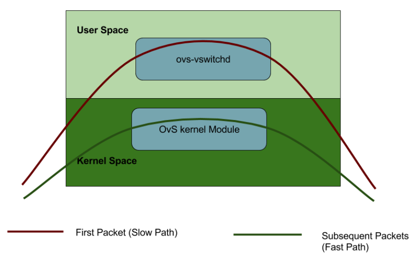

As can be seen in the Figure 2, OVS kernel module acts as a cache for the user space. And just like a cache, its performance decreases as the number of rules increase in the user space.

#### DPDK

The Data Plane Development Kit (DPDK) is a set of data plane libraries and network interface controller drivers for fast packet processing from Intel. DPDK runs inside user space, and gives applications direct access to raw traffic from NIC, completely bypassing kernel and kernel IP Stack. It further utilizes poll mode drivers (PMDs) and hugepages to increase network performance.


#### OVS-DPDK

With the help of DPDK, all the OVS processes are moved to user space. Since all the paths are in single space, it removes the bottleneck created by continuous switching between two spaces.


#### OVS-DPDK in Dell EMC Ready Architecture for Red Hat OpenStack Platform v13

OVS-DPDK is enabled as a part of the automated RHOSP deployment in Dell EMC Ready Architecture for Red Hat OpenStack Platform Version 13.0. There is no post deployment enablement support in this release. If enabled, OVS-DPDK must be so on all compute nodes.

> Note: OVS-DPDK deployment is enabled only on Dell Compute role.
 

OVS-DPDK requires an extra network bond; the already existing bonds (bond0 and bond1) carry storage network, OpenStack tunnelled tenant network and internal API network. The OVS-DPDK bond will carry OpenStack VLAN tenant networks.

#### Before You Begin

In this guide, it is assumed that the user has complete knowledge about the Dell EMC Ready Architecture for Red Hat OpenStack Platform Version 13. This includes:

1.	Knowledge about different nodes in Dell EMC Ready Architecture for Red Hat OpenStack Platform version 13, like SAH, Director, Controller, Compute and Ceph-storage as explained in  Dell_EMC_Red_Hat_Ready_Architecture_Guide_v13.0.pdf

2.	Hardware configurations including switch configurations as explained in Dell_EMC_Red_Hat_Ready_Architecture_Guide_v13.0.pdf and Dell_EMC_Red_Hat_Ready_Architecture_Cumulus_Switch_Configurations_v13.0.pdf

3.	Automation scripts, settings, and properties files required for deployment are open sourced and available in git hub https://github.com/dsp-jetpack/JetPack

#### Prerequisites

Before starting the deployment of Dell EMC Ready Architecture for Red Hat OpenStack Platform Version 13.0 with OVS-DPDK, following prerequisites must be met:

1.	Hyperthreading should be enabled and degree of hyperthreading should be 2 on compute nodes
2.	Total number of CPU sockets should be 2 per compute nodes.
3.	NUMA and Hugepages settings should be enabled in the .ini file.
4.	Extra NICs:
    Two extra Intel XXV710 NICs in the compute nodes are attached. For Dell EMC PowerEdge R640, OVS-DPDK NICs are plugged in PCI Slot 1 and 2 and for Dell EMC PowerEdge R740xd, OVS-DPDK NICs are plugged in PCI Slot 4 & 5.

##### System Requirements

Given below are the additional hardware requirements that must be supported to enable OVS-DPDK in Dell EMC NFV Ready Architecture for Red Hat OpenStack Platform v13.0:

| Device Name           | Quantity                                      |
|-----------------------|-----------------------------------------------|
| Intel XXV710 adapters | 3 or 6                                        |
| QSFP  connectors      | 4  (Depends upon the implementation of S5248) |
| SFP  Connector        | 6 or 12                                       |


##### Switch Configurations:

To setup the switch configurations, connect the OVS-DPDK NICs to leaf switches. The connections need to be such that high availability (HA) is ensured. This means that one NIC of a compute node is connected to switch 1, and other to switch 2 respectively. The bond is created over two NICs to ensure fail-over in case of failure of a NIC or a leaf switch.

Switch configurations depend on the numbr of ports used for OVS-DPDK. The tenant networks are carried over bond0 in the default Dell EMC NFV Ready Architecture for Red Hat OpenStack Platform v13.0 configuration. However, with OVS-DPDK enabled, these networks are carried over a new OVS-DPDK bond.

**OVS-DPDK with two ports:**

For this scenario, switch configuration will have three major changes:

a.	Creation of new bonds for the new ports that will be used for OVS-DPDK bond with LACP enabled on two ports.

b.	Removal of Removal of tenant VLANs from NOVA1-bond0, NOVA2-bond0 and NOVA3-bond0 bonds.

c.	Tagging of newly created bonds in tenant network VLANs.

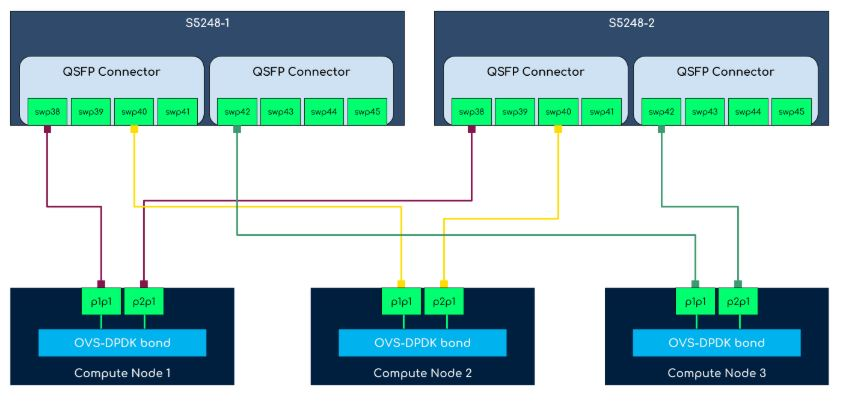

> NOTE: In the reference diagram above, PCI Slot 1 and PCI Slot 2 are utilized on all the Compute nodes. PCI slots on the Compute nodes are connected to swp38, swp40, and swp42 interfaces on Leaf-1 and Leaf-2 switches according to the reference diagram.


Switch configurations for OVS-DPDK on both switches according to the four ports OVS-DPDK will be:

```bash
$ net add interface swp38,swp40,swp42
$ net add bond NOVA1-bond10 bond slaves swp38 clag id 59
$ net add bond NOVA2-bond10 bond slaves swp40 clag id 61
$ net add bond NOVA3-bond10 bond slaves swp42 clag id 63
$ net add bond NOVA1-bond10 bridge vids 201-220
$ net add bond NOVA2-bond10 bridge vids 201-220
$ net add bond NOVA3-bond10 bridge vids 201-220


Also, the port channel will have the following configuration on both switches:

auto NOVA1-bond10
iface NOVA1-bond10
   bond-slaves swp38
   bridge-vids 201-220
   clag-id 59
   mtu 9000
 
 
auto NOVA2-bond10
iface NOVA2-bond10
   bond-slaves swp40
   bridge-vids 201-220
   clag-id 61
   mtu 9000
 
 
auto NOVA3-bond10
iface NOVA3-bond10
   bond-slaves swp42
   bridge-vids 201-220
   clag-id 63
   mtu 9000
```


**OVS-DPDK with four ports:**

For this scenario, switch configuration will have three major changes:

a.	Creation of new bonds for the new ports that will be used for OVS-DPDK bond with LACP enabled on four ports.

b.	Removal of tenant VLANs from NOVA1-bond0, NOVA2-bond0 and NOVA3-bond0 bonds.

c.	Tagging of newly created bonds in tenant network VLANs.

> Note: Tenant VLANs in JS 13.0:
> Mention the VLAN range for tenant network from 201-220 in the INI file under SAH node.i.e. Default Tenant VLANs range: 201-220

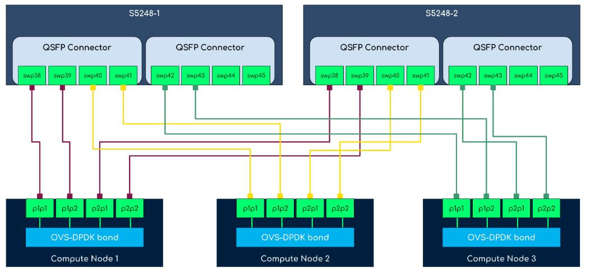

> Note: In the four ports OVS-DPDK reference diagram, PCI Slot 1 and PCI Slot 2 are utilized on all the Compute nodes. PCI slots on the Compute nodes are connected to swp38, swp39, swp40, swp41, swp42, and swp43 interfaces on Leaf-1 and Leaf-2 switches according to the reference diagram.

**Switch configurations for OVS-DPDK on both switches according to the four ports OVS-DPDK will be:**


```bash
$ net add interface swp38-43
$ net add bond NOVA1-bond10 bond slaves swp38-39 clag id 59
$ net add bond NOVA2-bond10 bond slaves swp40-41 clag id 61
$ net add bond NOVA3-bond10 bond slaves swp42-43 clag id 63
$ net add bond NOVA1-bond10 bridge vids 201-220
$ net add bond NOVA2-bond10 bridge vids 201-220
$ net add bond NOVA3-bond10 bridge vids 201-220


Also the new OVS-DPDK will have the following configuration on both switches:

auto NOVA1-bond10
 iface NOVA1-bond10
    bond-slaves swp38 swp39
    bridge-vids 201-220
    clag-id 59
    mtu 9000
 
 
auto NOVA2-bond10
 iface NOVA2-bond10
    bond-slaves swp40 swp41
    bridge-vids 201-220
    clag-id 61
    mtu 9000
 
 
auto NOVA3-bond10
 iface NOVA3-bond10
    bond-slaves swp42 swp43 
    bridge-vids 201-220
    clag-id 63
    mtu 9000
```

#### Settings file parameters

To enable OVS-DPDK in the Dell EMC Ready Architecture for Red Hat OpenStack Platform Version 13.0, following changes should be made in the settings file.

1.	Open an SSH terminal as "root" user, to the SAH Node. 

    ```bash
    $ssh root@<sah_node_ip>
    ```

2.	Open the settings file, and find "ovs_dpdk_enable". Assuming the name of settings file is "sample_csp_profile.ini" and it is present in the "/root" directory:

    ``` bash
    $vi /root/sample_csp_profile.ini
	```

	All the parameters that are related to enabling OVS-DPDK are described in the table below.

	


**Example 1 OVS-DPDK with two ports:**

Settings for enabling OVS-DPDK with two ports are following:

```yaml
numa_enable=true

numa_hostos_cpu_count=4

hpg_enable=true

hpg_size=1GB

ovs_dpdk_enable=true

nic_env_file= ovs-dpdk_7_port/nic_environment.yaml

#Note: the following interfaces need to be changed as per the server model
#R640 should use 'p2p1', 'p3p1', 'p2p2', 'p3p2'
#R740/R740xd should use 'p4p1', 'p5p1', 'p4p2', 'p5p2'
#The following lines should be commented out if ovs_dpdk_enable is set to false
ComputeOvsDpdkInterface1=p2p1
ComputeOvsDpdkInterface2=p3p1
ComputeOvsDpdkInterface3=p2p2
ComputeOvsDpdkInterface4=p3p2
BondInterfaceOvsOptions=bond_mode=balance-tcp lacp=active
```


**Example 2 OVS-DPDK with four ports:**

Settings for enabling OVS-DPDK with four ports:

```yaml
numa_enable=true

numa_hostos_cpu_count=4

hpg_enable=true

hpg_size=1GB

ovs_dpdk_enable=true

nic_env_file= ovs-dpdk_9_port/nic_enviornment.yaml

#Note: The following interfaces need to be changed as per the server model
#R640 should use 'p2p1', 'p3p1', 'p2p2', 'p3p2'
#R740/R740xd should use 'p4p1', 'p5p1', 'p4p2', 'p5p2'
#The following lines should be commented out if ovs_dpdk_enable is set to false
ComputeOvsDpdkInterface1=p2p1
ComputeOvsDpdkInterface2=p3p1
ComputeOvsDpdkInterface3=p2p2
ComputeOvsDpdkInterface4=p3p2
BondInterfaceOvsOptions=bond_mode=balance-tcp lacp=active
```


#### Start deployment

Change the directory to /root/JetPack/src/deploy/osp_deployer.

```bash
# cd /root/JetPack/src/deploy/osp_deployer
```


Start the “deployer.py” script execution and pass the settings file using “-s” parameter.

```bash
# python deployer.py –s /root/sample_csp_profile.ini
```


Monitor the output of the script. For detailed logs open a new SSH terminal and tail the logs file in “/ auto_results/” directory. The log files are timestamped.

```bash
# tail -f /auto_results/<latest log file>
```

Upon the successful completion of OVS-DPDK deployment, overcloud deployment status should be CREATE_COMPLETE. The VALIDATION SUCCESS status should be displayed in case the sanity test value is set to true success output for successful deployment looks like this:

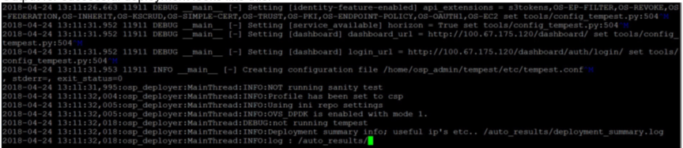


At the start of deployment a log message shows whether OVS-DPDK is enabled or not. For a successful deployment, overcloud deployment status should be CREATE_COMPLETE. And if sanity test was set to true in the .ini file, it should display VALIDATION SUCCESS message.

### Troubleshooting

**There are two types of deployment failures that can occur:**

1. At the start of deployment, failures related to settings and properties file input validation may occur.
3. During the deployment, failure can be due to multiple reasons: a subset of these failures is related to “FAILED_OVERCLOUD”. The OVS-DPDK related failure are part of this subset. The most likely reasons for these failures are following:

	a.	Switch configurations.

	b.	Hardware configuration like placing the extra NICs in the right PCI Slots.


#### Examples of errors than can occur at the start of deployment i.e. input validation period

**Unsupported value of ovs_dpdk_enable:**

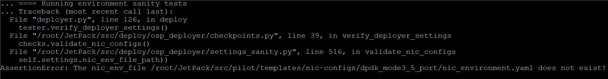

Change the value in the settings to a supported one and deploy again.


**Unsupported value of nic_env_file:**

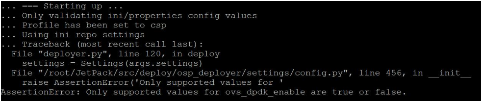

Change the value in the settings to a supported one and deploy again.

**Comments not removed for OVS-DPDK interfaces:**
 
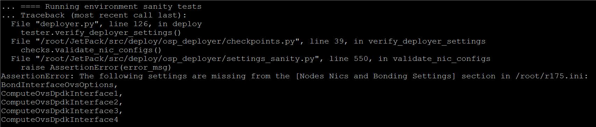

Un-comment the required parameters and deploy again.

**During Overcloud Deployment**

In this case deployment fails with overcloud deployment status as "CREATE_FAILED". These errors can be due to a number of reasons. Following commands can be used to debug the issue. All of these commands are to be run on the director node.

Use the following command to get the stack name.

```bash
$ openstack stack list
```

List all the resources of the stack and using grep, filter out the resources which are created successfully and list only FAILED or IN PROGRESS resources.

```bash
$ openstack stack resource list <stack-name> | grep -v COMPLETE
```


This will provide a general idea of which resource creation failed.

The following command can be used to list all the software deployments, which are either in "IN PROGRESS" or "FAILED" state.

```bash
$ openstack software deployment list | grep -v COMPLETE
```


To further filter out which server has failed or in progress, software deployment server option can be given.

First list all the servers and obtain the UUID of the servers.

```bash
$ openstack server list
```


Use the UUID to filter the output of software deployment list command.

```bash
$ openstack software deployment list server <server-uuid> | grep -v
COMPLETE
```


Failed software deployment reports also contain the reason for failure. Use the software deployment UUID to display all the information.

```bash
$ openstack software deployment show <uuid>
```

### Post deployment steps

Flavors created on the OVS-DPDK enabled compute nodes need to have the following metadata tags:

1.	hw:cpu_policy=dedicated
2.	hw:cpu_thread_policy=require
3.	hw:mem_page_size=large
4.	hw:numa_nodes=1
5.	hw:numa_mempolicy=preferred

To create a custom flavor for OVS-DPDK instance, follow the steps below.

1.	Source the overcloud resource configuration file.

	```bash
	$ source <overcloudrc>
	```

2.	Create the custom flavor.

	```bash
	$ openstack flavor create <flavor-name> --disk 40 --ram 4096 --vcpu 4
	```

	> Note: Disk size, RAM and number of vCPUs can vary.


3.	Add the metadata tags to the newly created flavor.

	
	```bash
	$ openstack flavor set <flavor-name> \
	--property hw:cpu_policy=dedicated \
	--property hw:cpu_thread_policy=require \
	--property hw:mem_page_size=large \
	--property hw:numa_nodes=1 \
	--property hw:numa_mempolicy=preferred
	```

	> Note: To add metadata tags to an existing flavor, only step 3 is required.


**Sample configurations**

dell-environment.yaml - Sample DPDK Parameters

```yaml
# Copyright (c) 2016-2018 Dell Inc. or its subsidiaries.
#
# Licensed under the Apache License, Version 2.0 (the "License");
# you may not use this file except in compliance with the License.
# You may obtain a copy of the License at
#
#     http://www.apache.org/licenses/LICENSE-2.0
#
# Unless required by applicable law or agreed to in writing, software
# distributed under the License is distributed on an "AS IS" BASIS,
# WITHOUT WARRANTIES OR CONDITIONS OF ANY KIND, either express or implied.
# See the License for the specific language governing permissions and
# limitations under the License.
 
resource_registry:
    OS::TripleO::NodeUserData: ./first-boot.yaml
 
parameter_defaults:
 
  # Defines the interface to bridge onto br-ex for network nodes
  NeutronPublicInterface: bond1
  # The tenant network type for Neutron
  NeutronNetworkType: vlan
  ## >neutron-disable-tunneling no mapping.
 
  # The neutron ML2 and OpenvSwith VLAN Mapping ranges to support.
  NeutronNetworkVLANRanges: physint:201:220,physext
 
  # The logical to physical bridge mappings to use.
  # Defaults to mapping the external bridge on hosts (br-ex) to a physical name (datacentre).
  # You would use this for the default floating network
  NeutronBridgeMappings: physint:br-tenant,physext:br-ex
 
  # Flavor used as the regular compute
  OvercloudDellComputeFlavor: baremetal
  # Flavor to use for the Controller nodes
  OvercloudControllerFlavor: baremetal
  # Flavor to use for the ceph Storage nodes
  OvercloudCephStorageFlavor: baremetal
  # Flavor to use for the Swift storage nodes
  OvercloudSwiftStorageFlavor: baremetal
  # Flavor to use for the Cinder nodes
  OvercloudBlockStorageFlavor: baremetal
 
  # List of Default Filters to pass to the nova Scheduler
  # Default filters are used if profile is set to XSP
  # This line is uncommented when using with CSP profile

  NovaSchedulerDefaultFilters: ['RetryFilter','AvailabilityZoneFilter','RamFilter','DiskFilter', 'ComputeFilter','ComputeCapabilitiesFilter','ImagePropertiesFilter','ServerGroupAntiAffinityFilter','ServerGroupAffinityFilter', 'CoreFilter', 'NUMATopologyFilter', 'AggregateInstanceExtraSpecsFilter']
 
  # List of CPUs reserver for Host OS operation
  # Disabled by default for XSP Profile
  # This line is uncommented and updated when using CSP Profile
  NovaVcpuPinSet: 4-23,28-47
  DellComputeParameters:
    KernelArgs: "iommu=pt intel_iommu=on default_hugepagesz=1GB hugepagesz=1G hugepages=176 isolcpus=4-23,28-47"
 
  # Number of Dell Compute nodes
  DellComputeCount: 3
 
  # Apply tuned-adm profile on Compute Nodes
  ComputeTunedAdmProfile: virtual-host
 
  # Number of Controller nodes
  ControllerCount: 3
 
  # Number of Ceph Storage nodes
  CephStorageCount: 3
 
 
  # Configures MySQL max_connections config setting
  MysqlMaxConnections: 15360
 
  # Configures MariaDB Buffer Pool Size
  # Setting 'dynamic' will apply 75% of total memory to innodb_buffer_pool_size
  BufferPoolSize: dynamic
 
  # Configures MariaDB Buffer Pool Instances
  BufferPoolInstances: 16
 
  # To customize the domain name of the overcloud nodes, change "localdomain"
  # in the following line to the desired domain name.
  CloudDomain: r151.nfv.lab
 
  # Set to true to enable Nova usage of Ceph for ephemeral storage.
  # If set to false, Nova uses the storage local to the compute.
  NovaEnableRbdBackend: true
  #  devices:
  #  - /dev/sda2
 
 
  # Configure Ceph Placement Group (PG) values for the indicated pools
  CephPools: [{"name": "volumes", "pg_num": 1024, "pgp_num": 1024}, {"name": "vms", "pg_num": 256, "pgp_num": 256},
{"name": "images", "pg_num": 128, "pgp_num": 128}, {"name": ".rgw.buckets", "pg_num": 512, "pgp_num": 512}]
 
  # Default pool size is 3, change to 2 if depolyment fails on 13G.
  CephPoolDefaultSize: 3
  CephConfigOverrides:
    journal_size: 10000
    journal_collocation: false
    raw_multi_journal: true
  CephAnsibleDisksConfig:
    osd_scenario: non-collocated
    devices:
      - /dev/sdb
      - /dev/sdc
      - /dev/sdd
      - /dev/sde
      - /dev/sdf
      - /dev/sdg
      - /dev/sdh
      - /dev/sdi
      - /dev/sdj
     
    dedicated_devices:
      - /dev/sdk
      - /dev/sdk
      - /dev/sdk
      - /dev/sdk
      - /dev/sdk
      - /dev/sdk
      - /dev/sdk
      - /dev/sdk
      - /dev/sdk
 
  NovaComputeExtraConfig:
    nova::migration::libvirt::live_migration_completion_timeout: 800
    nova::migration::libvirt::live_migration_progress_timeout: 150
  ControllerExtraConfig:
    nova::api::osapi_max_limit: 10000
    nova::rpc_response_timeout: 180
    nova::keystone::authtoken::revocation_cache_time: 300
    neutron::rpc_response_timeout: 180
    neutron::keystone::authtoken::revocation_cache_time: 300
    cinder::keystone::authtoken::revocation_cache_time: 300
    glance::api::authtoken::revocation_cache_time: 300
    tripleo::profile::pacemaker::database::mysql::innodb_flush_log_at_trx_commit: 0
    tripleo::haproxy::haproxy_default_maxconn: 10000


neutron-ovs-dpdk.yaml
# Copyright (c) 2016-2018 Dell Inc. or its subsidiaries.
#
# Licensed under the Apache License, Version 2.0 (the "License");
# you may not use this file except in compliance with the License.
# You may obtain a copy of the License at
#
#     http://www.apache.org/licenses/LICENSE-2.0
#
# Unless required by applicable law or agreed to in writing, software
# distributed under the License is distributed on an "AS IS" BASIS,
# WITHOUT WARRANTIES OR CONDITIONS OF ANY KIND, either express or implied.
# See the License for the specific language governing permissions and
# limitations under the License.
 
## A Heat environment that can be used to deploy DPDK with OVS
resource_registry:
  OS::TripleO::Services::ComputeNeutronOvsDpdk: ./overcloud/docker/services/neutron-ovs-dpdk-agent.yaml
  OS::TripleO::Services::ComputeNeutronOvsAgent: OS::Heat::None
 
parameter_defaults:
  NeutronDatapathType: "netdev"
  NeutronVhostuserSocketDir: "/var/lib/vhost_sockets"
  NovaSchedulerDefaultFilters: "RamFilter,ComputeFilter,AvailabilityZoneFilter,ComputeCapabilitiesFilter,ImagePropertiesFilter,NUMATopologyFilter"
  OvsDpdkDriverType: "vfio-pci"
  NeutronOVSFirewallDriver: openvswitch
  DellComputeParameters:
    VhostuserSocketGroup: "hugetlbfs"
    OvsPmdCoreList: "4-7,28-31"
    OvsDpdkCoreList: "0-3,24-27"
    IsolCpusList: "4-23,28-47"
    OvsDpdkMemoryChannels: "4"
    NovaReservedHostMemory: 4096
    OvsDpdkSocketMemory: "2048,2048"
    TunedProfileName: "cpu-partitioning"
    NumDpdkInterfaceRxQueues: 1
    OvsEnableDpdk: true
```


<div style="page-break-after: always;"></div>

# Appendix G Neutron managed SR-IOV

This appendix details the guidelines for configuration of Neutron managed SR-IOV at the time of deployment of Dell EMC Ready Architecture for Red Hat OpenStack Platform v13.0.

### SR-IOV

Neutron managed SR-IOV is enabled as a part of the automated RHOSP deployment solution in JS 13.0. In this guide, it is assumed that the user has complete knowledge about the Dell EMC NFV Ready Architecture for Red Hat OpenStack Platform v13.0. This includes knowledge about different nodes in Dell EMC NFV Ready Bundle for Red Hat v13.0 such as SAH, Director, Controller, Compute, and Ceph-storage.

#### Prerequisites

**System Requirements**

**Following are the hardware requirements for enabling Neutron-managed SR-IOV:**

| Device Name                            | Total                                     |
|----------------------------------------|-------------------------------------------|
| Intel® Ethernet Network Adapter XXV710 | 3 or 6                                    |
| SFP Connector                          | 6 or 12                                   |
| QSFP connector                         | Depends upon the implementation of S5248) |


**Additional SR-IOV NIC details**

| NIC                                    | Total NICs | NICs per Compute Node | Ports per NIC | Bandwidth per Port |
|----------------------------------------|------------|-----------------------|---------------|--------------------|
| Intel® Ethernet Network Adapter XXV710 | 3 or 6     | 1 or 2                | 2             | 25 Gb              |


**Switch Configurations**

To setup the switch configurations, connect the SR-IOV NICs to leaf switches such that high-availability (HA) is ensured. This implies one port of a NIC on a Compute node is attached to Leaf-1 switch while the other to Leaf-2 switch.

Switch configurations depend upon the number of ports used for SR-IOV. In Neutron managed SR-IOV, the tenant networks for normal instances are carried over the default bond0 while for SR-IOV enabled instances, tenant networks are carried over the SR-IOV enabled NICs.

**SR-IOV with Four Ports**

For this scenario, the following changes are required in the switch configurations:

* Wiring of SR-IOV NICs in Compute nodes to the Leaf switches according to the reference diagram for four ports.
* Reference wiring diagram for SR-IOV with four ports is depicted below:
 
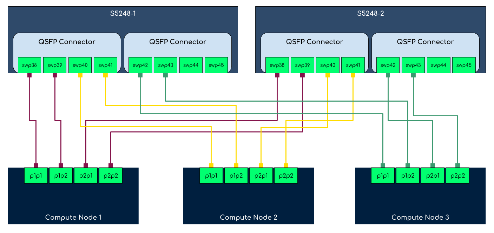


> NOTE: PCI slots in reference diagram
In the four ports SR-IOV reference diagram, PCI slot 1 and 2 are used just for reference. User can utilize different PCI slots according to the network environment.


* Addition of additional four ports to the tenant VLANs on both the leaf switches.
* Switch configuration for SR-IOV on both the switches according to the reference diagram will be:

```bash
$ net add interface swp38-43
$ net add bridge bridge ports swp38-43
$ net add interface swp38 bridge vids 201-220
$ net add interface swp39 bridge vids 201-220
$ net add interface swp40 bridge vids 201-220
$ net add interface swp41 bridge vids 201-220
$ net add interface swp42 bridge vids 201-220
$ net add interface swp43 bridge vids 201-220
```

**Following additional configuration will be added to both the switches:**

```bash
auto swp38
iface swp38
    bridge-vids 201-220

auto swp39
iface swp39
    bridge-vids 201-220

auto swp40
iface swp40
    bridge-vids 201-220

auto swp41
iface swp41
    bridge-vids 201-220

auto swp42
iface swp42
    bridge-vids 201-220

auto swp43
iface swp43
    bridge-vids 201-220

auto bridge
iface bridge
    bridge-ports CNTL1-bond0 CNTL1-bond1 CNTL2-bond0 CNTL2-bond1 CNTL3-bond0 CNTL3-bond1 MLAG NOVA1-bond0 NOVA1-bond1 NOVA2-bond0 NOVA2-bond1 NOVA3-bond0 NOVA3-bond1 S4048-LAG SAH-bond0 SAH-bond1 STOR1-bond0 STOR1-bond1 STOR2-bond0 STOR2-bond1 STOR3-bond0 STOR3-bond1 swp38 swp39 swp40 swp41 swp42 swp43
    bridge-vids 110 120 130 140 170 180 201-220 1543-1544
    bridge-vlan-aware yes
```


**SR-IOV with two ports**

For this scenario, the following changes are required in the switch configurations:

* Wiring of SR-IOV NICs in Compute nodes to the Leaf switches according to the reference diagram for four ports.
* Reference wiring diagram for SR-IOV with two ports is depicted below:

 
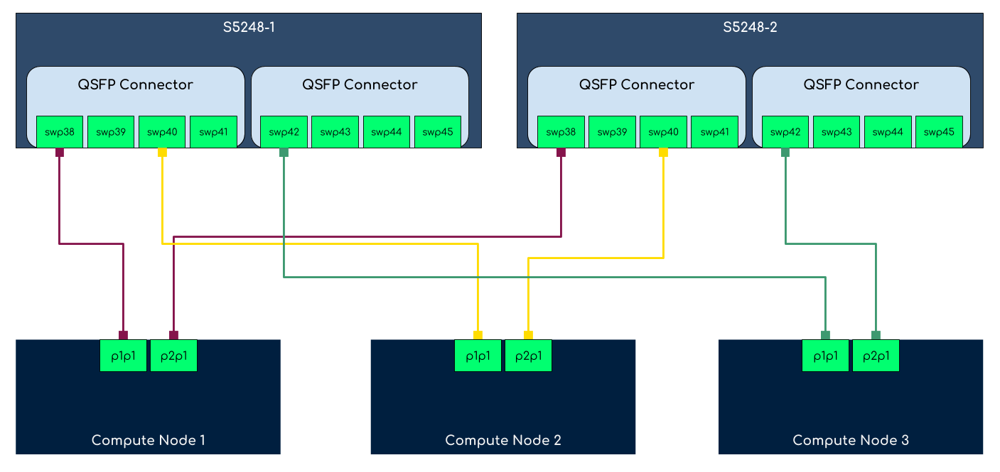

> NOTE: PCI slots in reference diagram
> In the two ports SR-IOV reference diagram, PCI slot 1 and 2 are used just for reference. User can utilize different PCI slots according to the network environment.


* Addition of additional two ports to the tenant VLANs on both the leaf switches.
* Switch configuration for SR-IOV on both the switches according to the reference diagram will be:


```bash
$ net add interface swp38,swp40,swp42
$ net add bridge bridge ports swp38,swp40,swp42
$ net add interface swp38 bridge vids 201-220
$ net add interface swp40 bridge vids 201-220
$ net add interface swp42 bridge vids 201-220
```

**Following additional configuration will be added to both the switches:**

```bash
auto swp38
iface swp38
    bridge-vids 201-220

auto swp40
iface swp40
    bridge-vids 201-220

auto swp42
iface swp42
    bridge-vids 201-220

auto bridge
iface bridge
    bridge-ports CNTL1-bond0 CNTL1-bond1 CNTL2-bond0 CNTL2-bond1 CNTL3-bond0 CNTL3-bond1 MLAG NOVA1-bond0 NOVA1-bond1 NOVA2-bond0 NOVA2-bond1 NOVA3-bond0 NOVA3-bond1 S4048-LAG SAH-bond0 SAH-bond1 STOR1-bond0 STOR1-bond1 STOR2-bond0 STOR2-bond1 STOR3-bond0 STOR3-bond1 swp38 swp40 swp42
    bridge-vids 110 120 130 140 170 180 201-220 1543-1544
    bridge-vlan-aware yes
```


> NOTE: Provider Network:
> Existing provider network physint is mapped on the SR-IOV interfaces, thus, both normal and SR-IOV enabled instances can be started together


### Deployment

To enable SR-IOV in JetStream 13.0, perform the following steps:

* Open an SSH session as user root in SAH node.

    ```bash
    $ ssh root@<sah_node_ip>
    ```

* Open the settings INI file located in /root directory for SR-IOV configuration.

    ```bash
    $ vi /root/<sample CSP profile INI file>
    ```

* Change the SR-IOV parameters provided in the following table in settings INI file: 
    
| Parameter                                                                                                       | Value                                                                                                                                     | Description                                                                                                                     |
|-----------------------------------------------------------------------------------------------------------------|-------------------------------------------------------------------------------------------------------------------------------------------|---------------------------------------------------------------------------------------------------------------------------------|
| sriov_enable                                                                                                    | true or false                                                                                                                             | SR-IOV is enabled when set to true                                                                                              |
| sriov_vf_count                                                                                                  | 1-64                                                                                                                                      | This parameter reflects the number of virtual functions created per physical function. <br>Example: sriov_vf_count=4            |
| nic_env_file                                                                                                    | To enable SR-IOV with 7 nic ports, choose sriov_7_port/nic_environment.yaml. While for 9 ports, choose sriov_9_port/nic_enviornment.yaml. | Set NIC environment file according to the SR-IOV ports requirement. <br>Example: nic_env_file=sriov_7_port/nic_environment.yaml |
| ComputeSriovInterface1=p1p1 ComputeSriovInterface2=p4p1 ComputeSriovInterface3=p2p1 ComputeSriovInterface4=p4p2 | Uncomment these lines when sriov_enable set to true.                                                                                      | Uncomment these interfaces according to the NIC environment file selected i.e. sriov_7_port or sriov_9_port                     |


* Change the directory to /root/JetPack/src/deploy/osp_deployer.

	```bash
	# cd /root/JetPack/src/deploy/osp_deployer
	```

* Execute the deployer.py script and pass the settings file using -s flag.

	```bash
	python deployer.py –s /root/sample_csp_profile.ini
	```

> Note: For detailed logs and to monitor the output of the script, open a new SSH terminal and tail the latest logs file in /auto_results/ directory. 

Upon the successful completion of SR-IOV deployment, overcloud deployment status should be CREATE_COMPLETE. The VALIDATION SUCCESS status should be displayed in case the sanity test value is set to true. SSH into the Compute nodes and verify the created VFs: 

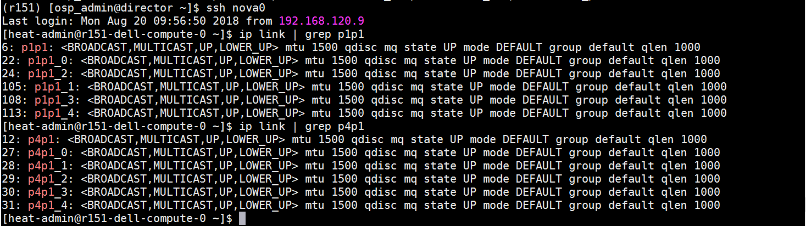

### Post deployment steps

After the completion of Neutron managed SR-IOV deployment with JetStream 13.0, perform the following steps to create a SR-IOV enabled instance:

1.	Source the overcloud RC file.

    ```bash
    $ source <overcloudrc>
    ```

2.	Create an aggregate group and add a host to it for SR-IOV.

    ```bash
    $ openstack aggregate create --zone=sriov sriov
    $ openstack aggregate add host sriov <compute node hostname>.localdomain
    ```

3.	Create a SR-IOV compliant flavor.
    ```bash
    $ openstack flavor create sriov --ram 4096 --disk 150 --vcpus 4
    ```

	> NUMA and hugepages
	> If NUMA and hugepages are enabled, set the required NUMA and hugepages metadata on the SR-IOV enabled flavor.

4.	Create a SR-IOV enabled network by specifying the provider network VLAN and provider physical network as mentioned in the neutron-sriov.yaml.

    ```bash
    $ openstack network create --provider-network-type=vlan --provider-physical-network=physint sriov_net
    $ openstack subnet create --project admin --subnet-range 10.0.10.0/24 --dhcp --network sriov_net sriov-sub
    ```

5.	Create a Neutron port associated with SR-IOV VF.

    ```bash
    $ openstack port create --network net1 --vnic-type direct sriov_port
    ```

6.	Deploy an instance.

    ```bash
    $ openstack server create --flavor compute --availability-zone sriov --image <image name> --nic port-id=sriov_port sriov_vm
    ```
    
**Sample configurations**

```yaml
neutron-sriov.yaml
Sample SR-IOV parameters
parameter_defaults:
  NeutronMechanismDrivers: ['sriovnicswitch', 'openvswitch']
  NovaSchedulerDefaultFilters: ['RetryFilter','AvailabilityZoneFilter','RamFilter','ComputeFilter','ComputeCapabilitiesFilter','ImagePropertiesFilter','ServerGroupAntiAffinityFilter','ServerGroupAffinityFilter','PciPassthroughFilter']
  NovaSchedulerAvailableFilters: ["nova.scheduler.filters.all_filters","nova.scheduler.filters.pci_passthrough_filter.PciPassthroughFilter"]
  NeutronEnableIsolatedMetadata: true
  NeutronEnableForceMetadata: true
  NeutronTunnelTypes: ''
  NeutronSriovNumVFs: 'p1p2:5:switchdev,p4p2:5:switchdev'
  NeutronPhysicalDevMappings: 'physint:p1p2,physint:p4p2'
  NovaPCIPassthrough: [{devname: p1p2,physical_network: physint},{devname: p4p2,physical_network: physint}]
```

**Functionality testing**

**Using first approach of SR-IOV deployment, five scenarios are tested:**

1.	Communication of SR-IOV instance on same compute nodes

    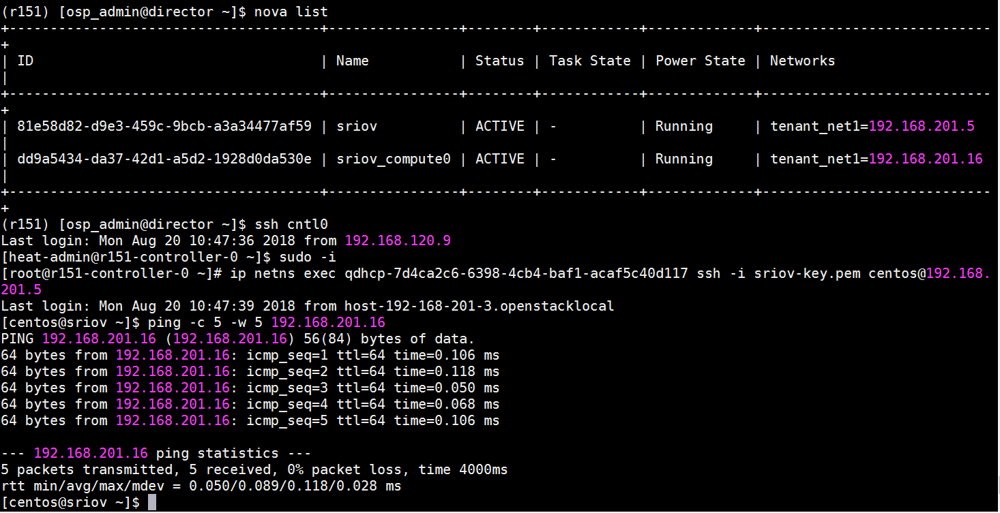

2.	Communication of SR-IOV instances on different compute nodes
    
    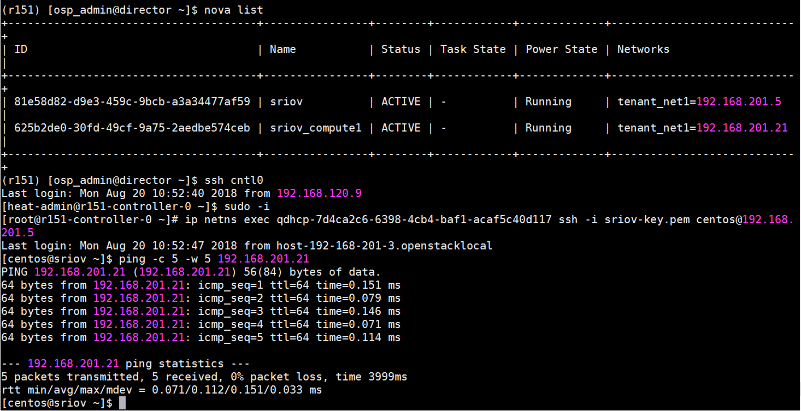
    
3.	Communication between instance with SR-IOV port and instance with normal port on same compute node:
    
    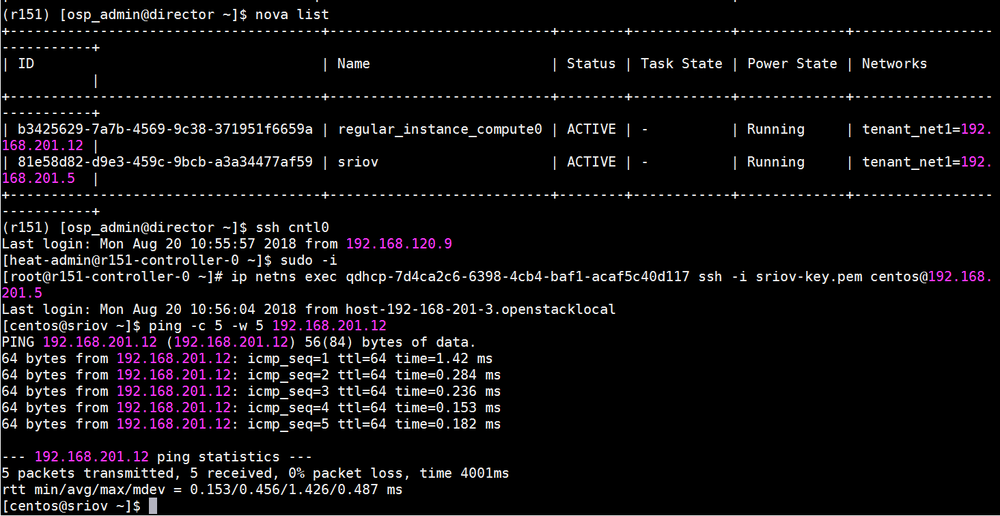
    
4.	Communication between instance with SR-IOV port and instance with normal port on different compute nodes:
    
    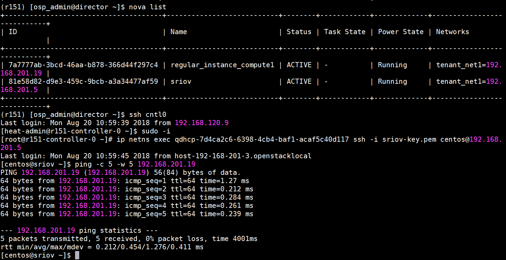
    
5.	Communication of SR-IOV instance with floating IP:
    
    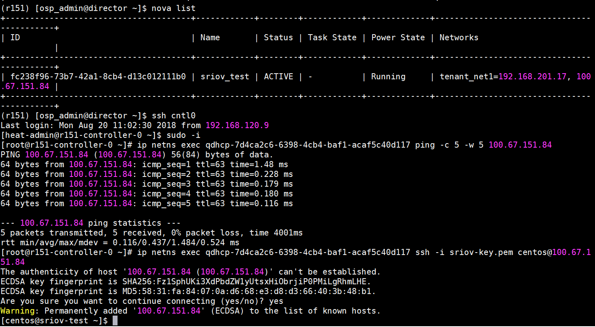


<div style="page-break-after: always;"></div>

# Appendix H Neutron DVR support in JS 13.0

This appendix details the guidelines for configuration of Neutron DVR support in JS 13.0 at the time of deployment of Dell EMC Ready Architecture for Red Hat OpenStack Platform v13.0.

### Introduction

Distributed Virtual Routing (DVR) offers an alternative routing design, which is now fully supported with Red Hat OpenStack Platform. It intends to isolate the failure domain of the controller node and optimize network traffic by deploying the L3 agent and schedule routers on every compute node. By eliminating a centralized layer 3 agent, the routing that was performed on a single node is now handled by the compute nodes themselves.  

### Prerequisite

Follow these steps to configure bonds interfaces of every compute node on both switches:

**Switch with OS9**

Switch with OS9, configurations can be done using following commands:

* Switch configurations for five port nics, port-channel of compute Bond1 interfaces should be in floating vlan:

    ```yaml
    # int vlan <floating-vlan> 
    #tagged port-channel <name of channel which have interfaces of bond1>
    # int vlan <publicApi-vlan> 
    #tagged port-channel <name of channel which have interfaces of bond1>
    ```

* When using seven port nic environment file, additional bond interfaces should be in external and floating vlan. Below are the configurations to add interfaces to vlans:

    ```yaml
    # int port-channel <name of channel which have interfaces of bond2 >
    # switchport
    # exit
    # int TwentyGigabitEthernet <interface of bond2>
    # port-channel porotocol lacp
    # port-channel <channel which have interfaces of bond2> mode active
    # exit
    # int vlan <floating-vlan>
    #tagged port-channel <channel which have interfaces of bond2>
    # int vlan <publicApi-vlan>
    #tagged port-channel <channel which have interfaces of bond2>
    Repeat the above configurations for bond’s other interface on switch 2.
    Add port channel on vlt-peer-lag on both switches
    # int port-channel <channel which have interfaces of bond2>
    # vlt-peer-lag port-channel <channel which have interfaces of bond2>

    ```


**Switch with Cumulus OS**

**Switch with Cumulus OS, configurations can be done using following commands:**

* **Switch configurations for five port nics, port-channel of compute Bond1 interfaces should be in floating vlan:**

    ```bash
    $ net add bond <compute node bond1> bridge vids <floating ip vlan>
    $ net commit
    # This settings need to done for every compute node bond1.
    ```

* **When using seven port nic environment file, additional bond interfaces should be in external and floating vlan. Below are the configurations to add interfaces to vlans:**

    ```bash
    #net add bond <compute node bond2> slave <compute node bond2 port number e-g swp38>
    #net add bond <compute node bond2> clag id <compute node bond2 clag id e-g 50>
    #net add bond <compute node bond2> bridge vids <floating network vlan>
    #net add bond <compute node bond2> mtu 9216
    #net commit
    Repeat the above configurations for bond’s other interface on switch 2 and also for every compute node.
    ```


### Settings file parameter verification

* To deploy the dvr with JS13, set the dvr_enable variable value to True in the .ini file under the [Deployment Settings] section

	``` bash 
	dvr_enable = True
	```
* For NIC configurations, change the value of nic_env_file parameter under the [Nodes Nics and Bonding Settings] section. DVR can be enabled in two different environments:

    1.	```dvr_5_port```
    2.	```dvr_7_port```
    
*	To enable DVR for 5_port, set the nic_env_file parameter to:

    ```bash
    nic_env_file = dvr_5_port/nic_environment.yaml
    ```
*	To enable DVR for 7_port, set the nic_env_file parameter to:
    
    ```bash
    nic_env_file = dvr_7_port/nic_environment.yaml
    ```
    
*	Uncomment the bellow 2 interfaces for enabling DVR for 7_port.
    
    ```bash
    #ComputeBond2Interface1=p3p1
    #ComputeBond2Interface2=p2p1
    ```


### JS 13.0 deployment of undercloud and overcloud

Assuming that SAH node is deployed and JetPack folder is at root location. Edit your hardware stamp’s .ini and .properties files to match your hardware stamp documentation. Run the deployment by executing the deployer.py command:

```bash
# cd /root/JetPack/src/deploy/osp_deployer
# python deployer.py -s <path_to_settings_ini_file>
```

### Deployment verification

Different scenarios are tested to check the functionality of DVR:

Verify that DVR is deployed on all the controller nodes

1. SSH to controller node and change to root user by command "sudo -i"
2. Get docker container id of neutron l3 agent container by cocmmand "docker ps"
3. Connect to the container by command"docker exec -it <neutron l3 agent container id> bash"
4. Run the command: "cat /etc/neutron/l3_agent.ini | grep dvr"
5. Agent_mode value must be dvr_snat
6. Repeat the all steps for other controller nodes.

**Verify that L3 agent must be distributed on all the compute nodes.**

1.	SSH to Director node as osp_admin user
2.	Source overcloudrc file
3.	Run the command "neutron agent-list --agent-type="L3 agent""
4.	In host column, you will see the nodes that host L3 agent.

**Verify that traffic between two compute nodes bypass the Controller node.**

1.	Create two instance on different compute nodes and networks
2.	SSH to both instances on the different tabs
3.	Ping first instance from second instance.
4.	SSH to controller node
5.	RUN the commands 

	```
	sudo ip netns exec  <qrouter-namepace> /bin/bash 
	ip a
	tcpdump -i <qr-interface>
	```
	
6.	Ping traffic for instance will not transfer the through that interface. 

**Verify the snat traffic transverse through the controller node.**

1.	Create an instance
2.	SSH to instance
3.	Ping 8.8.8.8 from instance.
4.	SSH to controller node
5.	Run the commands 

	```
	sudo ip netns exec  <snat-namepace> /bin/bash
	ip a
	tcpdump -i <sg-interface>
	```

6.	Ping traffic will transfer the through that interface

**Verify that traffic with floating IPs for external traffic must bypass the Controller node.**

1.	Create an instance and associate Floating IP to it. 
2.	ssh to instance
3.	Ping 8.8.8.8 from instance.
4.	ssh to controller node
5.	run the commands 

	```
	sudo ip netns exec  <qr-namepace> /bin/bash
	ip a
	tcpdump -i <qg-interface>
	
	```

6.	ping traffic will not transfer the through that interface. 

**ssh the instance through the fip namespaces created on the compute node.**

1.	SSH to compute node
2.	Run the command 
	
	```
	sudo ip netns exec <fip-namespace> 
	ssh –i /home/heat-admin/key user@<ip-addr>
	```
3.	SSH should be successful


<div style="page-break-after: always;"></div>

# Appendix I Performance optimization 

This appendix details the guidelines for application of performance optimization at the time of deployment of Dell EMC Ready Architecture for Red Hat OpenStack Platform version 13.

### Overview

Performance optimization is the improvement of system response. Typically, in cloud infrastructure, the motivation for such activity is called a performance problem, which can be either real or anticipated. Most systems will respond to increased load (computation, networking etc.) with some degree of decreasing performance. A system's ability to accept higher load is called scalability, and modifying a system to handle a higher load is synonymous to performance tuning.


### Deploying performance optimization

The Dell EMC Ready Architecture for Red Hat OpenStack Platform version 13.0 provides the ability to apply Performance Optimization on all the nodes during deployment. This section provides the instructions to configure deployment.

### Applying performance optimization parameters

List of performance optimization user modifiable Parameters 

* ```mariadb_max_connections```: (1000 - 100000) The maximum permitted number of simultaneous client connections.

    ```bash
    default : 15360
    ```


* ```innodb_buffer_pool_size``` : InnoDB buffer pool size in GBs. (Max. value of this parameter depends on the hardware architecture)

    ```bash
    default : dynamic (This assigns 75% ram size of controller node.)
    ```


* ```innodb_buffer_pool_instances``` : (8 - 48) The number of regions that the InnoDB buffer pool is divided into.

    ```bash
    default : 16
    ```


Follow the procedure provided below to apply performance optimization parameters with Dell EMC Ready Architecture for Red Hat OpenStack Platform version 13:

1.	Open an SSH session to the SAH node.

2.	Log in as the root user.

3.	Change the working directory to /root/JetPack/src/deploy/osp_deployer/settings/

    ```bash
    #cd /root/JetPack/src/deploy/osp_deployer/settings/
    ```

4.	Edit the sample_csp_profile.ini or sample_xsp_profile.ini file. Change the settings under section [Performance and Optimization]. Please refer sample_csp_profile.ini and sample_xsp_profile.ini for details.

     Note:

**Only two types of values are supported for ```innodb_buffer_pool_size``` those are:**

* For dynamically calculating and assigning 75% of total memory of respective controller node: innodb_buffer_pool_size = dynamic
* For user value: innodb_buffer_pool_size = 64G (Please follow the same format, an integer value followed by G).

**Deploy performance optimization parameters**

After applying performance optimization parameters in sample_csp_profile.ini or
sample_xsp_profile.ini file, perform the following steps to deploy performance and optimization parameters inDell EMC Ready Architecture for Red Hat OpenStack Platform version 13.
 
1.	Open an SSH session to the SAH node.
2.	Ensure all hardware in the OpenStack Cluster is powered off.
3.	Run the following command to deploy performance optimization:

    ```bash
    #cd /root/JetPack/src/deploy/osp_deployer
    #python deployer.py -s < path-of-settings-file >
    ```
4.	Upon successful execution, success log will be generated. Please refer section Logging for details.

There are more parameters which are by default optimized by Dell EMC Ready Architecture for Red Hat OpenStack Platform version 10.2. These parameters can be seen in List of parameters to be optimized by default .


### Logging

Below is the table of log messages and actions to be taken upon encountering such errors. Apart from these errors if any other error is received, please email openstack@dell.com.

| S No | Error description         | Custom error message                                            | Action                                                 | Log action    | Further action                                                                                                     |
|------|---------------------------|-----------------------------------------------------------------|--------------------------------------------------------|---------------|--------------------------------------------------------------------------------------------------------------------|
| 1    | Invalid buffer pool size. | "innodb_buffer_pool_size is greater than available memory size" | Login to the director VM as the initial deployed user. | Director_node | Check .ini file and verify the given value of innodb_buffer _pool_size try a lower value. Once corrected redeploy. |


### List of Parameters to be optimized by default

#### System level optimization

1.	Linux OS Limits: (all nodes)

    a. soft nofile 64000
    
    b.	hard nofile 64000
    
    c.	soft nproc 10240
    
    d.	hard nproc unlimited

2.	Tuned Profiles

    a.	tuned-adm profile virtual-host ( for all computes )
    
    b.	tuned-adm throughput-performance ( for all controllers and storage nodes )
    
    c.	OVS-DPDK requires the tuned profile set to be cpu-partitioning


### Openstack core services

1.	Nova (/etc/nova/nova.conf )
    
    ```yaml
    [DEFAULT] / rpc_response_timeout = 180
    [DEFAULT] / osapi_max_limit = 10000
    [keystone_authtoken] / revocation_cache_time = 300
    ```


2.	Neutron (/etc/neutron/neutron.conf)
    
    ```yaml
    [DEFAULT] / rpc_response_timeout = 180
    [keystone_authtoken] / revocation_cache_time = 300
    ```

    
3.	Cinder (/etc/cinder/cinder.conf)
    
    ```yaml
    [DEFAULT] / rpc_response_timeout = 180
    [keystone_authtoken] / revocation_cache_time = 300
    ```
    
4.	Glance (/etc/glance/glance-api.conf)
    
    ```yaml
    [DEFAULT] / rpc_response_timeout = 180
    [keystone_authtoken] / revocation_cache_time = 300
    ```


### Openstack components

1.	MariaDB (/etc/my.cnf.d/galera.cnf):
    
    ```yaml
    [mysqld] / innodb_log_file_size=1500M
    [mysqld] / innodb_log_files_in_group=2
    [mysqld] / innodb_flush_method = O_DIRECT
    [mysqld] / innodb_file_per_table = 1
    [mysqld] / innodb_flush_log_at_trx_commit = 0
    ```
2.	HAproxy (/etc/haproxy/haproxy.cfg)
    
    ```yaml
    defaults / maxconn 10000
    ```


Example of sample_csp_profile.ini and sample_xsp_profile.ini

```yaml
[Performance and Optimization]

#mariadb_max_connections takes value from 1000 to 100000, it is mandatory. 
mariadb_max_connections = 15360

#MariaDB innodb_buffer_pool_size should be given value in GB, Example : 64G.
#Default is 'dynamic' which assigns 75% ram size of controller node.
#Note that innodb_buffer_pool_size should be less than available ram size. innodb_buffer_pool_size = dynamic

#innodb_buffer_pool_instances takes value from 8 to 48 
innodb_buffer_pool_instances = 16
```


<div style="page-break-after: always;"></div>

# Appendix J Sample files

This appendix details the sample properties file and describes the differences between the xSP and CSP sample profile files found in Dell EMC Ready Architecture for Red Hat OpenStack Platform version 13.


### Sample properties file

sample.properties

```yaml

[
    {
        "is_sah": "true",
        "hostname": "sah",
        "iDRAC_ip": "192.168.110.20",
        "root_password": "xxxxxxxxxx",

        "anaconda_ip":"192.168.190.134",
        "anaconda_iface":"em4",

        "public_bond": "bond1",
        "public_slaves": "em2 p1p2",
        "public_api_ip":"192.168.190.12",

        "private_bond": "bond0",
        "private_slaves": "em1 p1p1",
        "provisioning_ip":"192.168.120.12",
        "storage_ip":"192.168.170.12",
        "private_api_ip":"192.168.140.12",
        "management_ip":"192.168.110.12"
    },
    {
        "is_director": "true",
        "hostname": "director",
        "root_password": "xxxxxxxxxx",

        "provisioning_ip": "192.168.120.13",

        "management_ip":"192.168.110.13",
        "public_api_ip":"192.168.190.13",

        "private_api_ip":"192.168.140.13"
    },
    {
        "is_dashboard": "true",
        "hostname": "dashboard",
        "root_password": "xxxxxxxxx",

        "public_api_ip": "192.168.190.14",
        "storage_ip": "192.168.170.14"
    },
    {
        "is_controller": "true",
        "iDRAC_ip": "192.168.110.21",

        "public_api_ip": "192.168.190.21",
        "private_api_ip": "192.168.140.21",
        "storage_ip": "192.168.170.21",
        "tenant_tunnel_ip": "192.168.130.21"
    },
    {
        "is_controller": "true",
        "service_tag": "ABCXYZ",

        "public_api_ip": "192.168.190.22",
        "private_api_ip": "192.168.140.22",
        "storage_ip": "192.168.170.22",
        "tenant_tunnel_ip": "192.168.130.22"
    },
    {
        "is_controller": "true",
        "iDRAC_ip": "192.168.110.23",

        "public_api_ip": "192.168.190.23",
        "private_api_ip": "192.168.140.23",
        "storage_ip": "192.168.170.23",
        "tenant_tunnel_ip": "192.168.130.23"
    },
    {
        "is_compute": "true",
        "iDRAC_ip": "192.168.110.31",

        "private_api_ip": "192.168.140.31",
        "storage_ip": "192.168.170.31",
        "tenant_tunnel_ip": "192.168.130.31"

    },
    {
        "is_compute": "true",
        "service_tag": "DEFUVW",

        "private_api_ip": "192.168.140.32",
        "storage_ip": "192.168.170.32",
        "tenant_tunnel_ip": "192.168.130.32"

    },
    {
        "is_compute": "true",
        "iDRAC_ip": "192.168.110.33",

        "private_api_ip": "192.168.140.33",
        "storage_ip": "192.168.170.33",
        "tenant_tunnel_ip": "192.168.130.33"

    },
    {
        "is_ceph_storage": "true",
        "iDRAC_ip": "192.168.110.76",

        "storage_ip": "192.168.170.76",
        "storage_cluster_ip": "192.168.180.76"
    },
    {
        "is_ceph_storage": "true",
        "service_tag": "GHIRST",

        "storage_ip": "192.168.170.77",
        "storage_cluster_ip": "192.168.180.77"
    },
    {
        "is_ceph_storage": "true",
        "iDRAC_ip": "192.168.110.78",

        "storage_ip": "192.168.170.78",
        "storage_cluster_ip": "192.168.180.78"
    }
]

```


### Sample CSP.ini file


```yaml
# Copyright (c) 2015-2018 Dell Inc. or its subsidiaries.
#
# Licensed under the Apache License, Version 2.0 (the "License");
# you may not use this file except in compliance with the License.
# You may obtain a copy of the License at
#
#     http://www.apache.org/licenses/LICENSE-2.0
#
# Unless required by applicable law or agreed to in writing, software
# distributed under the License is distributed on an "AS IS" BASIS,
# WITHOUT WARRANTIES OR CONDITIONS OF ANY KIND, either express or implied.
# See the License for the specific language governing permissions and
# limitations under the License.

###########################################################################
#                                                                         #
# Copy and rename this file for your own stamp.                           #
# Review ALL settings below, pay particular attention to paths/ip's etc.. #
#                                                                         #
###########################################################################


[Network Settings]

# Nova public network details
public_api_network=192.168.190.0/24
public_api_vlanid=190
public_api_gateway=192.168.190.1
public_api_netmask=255.255.255.0
public_api_allocation_pool_start=192.168.190.121
public_api_allocation_pool_end=192.168.190.250
name_server=8.8.8.8

# Private API network details
private_api_network=192.168.140.0/24
private_api_vlanid=140
private_api_netmask=255.255.255.0
private_api_allocation_pool_start=192.168.140.121
private_api_allocation_pool_end=192.168.140.250

# Storage network details
storage_network=192.168.170.0/24
storage_vlanid=170
storage_netmask=255.255.255.0
storage_allocation_pool_start=192.168.170.125
storage_allocation_pool_end=192.168.170.250

# Provisioning network details
provisioning_network=192.168.120.0/24
provisioning_vlanid=120
provisioning_netmask=255.255.255.0
provisioning_gateway=192.168.120.1
provisioning_net_dhcp_start=192.168.120.121
provisioning_net_dhcp_end=192.168.120.250
discovery_ip_range=192.168.120.21,192.168.120.120

# Storage cluster network details
storage_cluster_network=192.168.180.0/24
storage_cluster_vlanid=180
storage_cluster_allocation_pool_start=192.168.180.121
storage_cluster_allocation_pool_end=192.168.180.250

# Management network details
# Make sure the SAH node iDRAC ip defined in the .properties
# is NOT within the allocation pool below.
management_network=192.168.110.0/24
management_vlanid=110
management_netmask=255.255.255.0
management_gateway=192.168.110.1
management_allocation_pool_start=192.168.110.100
management_allocation_pool_end=192.168.110.199

# Tenant network details
# Not used unless you wish to configure Generic Routing Encapsulation (GRE) networks.
tenant_tunnel_network=192.168.130.0/24
tenant_tunnel_network_allocation_pool_start=192.168.130.121
tenant_tunnel_network_allocation_pool_end=192.168.130.250
tenant_tunnel_network_vlanid=130

# Nova Private network details
tenant_vlan_range=201:250


[MTU Settings]

# The mtu_selection setting defines whether to use the "global" or "per_network" option. 
# If the mtu_selection is defined as "global", the mtu value for all networks will be set to the value provided in mtu_size_global_default. The supported value must be within the range of 1500-9000.
# If "per_network" mtu_selection is defined, the user should provide an mtu value for each network in the range of 1500-9000.
# For "public_api_network_mtu" and "floating_ip_network_mtu" networks, mtu sizes greater than 1500 is only supported if jumbo frames are enabled on upstream routers.
mtu_selection=global 
mtu_size_global_default=1500
public_api_network_mtu=1500
floating_ip_network_mtu=1500
private_api_network_mtu=1500
tenant_network_mtu=1500
storage_cluster_network_mtu=1500
storage_network_mtu=1500
tenant_tunnel_network_mtu=1500

[Vips Settings]

# Use static VIPs ip addresses for the overcloud
use_static_vips=true

# The following VIP settings apply if the above use_static_vips is enabled.

# VIP for the redis service on the Private API api network
# Note that this IP must lie outside the private_api_allocation_pool_start/end
# range
redis_vip=192.168.140.251

# VIP for the provisioning network
# Note that this IP must lie outside the provisioning_net_dhcp_start/end range
provisioning_vip=192.168.120.251

# VIP for the Private API network
# Note that this IP must lie outside the private_api_allocation_pool_start/end
# range
private_api_vip=192.168.140.252

# VIP for the Public API network
# Note that this IP must lie outside the public_api_allocation_pool_start/end
# range
public_api_vip=192.168.190.251

# VIP for the Storage network
# Note that this IP must lie outside the storage_allocation_pool_start/end
# range
storage_vip=192.168.170.251

# VIP for the Storage cluster network
# The Storage Clustering network is not connected to the controller nodes,
# so the VIP for this network must be mapped to the provisioning network
# Note that this IP must lie outside the provisioning_net_dhcp_start/end range
storage_cluster_vip=192.168.120.252


[Subscription Manager Settings]

# Subscription Manager account info for registering Red Hat subscriptions
subscription_manager_user=xxxxxxx
subscription_manager_password=xxxxxxxxxxxxxx

# The following pool IDs provide different collections of repositories.
# Each is labeled with possible subscription names.

# Red Hat Enterprise Linux (Physical Node)
subscription_manager_pool_sah=xxxxxxxxxxxxxxxxxxxxxxxxxxxx44f5

# Red Hat Enterprise Linux OpenStack Platform (Virtual Node)
subscription_manager_pool_vm_rhel=xxxxxxxxxxxxxxxxxxxxxxxxxxxx454a

# Red Hat Ceph Storage (Physical Node)
subscription_manager_vm_ceph=xxxxxxxxxxxxxxxxxxxxxxxxxxxx7826

subscription_check_retries=20


[Nodes Nics and Bonding Settings]

sah_bond_opts=mode=802.3ad miimon=100 xmit_hash_policy=layer3+4 lacp_rate=1

# NIC environment file
#       1. To enable standard XSP profile or standard CSP profile (NUMA and HugePages):
#          For 5 ports, choose 5_port/nic_environment.yaml. 
#          For 4 ports, choose 4_port/nic_environment.yaml.
#       2. To enable OVS-DPDK with 7 nic ports, choose ovs-dpdk_7_port/nic_environment.yaml.
#          For 9 ports, choose ovs-dpdk_9_port/nic_enviornment.yaml.
#       3. To enable SR-IOV with 7 nic ports, choose sriov_7_port/nic_environment.yaml.
#          For 9 ports, choose sriov_9_port/nic_enviornment.yaml.
#       4. To enable OVS-DPDK (2-ports) and SR-IOV (2-ports), choose ovs-dpdk_sriov_9_port/nic_environment.yaml.
#       5. To enable DVR, for Storage and Floating networks that share a single bond, choose 5_port/nic_environment.yaml.
#          If a separate bond is required for Floating network on compute nodes, choose dvr_7_port/nic_environment.yaml.
nic_env_file=5_port/nic_environment.yaml

# Interfaces and bonding options per node type.
# When using any 4 port NIC configuration, comment out or delete the
# ControllerProvisioningInterface line below.
ControllerProvisioningInterface=em3
ControllerBond0Interface1=em1
ControllerBond0Interface2=p1p1
ControllerBond1Interface1=em2
ControllerBond1Interface2=p1p2
ControllerBondInterfaceOptions=mode=802.3ad miimon=100 xmit_hash_policy=layer3+4 lacp_rate=1

# When using any 4 port NIC configuration, comment out or delete the
# ComputeProvisioningInterface line below.
ComputeProvisioningInterface=em3
ComputeBond0Interface1=em1
ComputeBond0Interface2=p1p1
ComputeBond1Interface1=em2
ComputeBond1Interface2=p1p2
ComputeBondInterfaceOptions=mode=802.3ad miimon=100 xmit_hash_policy=layer3+4 lacp_rate=1

# When using any 4 port NIC configuration, comment out or delete the
# StorageProvisioningInterface line below.
StorageProvisioningInterface=em3
StorageBond0Interface1=em1
StorageBond0Interface2=p2p1
StorageBond1Interface1=em2
StorageBond1Interface2=p2p2
StorageBondInterfaceOptions=mode=802.3ad miimon=100 xmit_hash_policy=layer3+4 lacp_rate=1

# To enable standalone OVS-DPDK, two or four interfaces should be used.
# For two interfaces, uncomment 'ComputeOvsDpdkInterface1', 'ComputeOvsDpdkInterface2' and 'BondInterfaceOvsOption'.
# For four interfaces, uncomment all four interfaces and 'BondInterfaceOvsOption'.
# The following lines should be commented out  if ovs_dpdk_enable is set to false
#ComputeOvsDpdkInterface1=p2p1
#ComputeOvsDpdkInterface2=p3p1
#ComputeOvsDpdkInterface3=p2p2
#ComputeOvsDpdkInterface4=p3p2
#BondInterfaceOvsOptions=bond_mode=balance-tcp lacp=active

# To enable standalone SR-IOV, two or four interfaces should be used.
# For two interfaces, uncomment 'ComputeSriovInterface1' and 'ComputeSriovInterface2'.
# For four interfaces, uncomment all four interfaces.
# Following lines should be commented out if sriov_enable is set to false
#ComputeSriovInterface1=p1p1
#ComputeSriovInterface2=p4p1
#ComputeSriovInterface3=p1p2
#ComputeSriovInterface4=p4p2

# To enable SR-IOV and OVS-DPDK, four interfaces should be used.
# Following lines should be uncommented if both sriov_enable and ovs-dpdk_enable are set to true.
#ComputeSriovInterface1=p1p1
#ComputeSriovInterface2=p4p1
#ComputeOvsDpdkInterface1=p2p1
#ComputeOvsDpdkInterface2=p3p1
#BondInterfaceOvsOptions=bond_mode=balance-tcp lacp=active

# To enable DVR with a separate bond for Floating network on compute nodes, two interfaces should be used.  
# To use the two interfaces, uncomment 'ComputeBond2Interface1' and 'ComputeBond2Interface2'.
# Following lines should be commented out if dvr_enable is set to false. 
#ComputeBond2Interface1: p3p1
#ComputeBond2Interface2: p1p2

[Dell NFV Settings]

#Enter value of enable_hpg as true/false for HugePages
hpg_enable=true
#User should give this parameter in same format.
#Supported values for hpg_size(Size of hugepages) is 2MB and 1 GB.
#The number of hugepages will be calculated dynamically.
hpg_size=1GB

#Enter value of enable_numa as true/false for NUMA
numa_enable=true

# OVS-DPDK Settings
# Set the following option to true/false
ovs_dpdk_enable=false

# Enter number of cores you want to reserve for Host OS
# Supported values are 2,4,6,8
numa_hostos_cpu_count=4

# SRIOV Settings
# Set the following option to true/false for SRIOV
sriov_enable=false

# Enter the number of VFs you want to create per port
# Supported values are between 1-64
sriov_vf_count=64

# Set to true to enable DVR
dvr_enable=false


[Performance and Optimization]

# mariadb_max_connections takes value from 1000 to 100000, it is mandatory.
mariadb_max_connections = 15360

# MariaDB innodb_buffer_pool_size should be given value in GB, Example : 64G.
# Default is 'dynamic' which assigns 75% ram size of controller node.
# Note that innodb_buffer_pool_size should be less than available ram size.
innodb_buffer_pool_size = dynamic

# innodb_buffer_pool_instances takes value from 8 to 48
innodb_buffer_pool_instances = 16

[IPMI credentials Settings]

# DRAC credentials with IPMI privilege for the SAH node
sah_ipmi_user=root
sah_ipmi_password=xxxxxxx

# DRAC credentials with IPMI privilege for the overcloud nodes
ipmi_user=root
ipmi_password=xxxxxxx
# A password to change to on overcloud nodes if desired
new_ipmi_password=


[Deployment Settings]

#Valid values are csp, xsp and custom.
profile=csp

# This pathname must be the full path to the properties file which
# describes the cluster. You should copy *this* sample settings file
# (sample.ini) and the sample properties file (sample.properties) to
# another directory, and customize them for your cluster. Then use the
# path to your customized properties file here.
cluster_nodes_configuration_file=/root/acme.properties

# User for the undercloud/overcloud installation
director_install_user=osp_admin
director_install_user_password=xxxxxxx

# Name of the Overcloud.
# The nodes hostnames will be prepended with the given name and a dash
overcloud_name=overcloud

# Domain name for the cluster (i.e., mycluster.lab)
domain=domain.net

# Optional : root passord for the overcloud nodes, no password is set if left empty
overcloud_nodes_pwd=

# , separated list of ntp servers
ntp_servers=0.centos.pool.ntp.org,1.centos.pool.ntp.org,2.centos.pool.ntp.org,3.centos.pool.ntp.org
time_zone=America/Chicago

# Use static ip adresses for the overcloud nodes if set to true (ips need to be defined in the .properties)
# Use dhcp if set to false (ips not required in the .properties)
overcloud_static_ips=true

# Set to true to enable cinder backend of Ceph for storage.
enable_rbd_backend=true

# Set to true to enable Nova usage of Ceph for ephemeral storage.
# If set to false, Nova uses the storage local to the compute.
enable_rbd_nova_backend=true

# Set the glance backend. Vaules are file, rbd ,swift or cinder
glance_backend=rbd

# Set to false to disable fencing
enable_fencing=true

[Storage back-end Settings]

# Compellent parameters. See the Software Deployment Guide for description of the parameters.
enable_dellsc_backend=false
dellsc_backend_name=CHANGEME
dellsc_api_port=3033
dellsc_iscsi_ip_address=CHANGEME
dellsc_iscsi_port=3260
dellsc_san_ip=CHANGEME
dellsc_san_login=CHANGEME
dellsc_san_password=CHANGEME
dellsc_ssn=CHANGEME
dellsc_server_folder=cmpl_iscsi_servers
dellsc_volume_folder=cmpl_iscsi_volumes


[Sanity Test Settings]

# If you want the sanity script to run on deployment completion (Appendix C, etc.), you may do so.
run_sanity=false

floating_ip_network=192.168.191.0/24
floating_ip_network_start_ip=192.168.191.20
floating_ip_network_end_ip=192.168.191.59
floating_ip_network_gateway=192.168.191.1
floating_ip_network_vlan=191
sanity_tenant_network=192.168.201.0/24
sanity_user_password=s@n1ty
sanity_user_email=someone@somewhere.com
sanity_key_name=sanity

# The number of instances to spin up in nova.
# Note that this will be limited by the instance quota in OpenStack, which is
# 10 by default.
# Note: One additional instance will be created for vlan-aware testing. Maximum
# number of instances can be 9 unless the quota is increased.
sanity_number_instances=1
sanity_image_url=http://cloud.centos.org/centos/7/images/CentOS-7-x86_64-GenericCloud.qcow2

# vlan-aware specific parameters
# address of vlan-network where subport is attached
sanity_vlantest_network=192.168.216.0/24

[Tempest Settings]

# If you want to run Tempest post-deployment, you may do so. The sanity script must also run to create networks for Tempest.
run_tempest=false
tempest_smoke_only=true


[Advanced Settings]

#The following settings should typically only be used by developers

# Only developers should set to false.
enable_version_locking=true

# The list of RHSM repositories to enable to access the product.  Repos should
# be comma separated.
# Note that this parameter is defaulted as shown below when commented out or
# not specified.  It should not be necessary to change it from the default in
# most cases.
rhsm_repos=rhel-7-server-openstack-13-rpms,rhel-7-server-openstack-13-devtools-rpms,rhel-7-server-rhceph-3-tools-rpms

# Option below is to use a custom instack.json and skip discover_nodes
use_custom_instack_json=false
custom_instack_json=n/a

# Indicates if the deploy-overcloud.py script should be run in debug mode
deploy_overcloud_debug=false

use_internal_repo=false
# Semi-colon ( ; ) separated list of internal repos to use, if needed.
internal_repos_locations=CHANGEME_INTERNAL_REPO_URL

cloud_repo_dir=/root/JetPack
rhel_iso=/root/rhel76.iso

# Overcloud deployment timeout value - default is 120mns, but can be tweaked here if required.
overcloud_deploy_timeout=120

# Default driver is DRAC.
use_ipmi_driver=false

# Default introspection method is in-band.
# Note that out-of-band introspection is only supported by the DRAC driver.  If
# use_ipmi_driver is set to "true" above then in-band introspection will be
# used regardless of the value below.
use_in_band_introspection=true

# RDO cloud images
# Available to download @ https://access.redhat.com/downloads/content/191/ver=8/rhel---7/8/x86_64/product-software
discovery_ram_disk_image=/pathto/discovery-ramdisk-7.1.0-39.tar
overcloud_image=/pathto/overcloud-full-7.1.0-39.tar
# if option below is enabled, images will be pulled fom the cdn (and the above x2 settings ignored)
pull_images_from_cdn=true

# Occasionally there can be problems with Subscription Manager
# and a node may be properly registered yet "subscription manager status"
# will return "Unknown"  which will cause checks to fail.
# Setting this to false will skip SM checks to get around this issue.
verify_rhsm_status=true

```

Acme.properties example for 14G stamp (Power Edge R640 servers)

Each server for ceph nodes had total of 8 disks [slot 0 to 7]

Ceph storage nodes: disks in last two slots are RAID-1 and used for OS installation (root disk) which are HDD disks Remaining six all are SSD disks are for five OSDs  + one journal. 

The name should follow as below in acme.properties for this scenario:
 
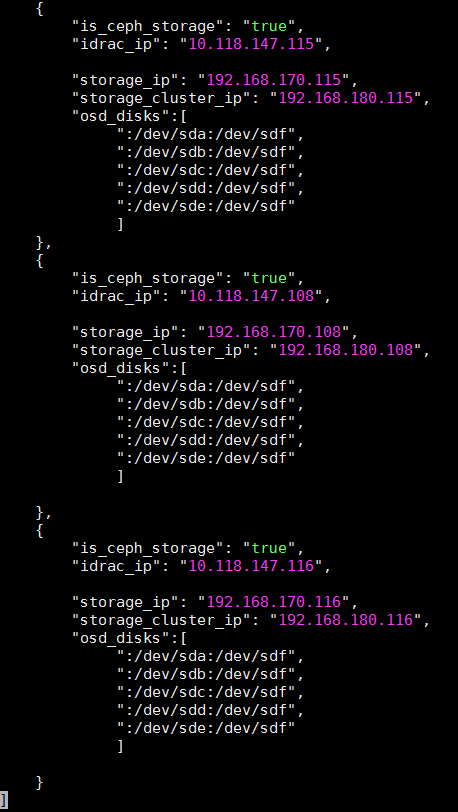


Also in the assign_role.py, small tweak was done by changing SSD as media_type_filter instead of HDD. This is required since we are using all SSDs disk for Ceph OSDs.

<a href="https://github.com/dsp-jetpack/JetPack/blob/master/src/pilot/assign_role.py#L517" target="_blank">https://github.com/dsp-jetpack/JetPack/blob/master/src/pilot/assign_role.py#L517</a>


### Sample xSP.ini file

```yaml
# Copyright (c) 2015-2018 Dell Inc. or its subsidiaries.
#
# Licensed under the Apache License, Version 2.0 (the "License");
# you may not use this file except in compliance with the License.
# You may obtain a copy of the License at
#
#     http://www.apache.org/licenses/LICENSE-2.0
#
# Unless required by applicable law or agreed to in writing, software
# distributed under the License is distributed on an "AS IS" BASIS,
# WITHOUT WARRANTIES OR CONDITIONS OF ANY KIND, either express or implied.
# See the License for the specific language governing permissions and
# limitations under the License.

###########################################################################
#                                                                         #
# Copy and rename this file for your own stamp.                           #
# Review ALL settings below, pay particular attention to paths/ip's etc.. #
#                                                                         #
###########################################################################


[Network Settings]

# Nova public network details
public_api_network=192.168.190.0/24
public_api_vlanid=190
public_api_gateway=192.168.190.1
public_api_netmask=255.255.255.0
public_api_allocation_pool_start=192.168.190.121
public_api_allocation_pool_end=192.168.190.250
name_server=8.8.8.8

# Private API network details
private_api_network=192.168.140.0/24
private_api_vlanid=140
private_api_netmask=255.255.255.0
private_api_allocation_pool_start=192.168.140.121
private_api_allocation_pool_end=192.168.140.250

# Storage network details
storage_network=192.168.170.0/24
storage_vlanid=170
storage_netmask=255.255.255.0
storage_allocation_pool_start=192.168.170.125
storage_allocation_pool_end=192.168.170.250

# Provisioning network details
provisioning_network=192.168.120.0/24
provisioning_vlanid=120
provisioning_netmask=255.255.255.0
provisioning_gateway=192.168.120.1
provisioning_net_dhcp_start=192.168.120.121
provisioning_net_dhcp_end=192.168.120.250
discovery_ip_range=192.168.120.21,192.168.120.120

# Storage cluster network details
storage_cluster_network=192.168.180.0/24
storage_cluster_vlanid=180
storage_cluster_allocation_pool_start=192.168.180.121
storage_cluster_allocation_pool_end=192.168.180.250

# Management network details
# Make sure the SAH node iDRAC ip defined in the .properties
# is NOT within the allocation pool below.
management_network=192.168.110.0/24
management_vlanid=110
management_netmask=255.255.255.0
management_gateway=192.168.110.1
management_allocation_pool_start=192.168.110.100
management_allocation_pool_end=192.168.110.199

# Tenant network details
# Not used unless you wish to configure Generic Routing Encapsulation (GRE) networks.
tenant_tunnel_network=192.168.130.0/24
tenant_tunnel_network_allocation_pool_start=192.168.130.121
tenant_tunnel_network_allocation_pool_end=192.168.130.250
tenant_tunnel_network_vlanid=130

# Nova Private network details
tenant_vlan_range=201:250


[MTU Settings]

# The mtu_selection setting defines whether to use the "global" or "per_network" option. 
# If the mtu_selection is defined as "global", the mtu value for all networks will be set to the value provided in mtu_size_global_default. The supported value must be within the range of 1500-9000.
# If "per_network" mtu_selection is defined, the user should provide an mtu value for each network in the range of 1500-9000.
# For "public_api_network_mtu" and "floating_ip_network_mtu" networks, mtu sizes greater than 1500 is only supported if jumbo frames are enabled on upstream routers.
mtu_selection=global 
mtu_size_global_default=1500
public_api_network_mtu=1500
floating_ip_network_mtu=1500
private_api_network_mtu=1500
tenant_network_mtu=1500
storage_cluster_network_mtu=1500
storage_network_mtu=1500
tenant_tunnel_network_mtu=1500

[Vips Settings]

# Use static VIPs ip addresses for the overcloud
use_static_vips=true

# The following VIP settings apply if the above use_static_vips is enabled.

# VIP for the redis service on the Private API api network
# Note that this IP must lie outside the private_api_allocation_pool_start/end
# range
redis_vip=192.168.140.251

# VIP for the provisioning network
# Note that this IP must lie outside the provisioning_net_dhcp_start/end range
provisioning_vip=192.168.120.251

# VIP for the Private API network
# Note that this IP must lie outside the private_api_allocation_pool_start/end
# range
private_api_vip=192.168.140.252

# VIP for the Public API network
# Note that this IP must lie outside the public_api_allocation_pool_start/end
# range
public_api_vip=192.168.190.251

# VIP for the Storage network
# Note that this IP must lie outside the storage_allocation_pool_start/end
# range
storage_vip=192.168.170.251

# VIP for the Storage cluster network
# The Storage Clustering network is not connected to the controller nodes,
# so the VIP for this network must be mapped to the provisioning network
# Note that this IP must lie outside the provisioning_net_dhcp_start/end range
storage_cluster_vip=192.168.120.252


[Subscription Manager Settings]

# Subscription Manager account info for registering Red Hat subscriptions
subscription_manager_user=xxxxxxx
subscription_manager_password=xxxxxxxxxxxxxx

# The following pool IDs provide different collections of repositories.
# Each is labeled with possible subscription names.

# Red Hat Enterprise Linux (Physical Node)
subscription_manager_pool_sah=xxxxxxxxxxxxxxxxxxxxxxxxxxxx44f5

# Red Hat Enterprise Linux OpenStack Platform (Virtual Node)
subscription_manager_pool_vm_rhel=xxxxxxxxxxxxxxxxxxxxxxxxxxxx454a

# Red Hat Ceph Storage (Physical Node)
subscription_manager_vm_ceph=xxxxxxxxxxxxxxxxxxxxxxxxxxxx7826

subscription_check_retries=20


[Nodes Nics and Bonding Settings]

sah_bond_opts=mode=802.3ad miimon=100 xmit_hash_policy=layer3+4 lacp_rate=1

# NIC environment file
#       1. To enable standard XSP profile or standard CSP profile (NUMA and HugePages):
#          For 5 ports, choose 5_port/nic_environment.yaml. 
#          For 4 ports, choose 4_port/nic_environment.yaml.
#       2. To enable OVS-DPDK with 7 nic ports, choose ovs-dpdk_7_port/nic_environment.yaml.
#          For 9 ports, choose ovs-dpdk_9_port/nic_enviornment.yaml.
#       3. To enable SR-IOV with 7 nic ports, choose sriov_7_port/nic_environment.yaml.
#          For 9 ports, choose sriov_9_port/nic_enviornment.yaml.
#       4. To enable OVS-DPDK (2-ports) and SR-IOV (2-ports), choose ovs-dpdk_sriov_9_port/nic_environment.yaml.
#       5. To enable DVR, for Storage and Floating networks that share a single bond, choose 5_port/nic_environment.yaml.
#          If a separate bond is required for Floating network on compute nodes, choose dvr_7_port/nic_environment.yaml.
nic_env_file=5_port/nic_environment.yaml

# Interfaces and bonding options per node type.
# When using any 4 port NIC configuration, comment out or delete the
# ControllerProvisioningInterface line below.
ControllerProvisioningInterface=em3
ControllerBond0Interface1=em1
ControllerBond0Interface2=p1p1
ControllerBond1Interface1=em2
ControllerBond1Interface2=p1p2
ControllerBondInterfaceOptions=mode=802.3ad miimon=100 xmit_hash_policy=layer3+4 lacp_rate=1

# When using any 4 port NIC configuration, comment out or delete the
# ComputeProvisioningInterface line below.
ComputeProvisioningInterface=em3
ComputeBond0Interface1=em1
ComputeBond0Interface2=p1p1
ComputeBond1Interface1=em2
ComputeBond1Interface2=p1p2
ComputeBondInterfaceOptions=mode=802.3ad miimon=100 xmit_hash_policy=layer3+4 lacp_rate=1

# When using any 4 port NIC configuration, comment out or delete the
# StorageProvisioningInterface line below.
StorageProvisioningInterface=em3
StorageBond0Interface1=em1
StorageBond0Interface2=p2p1
StorageBond1Interface1=em2
StorageBond1Interface2=p2p2
StorageBondInterfaceOptions=mode=802.3ad miimon=100 xmit_hash_policy=layer3+4 lacp_rate=1

# To enable standalone OVS-DPDK, two or four interfaces should be used.
# For two interfaces, uncomment 'ComputeOvsDpdkInterface1', 'ComputeOvsDpdkInterface2' and 'BondInterfaceOvsOption'.
# For four interfaces, uncomment all four interfaces and 'BondInterfaceOvsOption'.
# The following lines should be commented out  if ovs_dpdk_enable is set to false
#ComputeOvsDpdkInterface1=p2p1
#ComputeOvsDpdkInterface2=p3p1
#ComputeOvsDpdkInterface3=p2p2
#ComputeOvsDpdkInterface4=p3p2
#BondInterfaceOvsOptions=bond_mode=balance-tcp lacp=active

# To enable standalone SR-IOV, two or four interfaces should be used.
# For two interfaces, uncomment 'ComputeSriovInterface1' and 'ComputeSriovInterface2'.
# For four interfaces, uncomment all four interfaces.
# Following lines should be commented out if sriov_enable is set to false
#ComputeSriovInterface1=p1p1
#ComputeSriovInterface2=p4p1
#ComputeSriovInterface3=p1p2
#ComputeSriovInterface4=p4p2

# To enable SR-IOV and OVS-DPDK, four interfaces should be used.
# Following lines should be uncommented if both sriov_enable and ovs-dpdk_enable are set to true.
#ComputeSriovInterface1=p1p1
#ComputeSriovInterface2=p4p1
#ComputeOvsDpdkInterface1=p2p1
#ComputeOvsDpdkInterface2=p3p1
#BondInterfaceOvsOptions=bond_mode=balance-tcp lacp=active

# To enable DVR with a separate bond for Floating network on compute nodes, two interfaces should be used.
# To use the two interfaces, uncomment 'ComputeBond2Interface1' and 'ComputeBond2Interface2'.
# Following lines should be commented out if dvr_enable is set to false.
#ComputeBond2Interface1: p3p1
#ComputeBond2Interface2: p1p2

[Dell NFV Settings]

#Enter value of enable_hpg as true/false for HugePages
hpg_enable=false
#User should give this parameter in same format.
#Supported values for hpg_size(Size of hugepages) is 2MB and 1 GB.
#The number of hugepages will be calculated dynamically.
hpg_size=1GB

#Enter value of enable_numa as true/false for NUMA
numa_enable=false

# OVS-DPDK Settings
# Set the following option to true/false
ovs_dpdk_enable=false

#Enter number of cores you want to reserve for Host OS
#Supported values are 2,4,6,8
numa_hostos_cpu_count=4

# SRIOV Settings
# Set the following option to true/false for SRIOV
sriov_enable=false

#Enter the number of VFs you want to create per port
#Supported values are between 1-64
sriov_vf_count=64

# Set to true to enable DVR
dvr_enable=false


[Performance and Optimization]

# mariadb_max_connections takes value from 1000 to 100000, it is mandatory.
mariadb_max_connections = 15360

# MariaDB innodb_buffer_pool_size should be given value in GB, Example : 64G.
# Default is 'dynamic' which assigns 75% ram size of controller node.
# Note that innodb_buffer_pool_size should be less than available ram size.
innodb_buffer_pool_size = dynamic

# innodb_buffer_pool_instances takes value from 8 to 48
innodb_buffer_pool_instances = 16

[IPMI credentials Settings]

# DRAC credentials with IPMI privilege for the SAH node
sah_ipmi_user=root
sah_ipmi_password=xxxxxxx

# DRAC credentials with IPMI privilege for the overcloud nodes
ipmi_user=root
ipmi_password=xxxxxxx
# A password to change to on overcloud nodes if desired
new_ipmi_password=


[Deployment Settings]

# valid values are csp, xsp and custom.
profile=xsp

# This pathname must be the full path to the properties file which
# describes the cluster. You should copy *this* sample settings file
# (sample.ini) and the sample properties file (sample.properties) to
# another directory, and customize them for your cluster. Then use the
# path to your customized properties file here.
cluster_nodes_configuration_file=/root/acme.properties

# User for the undercloud/overcloud installation
director_install_user=osp_admin
director_install_user_password=xxxxxxx

# Name of the Overcloud.
# The nodes hostnames will be prepended with the given name and a dash
overcloud_name=overcloud

# Domain name for the cluster (i.e., mycluster.lab)
domain=domain.net

# Optional : root passord for the overcloud nodes, no password is set if left empty
overcloud_nodes_pwd=

# , separated list of ntp servers
ntp_servers=0.centos.pool.ntp.org,1.centos.pool.ntp.org,2.centos.pool.ntp.org,3.centos.pool.ntp.org
time_zone=America/Chicago

# Use static ip adresses for the overcloud nodes if set to true (ips need to be defined in the .properties)
# Use dhcp if set to false (ips not required in the .properties)
overcloud_static_ips=true

# Set to true to enable cinder backend of Ceph for storage.
enable_rbd_backend=true

# Set to true to enable Nova usage of Ceph for ephemeral storage.
# If set to false, Nova uses the storage local to the compute.
enable_rbd_nova_backend=true

# Set the glance backend. Vaules are file, rbd, swift or cinder
glance_backend=rbd

# Set to false to disable fencing
enable_fencing=true


[Storage back-end Settings]

# Compellent parameters. See the Software Deployment Guide for description of the parameters.
enable_dellsc_backend=false
dellsc_backend_name=CHANGEME
dellsc_api_port=3033
dellsc_iscsi_ip_address=CHANGEME
dellsc_iscsi_port=3260
dellsc_san_ip=CHANGEME
dellsc_san_login=CHANGEME
dellsc_san_password=CHANGEME
dellsc_ssn=CHANGEME
dellsc_server_folder=cmpl_iscsi_servers
dellsc_volume_folder=cmpl_iscsi_volumes


[Sanity Test Settings]

# If you want the sanity script to run on deployment completion (Appendix C, etc.), you may do so.
run_sanity=false

floating_ip_network=192.168.191.0/24
floating_ip_network_start_ip=192.168.191.20
floating_ip_network_end_ip=192.168.191.59
floating_ip_network_gateway=192.168.191.1
floating_ip_network_vlan=191
sanity_tenant_network=192.168.201.0/24
sanity_user_password=s@n1ty
sanity_user_email=someone@somewhere.com
sanity_key_name=sanity

# The number of instances to spin up in nova.
# Note that this will be limited by the instance quota in OpenStack, which is
# 10 by default.
# Note: One additional instance will be created for vlan-aware testing. Maximum
# number of instances can be 9 unless the quota is increased.
sanity_number_instances=1
sanity_image_url=http://cloud.centos.org/centos/7/images/CentOS-7-x86_64-GenericCloud.qcow2

# vlan-aware specific parameters
# address of vlan-network where subport is attached
sanity_vlantest_network=192.168.216.0/24


[Tempest Settings]

# If you want to run Tempest post-deployment, you may do so. The sanity script must also run to create networks for Tempest.
run_tempest=false
tempest_smoke_only=true


[Advanced Settings]

#The following settings should typically only be used by developers

# Only developers should set to false.
enable_version_locking=true

# The list of RHSM repositories to enable to access the product.  Repos should
# be comma separated.
# Note that this parameter is defaulted as shown below when commented out or
# not specified.  It should not be necessary to change it from the default in
# most cases.
rhsm_repos=rhel-7-server-openstack-13-rpms,rhel-7-server-openstack-13-devtools-rpms,rhel-7-server-rhceph-3-tools-rpms

# Option below is to use a custom instack.json and skip discover_nodes
use_custom_instack_json=false
custom_instack_json=n/a

# Indicates if the deploy-overcloud.py script should be run in debug mode
deploy_overcloud_debug=false

use_internal_repo=false
# Semi-colon ( ; ) separated list of internal repos to use, if needed.
internal_repos_locations=CHANGEME_INTERNAL_REPO_URL

cloud_repo_dir=/root/JetPack
rhel_iso=/root/rhel76.iso

# Overcloud deployment timeout value - default is 120mns, but can be tweaked here if required.
overcloud_deploy_timeout=120

# Default driver is DRAC.
use_ipmi_driver=false

# Default introspection method is out-of-band.
# Note that out-of-band introspection is only supported by the DRAC driver.  If
# use_ipmi_driver is set to "true" above then in-band introspection will be
# used regardless of the value below.
use_in_band_introspection=false

# RDO cloud images
# Available to download @ https://access.redhat.com/downloads/content/191/ver=8/rhel---7/8/x86_64/product-software
discovery_ram_disk_image=/pathto/discovery-ramdisk-7.1.0-39.tar
overcloud_image=/pathto/overcloud-full-7.1.0-39.tar
# if option below is enabled, images will be pulled fom the cdn (and the above x2 settings ignored)
pull_images_from_cdn=true

# Occasionally there can be problems with Subscription Manager
# and a node may be properly registered yet "subscription manager status"
# will return "Unknown"  which will cause checks to fail.
# Setting this to false will skip SM checks to get around this issue.
verify_rhsm_status=true

```


### Sample xSP/CSP profile file differences

The sample xSP and CSP profile files are very similar. The primary differences between them are that the CSP profile has various NFV features enabled, while the xSP profile has these features disabled.

The following features are enabled by default in the CSP profile and disabled in the xSP profile:

* Huge pages (hpg_enable)
* NUMA (numa_enable)
* OVS-DPDK
* DVR
* MTU (Can be enabled on both CSP and xSP Profiles)

See the JetPack open source repository for the entire content of each file, or if doing an automated install, see the ~/JetPack/src/deploy/osp_deployer/settings directory on the SAH node.


<div style="page-break-after: always;"></div>

# Appendix K Solution validation overview 

Validation of the complete solution is based on the hardware in the Ready Architecture, as defined in the Dell EMC Ready Architecture for Red Hat OpenStack Platform - Architecture Guide - Version 13, the JetPack software, and utilizes several tools to ensure the functionality of the solution. In addition, the Solution, once validated, is listed by the OpenStack Foundation (https://www.openstack.org/marketplace/distros/distribution/emc/dell-emc-ready-arch-for-red-hat-openstack) as a certified . 


### Solution validation hardware

**Hardware components used in the solution include:**

* Node 1: Dell EMC PowerEdge R640 Solution Admin Host with the Red Hat OpenStack Platform Director and the Red Hat Ceph Storage Dashboard Installed
* Nodes 2 - 4: Dell EMC PowerEdge R640 OpenStack Controllers
* Nodes 5 - 7 Dell EMC PowerEdge R640 Nova Compute Nodes
* Nodes 8 - 10: Dell EMC PowerEdge R740xd Storage Nodes
* Dell Networking S3048-ON Switch
* Dell Networking S4048-ON Switch
* Dell Networking S5248F Switch


### Solution validation tools and certifications

#### The tools used to validate the deployed solution include:

	OpenStack Tempest Test Suite
	Deployment Scripted RHOSP Sanity Test
	Solution RefStack submission https://refstack.openstack.org/#/results/87e12c62-d3d1-4eea-a0fa-5de89a4815d9 for OpenStack Powered Compute

#### The certification listing of the solution is listed on the OpenStack marketplace at:

	https://www.openstack.org/marketplace/distros/distribution/emc/dell-emc-ready-bundle-for-red-hat-openstack

### Tempest Results

Results of a full Tempest run:

```bash
Ran: 2089 tests in 3559.522 sec.
	Passed: 1776
	Skipped: 296
	Expected Fail: 0
	Unexpected Success: 0
	Failed: 17
```


### Test results from deployment validation sanity

	> Note: the log output below is for guidance only.

#### Results of a complete run of the deployment scripted RHOSP sanity test:

```bash
2018-10-13 14:20:13: INFO: ###Appendix-C Openstack Operations Functional Test ###
2018-10-13 14:20:13: INFO: ### Random init stuff
2018-10-13 14:20:13: INFO: ### Collecting SSH keys... ###

2018-10-13 14:20:13: INFO: Executing: /home/osp_admin/pilot/ update_ssh_config.py
2018-10-13 14:20:17: INFO: setting admin scope with: ~/MHTR18BLKrc.
2018-10-13 14:20:17: INFO: ### sourcing ~/MHTR18BLKrc
2018-10-13 14:20:17: INFO: ### PCS Status
 


Warning: Permanently added '192.168.120.138' (ECDSA) to the list of known hosts.


Cluster name: tripleo_cluster
Stack: corosync

Current DC: mhtr18blk-controller-1 (version 1.1.16-12.el7_4.2-94ff4df) - partition with quorum
Last updated: Fri Oct 13 18:20:17 2017

Last change: Fri Oct 13 16:06:52 2017 by root via cibadmin on mhtr18blk-controller-2

3 nodes configured
22 resources configured

Online: [ mhtr18blk-controller-0 mhtr18blk-controller-1 mhtr18blk-controller-2 ]

Full list of resources:

ip-192.168.140.211 (ocf::heartbeat:IPaddr2): Started mhtr18blk-controller-0
Clone Set: haproxy-clone [haproxy]

Started: [ mhtr18blk-controller-0 mhtr18blk-controller-1 mhtr18blk-controller-2 ]
Master/Slave Set: galera-master [galera]

Masters: [ mhtr18blk-controller-0 mhtr18blk-controller-1 mhtr18blk-controller-2 ]
ip-192.168.120.211 (ocf::heartbeat:IPaddr2): Started mhtr18blk-controller-1
ip-192.168.120.210 (ocf::heartbeat:IPaddr2): Started mhtr18blk-controller-2
ip-192.168.140.210 (ocf::heartbeat:IPaddr2): Started mhtr18blk-controller-0
Clone Set: rabbitmq-clone [rabbitmq]

Started: [ mhtr18blk-controller-0 mhtr18blk-controller-1 mhtr18blk-controller-2 ]
ip-192.168.170.210 (ocf::heartbeat:IPaddr2): Started mhtr18blk-controller-1
Master/Slave Set: redis-master [redis]
Masters: [ mhtr18blk-controller-1 ]
Slaves: [ mhtr18blk-controller-0 mhtr18blk-controller-2 ]
ip-100.84.122.62 (ocf::heartbeat:IPaddr2): Started mhtr18blk-controller-2
openstack-cinder-volume (systemd:openstack-cinder-volume): Started
mhtr18blk-controller-0
mhtr18blk-controller-0-ipmi (stonith:fence_ipmilan): Started
mhtr18blk-controller-1-ipmi (stonith:fence_ipmilan): Started

mhtr18blk-controller-2-ipmi (stonith:fence_ipmilan): Started Daemon Status:
corosync: active/enabled
pacemaker: active/enabled
pcsd: active/enabled

Warning: Permanently added '192.168.120.138' (ECDSA) to the list of known hosts.

2018-10-13 14:20:18: INFO: ###Ensure db and rabbit services are in the active state

Warning: Permanently added '192.168.120.138' (ECDSA) to the list of known hosts.

rabbitmq	78093	0.0	0.0	44728	732	?	S	15:34	0:00	/usr/
lib64/erlang/erts-7.3.1.3/bin/epmd	-daemon				
root	97942	0.0	0.0	11636	1352	?	Ss	15:38	0:00 sh -
c /usr/sbin/rabbitmq-server	> /var/log/rabbitmq/startup_log 2> /var/log/
rabbitmq/startup_err								
root	97950	0.0	0.0	11636	1436	?	S	15:38	0:00	/bin/sh /
usr/sbin/rabbitmq-server							
root	97972	0.0	0.0	86120	2312	?	S	15:38	0:00	su
rabbitmq -s /bin/sh -c /usr/lib/rabbitmq/bin/rabbitmq-server		
 


rabbitmq	97974	0.0	0.0	9516  1452 ?	Ss	15:38	0:00 /bin/sh -
e /usr/lib/rabbitmq/bin/rabbitmq-server			
rabbitmq	98240	12.1	0.2	22607776 587808 ?	Sl	15:38	19:40 /usr/
lib64/erlang/erts-7.3.1.3/bin/beam.smp -W w -A 768 -K true -P 1048576
-K true -B i --	-root	/usr/lib64/erlang -progname erl -- -home /
var/lib/rabbitmq	-- -pa /usr/lib/rabbitmq/lib/rabbitmq_server-3.6.3/
ebin -noshell -noinput	-s rabbit boot -sname rabbit@mhtr18blk-

controller-2 -boot start_sasl -config /etc/rabbitmq/rabbitmq -kernel
inet_default_connect_options [{nodelay,true},{raw,6,18,<<5000:64/native>>}]
-kernel inet_default_listen_options [{raw,6,18,<<5000:64/native>>}] -
kernel inet_default_connect_options [{nodelay,true}] -rabbit tcp_listeners
[{"192.168.140.11",5672}] -sasl errlog_type error -sasl sasl_error_logger
false -rabbit error_logger {file,"/var/log/rabbitmq/rabbit@mhtr18blk-
controller-2.log"} -rabbit sasl_error_logger {file,"/var/log/rabbitmq/
rabbit@mhtr18blk-controller-2-sasl.log"} -rabbit enabled_plugins_file
"/etc/rabbitmq/enabled_plugins" -rabbit plugins_dir "/usr/lib/rabbitmq/
lib/rabbitmq_server-3.6.3/plugins" -rabbit plugins_expand_dir "/var/lib/
rabbitmq/mnesia/rabbit@mhtr18blk-controller-2-plugins-expand" -os_mon
start_cpu_sup false -os_mon start_disksup false -os_mon start_memsup false
-mnesia dir "/var/lib/rabbitmq/mnesia/rabbit@mhtr18blk-controller-2"
rabbitmq	99235	0.0	0.0	11544	448	?	Ss	15:38	0:00
inet_gethost 4								
rabbitmq	99237	0.0	0.0	13668	656	?	S	15:38	0:00
inet_gethost 4								
root	918767	0.0	0.0	115516	1860	?	S	18:20	0:00 /bin/sh /
usr/lib/ocf/resource.d/heartbeat/rabbitmq-cluster monitor	
root	918798	0.0	0.0	11636	1436	?	S	18:20	0:00 /bin/sh /
usr/sbin/rabbitmqctl cluster_status					
root	918809	0.0	0.0	86120	2308	?	S	18:20	0:00 su
rabbitmq	-s /bin/sh -c /usr/lib/rabbitmq/bin/rabbitmqctl	'cluster_status'
rabbitmq	918810	31.0	0.0	4085264	70388 ?	Ssl	18:20	0:00 /usr/
lib64/erlang/erts-7.3.1.3/bin/beam.smp -B -- -root /usr/lib64/erlang -
progname erl -- -home /var/lib/rabbitmq	-- -pa /usr/lib/rabbitmq/lib/
rabbitmq_server-3.6.3/ebin	-noshell -noinput -hidden -boot start_clean -sasl

errlog_type error -mnesia dir "/var/lib/rabbitmq/mnesia/rabbit@mhtr18blk-controller-2" -s rabbit_control_main -nodename rabbit@mhtr18blk-controller-2
-extra cluster_status									
rabbitmq  918967	0.0	0.0	4143452	60016 ?	Ssl	18:20	0:00 /usr/
lib64/erlang/erts-7.3.1.3/bin/beam.smp --	-root /usr/lib64/erlang -progname
erl -- -home /var/lib/rabbitmq -- -sname	epmd-starter-815754527 -proto_dist
"inet_tcp" -noshell -eval	halt().							
heat-ad+  919052	0.0	0.0	113128	1512	?		Ss	18:20	0:00	bash -c
sudo ps aux | grep rabbit								
heat-ad+  919060	0.0	0.0	112664	940	?		S	18:20	0:00	grep
rabbit										
Warning: Permanently added '192.168.120.138' (ECDSA) to the list of known
hosts.			
root	93950	1  0 15:37 ?	00:00:00 /bin/sh /usr/bin/

mysqld_safe --defaults-file=/etc/my.cnf --pid-file=/var/run/mysql/mysqld.pid --socket=/var/lib/mysql/mysql.sock --datadir=/var/lib/mysql --log-error=/ var/log/mysqld.log --user=mysql --open-files-limit=16384 --wsrep-cluster-address=gcomm://
mysql	94902	93950	0 15:37 ?	00:00:42 /usr/libexec/mysqld
--defaults-file=/etc/my.cnf --basedir=/usr --datadir=/var/lib/mysql
--plugin-dir=/usr/lib64/mysql/plugin --user=mysql --wsrep-provider=/

usr/lib64/galera/libgalera_smm.so --wsrep-cluster-address=gcomm:// -- log-error=/var/log/mysqld.log --open-files-limit=16384 --pid-file=/var/ run/mysql/mysqld.pid --socket=/var/lib/mysql/mysql.sock --port=3306 -- wsrep_start_position=00000000-0000-0000-0000-000000000000:-1
heat-ad+	919087	919071	0	18:20	?	00:00:00	bash	-c ps -ef | grep
mysqld								
heat-ad+	919095	919087	0	18:20	?	00:00:00	grep	mysqld
 


Warning: Permanently added '192.168.120.138' (ECDSA) to the list of known hosts.


heat-ad+	919212	919168	0	18:20	?	00:00:00	bash	-c ps -ef | grep
mariadb								
heat-ad+	919270	919212	0	18:20	?	00:00:00	grep	mariadb
2018-10-13 14:20:18: INFO: ### CREATION MODE
2018-10-13 14:20:18: INFO: ### Getting unique names
2018-10-13 14:20:18: INFO: setting admin scope with: ~/MHTR18BLKrc.
2018-10-13 14:20:18: INFO: ### sourcing ~/MHTR18BLKrc
2018-10-13 14:20:19: INFO: Generating sanityrc file.
2018-10-13 14:20:19: INFO: ### Setting up new project sanity1
2018-10-13 14:20:19: INFO: setting admin scope with: ~/MHTR18BLKrc.

2018-10-13 14:20:19: INFO: ### sourcing ~/MHTR18BLKrc No tenant with a name or ID of 'sanity1' exists.
2018-10-13 14:20:20: INFO: Executing: openstack project create sanity1
+-------------	+	----------------------------------	+
| Field	|	Value	|
+-------------	+	----------------------------------	+
| description |	None	|
| enabled	|	True	|
| id	|	26c77e1e763b4fecbc1833b9284e4986 |
| name	|	sanity1	|
+-------------	+	----------------------------------	+

2018-10-13 14:20:21: INFO: Executing: openstack user create --project sanity1 --password <<PASSWORD>> --email someone@somewhere.com sanity1
+------------	+	----------------------------------	+
| Field	|	Value	|
+------------	+	----------------------------------	+
| email	|	someone@somewhere.com	|
| enabled	|	True	|
| id	|	4442207de58448938694bdbd7b764cf4 |
| name	|	sanity1	|
| project_id |	26c77e1e763b4fecbc1833b9284e4986 |
| username	|	sanity1	|
+------------	+	----------------------------------	+
2018-10-13 14:20:21: INFO: ### Creating the Networks ####
2018-10-13 14:20:21: INFO: setting admin scope with: ~/MHTR18BLKrc.
2018-10-13 14:20:21: INFO: ### sourcing ~/MHTR18BLKrc
2018-10-13 14:20:22: INFO: Executing: openstack network create --share
tenant_net1		
+---------------------------	+--------------------------------------	+
| Field	| Value	|
+---------------------------	+--------------------------------------	+
| admin_state_up	| UP	|
| availability_zone_hints	|	|
| availability_zones	|	|
| created_at	| 2018-10-13T18:20:23Z	|
| description	|	|
| headers	|	|
| id	| e8e22aaf-0ee9-4c82-a295-f02788e97e8f |
| ipv4_address_scope	| None	|
| ipv6_address_scope	| None	|
| mtu	| 1496	|
| name	| tenant_net1	|
| port_security_enabled	| True	|
| project_id	| 4790c5b2d4c64f6e9d6c367bc0b8b069	|
| project_id	| 4790c5b2d4c64f6e9d6c367bc0b8b069	|
| provider:network_type	| vlan	|
| provider:physical_network	| physint	|
| provider:segmentation_id	| 237	|
| qos_policy_id	| None	|
| revision_number	| 3	|
| router:external	| Internal	|
| shared				| True	|
| status				| ACTIVE	|
| subnets				|	|
| tags				| []	|
| updated_at				| 2018-10-13T18:20:23Z	|
+---------------------------			+--------------------------------------	+
2018-10-13 14:20:24: INFO: Executing: neutron subnet-create tenant_net1
192.168.201.0/24 --name tenant_2011	
Created a new subnet:				
+-------------------	+	------------------------------------------------------		+
| Field	|	Value		|
+-------------------	+	------------------------------------------------------		+
| allocation_pools	|	{"start": "192.168.201.2", "end": "192.168.201.254"} |
| cidr	|	192.168.201.0/24	|
| created_at	|	2018-10-13T18:20:25Z	|
| description	|				|
| dns_nameservers	|				|
| enable_dhcp	|	True			|
| gateway_ip	|	192.168.201.1	|
| host_routes	|				|
| id	|	c8057c7b-777f-4f5d-bfe8-7d227da6c960	|
| ip_version	|	4			|
| ipv6_address_mode	|				|
| ipv6_ra_mode	|				|
| name	|	tenant_2011	|
| network_id	|	e8e22aaf-0ee9-4c82-a295-f02788e97e8f	|
| project_id	|	4790c5b2d4c64f6e9d6c367bc0b8b069	|
| revision_number	|	2			|
| service_types	|				|
| subnetpool_id	|				|
| tenant_id	|	4790c5b2d4c64f6e9d6c367bc0b8b069	|
| updated_at	|	2018-10-13T18:20:25Z	|
+-------------------	+	------------------------------------------------------		+
2018-10-13 14:20:26: INFO: Executing: neutron router-create	
tenant_201_router1					
Created a new router:				
+-------------------------		+	--------------------------------------	+
| Field			|	Value	|
+-------------------------		+	--------------------------------------	+
| admin_state_up			|	True	|
| availability_zone_hints |		|
| availability_zones		|		|
| created_at			|	2018-10-13T18:20:26Z	|
| description			|		|
| distributed			|	False	|
| external_gateway_info	|		|
| flavor_id			|		|
| ha			|	True	|
| id			|	5adcd390-b199-43cf-a32d-a708bcb1fb50 |
| name			|	tenant_201_router1	|
| project_id			|	4790c5b2d4c64f6e9d6c367bc0b8b069	|
| revision_number			|	3	|
| routes			|		|
| status			|	ACTIVE	|
| tenant_id			|	4790c5b2d4c64f6e9d6c367bc0b8b069	|
| updated_at			|	2018-10-13T18:20:26Z	|
+-------------------------		+	--------------------------------------	+
2018-10-13 14:20:29: INFO: Executing: neutron router-interface-add
tenant_201_router1	c8057c7b-777f-4f5d-bfe8-7d227da6c960	
Added interface 7e458d5e-7c68-4607-8f32-64470d6d0359 to router	
tenant_201_router1.				

2018-10-13 14:20:30: INFO: Executing: ssh -o StrictHostKeyChecking=no -o UserKnownHostsFile=/dev/null -o KbdInteractiveDevices=no heat-admin@192.168.120.138 sudo grep network_vlan_ranges /etc/neutron/plugin.ini
 

Warning: Permanently added '192.168.120.138' (ECDSA) to the list of known hosts.


#network_vlan_ranges =

network_vlan_ranges =physint:201:250,physext 2018-10-13 14:20:32: INFO: Executing: neutron net-create public -- router:external --provider:network_type vlan --provider:physical_network
physext --provider:segmentation_id 1223	
Created a new network:			
+---------------------------	+	--------------------------------------	+
| Field	|	Value	|
+---------------------------	+	--------------------------------------	+
| admin_state_up	|	True	|
| availability_zone_hints	|		|
| availability_zones	|		|
| created_at	|	2018-10-13T18:20:32Z	|
| description	|		|
| id	|	46cc68f3-0ee2-4ae1-8ee0-60ef6d89c0e6 |
| ipv4_address_scope	|		|
| ipv6_address_scope	|		|
| is_default	|	False	|
| mtu	|	1496	|
| name	|	public	|
| port_security_enabled	|	True	|
| project_id	|	4790c5b2d4c64f6e9d6c367bc0b8b069	|
| provider:network_type	|	vlan	|
| provider:physical_network |	physext	|
| provider:segmentation_id	|	1223	|
| qos_policy_id	|		|
| revision_number	|	4	|
| router:external	|	True	|
| shared	|	False	|
| status	|	ACTIVE	|
| subnets	|		|
| tags	|		|
| tenant_id	|	4790c5b2d4c64f6e9d6c367bc0b8b069	|
| updated_at	|	2018-10-13T18:20:32Z	|
+---------------------------	+	--------------------------------------	+
2018-10-13 14:20:32: INFO: Executing: neutron subnet-create --name	
external_sub --allocation-pool start=100.84.122.71,end=100.84.122.104 --	
gateway 100.84.122.65	--disable-dhcp public 100.84.122.64/26	
Created a new subnet:		
+-------------------	+	-----------------------------------------------------	+
| Field	|	Value	|
+-------------------	+	-----------------------------------------------------	+
| allocation_pools	|	{"start": "100.84.122.71", "end": "100.84.122.104"} |
| cidr	|	100.84.122.64/26	|
| created_at	|	2018-10-13T18:20:33Z	|
| description	|		|
| dns_nameservers	|		|
| enable_dhcp	|	False	|
| gateway_ip	|	100.84.122.65	|
| host_routes	|		|
| id	|	957798ec-ec62-435f-a7a7-7bd749cb5d6f	|
| ip_version	|	4	|
| ipv6_address_mode |		|
| ipv6_ra_mode	|		|
| name	|	external_sub	|
| network_id	|	46cc68f3-0ee2-4ae1-8ee0-60ef6d89c0e6	|
| project_id	|	4790c5b2d4c64f6e9d6c367bc0b8b069	|
| revision_number	|	2	|
| service_types	|		|
| subnetpool_id	|		|
| tenant_id	|	4790c5b2d4c64f6e9d6c367bc0b8b069	|
| updated_at	| 2018-10-13T18:20:33Z	|

+-------------------+-----------------------------------------------------+
2018-10-13 14:20:33: INFO: Executing: openstack network list
+--------------------------------------
+----------------------------------------------------
+--------------------------------------+
| ID	| Name
| Subnets	|
+--------------------------------------
+----------------------------------------------------
+--------------------------------------+
| 46cc68f3-0ee2-4ae1-8ee0-60ef6d89c0e6 | public

| 957798ec-ec62-435f-a7a7-7bd749cb5d6f | | 76ad3e74-7171-4a4f-9d80-4d452d469f14 | HA network tenant
	4790c5b2d4c64f6e9d6c367bc0b8b069 | c235034a-4403-4624-87c0-82ee742527ef |
| e8e22aaf-0ee9-4c82-a295-f02788e97e8f |	tenant_net1	
		| c8057c7b-777f-4f5d-bfe8-7d227da6c960 |	
+	--------------------------------------				
+	----------------------------------------------------				
+	--------------------------------------		+		
2018-10-13 14:20:34: INFO: Executing: openstack router list	
+	--------------------------------------		+	--------------------	+--------
+	-------+-------------	+------	+----------------------------------	+
| ID			|	Name	| Status | State
	| Distributed | HA	| Project	|	
+	--------------------------------------		+	--------------------	+--------
+	-------+-------------	+------	+----------------------------------	+
| 5adcd390-b199-43cf-a32d-a708bcb1fb50 |	tenant_201_router1 | ACTIVE | UP
	| False	| True | 4790c5b2d4c64f6e9d6c367bc0b8b069 |	
+	--------------------------------------		+	--------------------	+--------
+	-------+-------------	+------	+----------------------------------	+

2018-10-13 14:20:35: INFO: Executing: neutron router-gateway-set tenant_201_router1 public
Set gateway for router tenant_201_router1
2018-10-13 14:20:37: INFO: Setting tenant scope.
2018-10-13 14:20:39: INFO: ### Creating a Security Group ####

2018-10-13 14:20:39: INFO: Executing: neutron security-group-create sanity_security_group
Created a new security_group:
+----------------------
+--------------------------------------------------------------------------------------
+
| Field	| Value


|
+----------------------
+--------------------------------------------------------------------------------------
+
| created_at	| 2018-10-13T18:20:39Z


|
| description	|

|
| id	| 429d26ae-d018-41c8-9331-debd33bebbff


|
| name	| sanity_security_group


|
| project_id	| 26c77e1e763b4fecbc1833b9284e4986


|
| revision_number	| 1


|
| security_group_rules | {"remote_group_id": null, "direction":
"egress", "protocol": null, "description": null, "ethertype": "IPv4",
"remote_ip_prefix": null, "port_range_max": null, "updated_at":
"2018-10-13T18:20:39Z", "security_group_id": "429d26ae-d018-41c8-9331-
debd33bebbff", "port_range_min": null, "revision_number": 1,
"tenant_id": "26c77e1e763b4fecbc1833b9284e4986", "created_at":
"2018-10-13T18:20:39Z", "project_id": "26c77e1e763b4fecbc1833b9284e4986",
"id": "1aa1def6-9405-4b60-bf71-65cc4499859f"} |
|	| {"remote_group_id": null, "direction":
"egress", "protocol": null, "description": null, "ethertype": "IPv6",
"remote_ip_prefix": null, "port_range_max": null, "updated_at":
"2018-10-13T18:20:39Z", "security_group_id": "429d26ae-d018-41c8-9331-

debd33bebbff", "port_range_min": null, "revision_number": 1, "tenant_id": "26c77e1e763b4fecbc1833b9284e4986", "created_at": "2018-10-13T18:20:39Z", "project_id": "26c77e1e763b4fecbc1833b9284e4986", "id": "fc6fe44a-c8de-4cd3-9cf2-aa13ae770259"} |
| tenant_id	| 26c77e1e763b4fecbc1833b9284e4986


|
| updated_at	| 2018-10-13T18:20:39Z


|
+----------------------
+--------------------------------------------------------------------------------------
+
 


2018-10-13 14:20:39: INFO: Executing: neutron security-group-rule-create --direction ingress --ethertype IPv4 --protocol icmp --remote-ip-prefix

0.0.0.0/0 sanity_security_group	
Created a new security_group_rule:	
+-------------------	+--------------------------------------	+
| Field	| Value	|
+-------------------	+--------------------------------------	+
| created_at	| 2018-10-13T18:20:40Z	|
| description	|	|
| direction	| ingress	|
| ethertype	| IPv4	|
| id	| 282502a2-c60a-4e7d-b05d-2c079a5aeb0d |
| port_range_max	|	|
| port_range_min	|	|
| project_id	| 26c77e1e763b4fecbc1833b9284e4986	|
| protocol	| icmp	|
| remote_group_id	|	|
| remote_ip_prefix	| 0.0.0.0/0	|
| revision_number	| 1	|
| security_group_id	| 429d26ae-d018-41c8-9331-debd33bebbff |
| tenant_id	| 26c77e1e763b4fecbc1833b9284e4986	|
| updated_at	| 2018-10-13T18:20:40Z	|
+-------------------	+--------------------------------------	+
2018-10-13 14:20:40: INFO: Executing: neutron security-group-rule-create
--direction egress	--ethertype IPv4 --protocol icmp --remote-ip-prefix
0.0.0.0/0 sanity_security_group	
Created a new security_group_rule:	
+-------------------	+--------------------------------------	+
| Field	| Value	|
+-------------------	+--------------------------------------	+
| created_at	| 2018-10-13T18:20:41Z	|
| description	|	|
| direction	| egress	|
| ethertype	| IPv4	|
| id	| 2638d18f-9dd4-414b-988e-34de3f77a76e |
| port_range_max	|	|
| port_range_min	|	|
| project_id	| 26c77e1e763b4fecbc1833b9284e4986	|
| protocol	| icmp	|
| remote_group_id	|	|
| remote_ip_prefix	| 0.0.0.0/0	|
| revision_number	| 1	|
| security_group_id	| 429d26ae-d018-41c8-9331-debd33bebbff |
| tenant_id	| 26c77e1e763b4fecbc1833b9284e4986	|
| updated_at	| 2018-10-13T18:20:41Z	|
+-------------------	+--------------------------------------	+

2018-10-13 14:20:41: INFO: Executing: neutron security-group-rule-create -- direction ingress --ethertype IPv4 --protocol tcp --port-range-min 1 --port-range-max 65535 --remote-ip-prefix 0.0.0.0/0 sanity_security_group
Created a new security_group_rule:	
+-------------------	+--------------------------------------	+
| Field	| Value	|
+-------------------	+--------------------------------------	+
| created_at	| 2018-10-13T18:20:41Z	|
| description	|	|
| direction	| ingress	|
| ethertype	| IPv4	|
| id	| aaa2e0b0-f8ad-4f4f-ae25-a60cbb187af7 |
| port_range_max	| 65535	|
| port_range_min	| 1	|
| project_id	| 26c77e1e763b4fecbc1833b9284e4986	|
| protocol	| tcp	|
| remote_group_id	|	|
| remote_ip_prefix	| 0.0.0.0/0	|
 


| revision_number	|	1	|
| security_group_id |	429d26ae-d018-41c8-9331-debd33bebbff |
| tenant_id	|	26c77e1e763b4fecbc1833b9284e4986	|
| updated_at	|	2018-10-13T18:20:41Z	|
+-------------------	+	--------------------------------------	+

2018-10-13 14:20:41: INFO: Executing: neutron security-group-rule-create -- direction egress --ethertype IPv4 --protocol tcp --port-range-min 1 --port-range-max 65535 --remote-ip-prefix 0.0.0.0/0 sanity_security_group Created a new security_group_rule:
+-------------------	+	--------------------------------------	+
| Field	|	Value	|
+-------------------	+	--------------------------------------	+
| created_at	|	2018-10-13T18:20:42Z	|
| description	|		|
| direction	|	egress	|
| ethertype	|	IPv4	|
| id	|	c8627ddc-8100-4f11-8c30-40ace0d787b0 |
| port_range_max	|	65535	|
| port_range_min	|	1	|
| project_id	|	26c77e1e763b4fecbc1833b9284e4986	|
| protocol	|	tcp	|
| remote_group_id	|		|
| remote_ip_prefix	|	0.0.0.0/0	|
| revision_number	|	1	|
| security_group_id |	429d26ae-d018-41c8-9331-debd33bebbff |
| tenant_id	|	26c77e1e763b4fecbc1833b9284e4986	|
| updated_at	|	2018-10-13T18:20:42Z	|
+-------------------	+	--------------------------------------	+

2018-10-13 14:20:42: INFO: Executing: neutron security-group-rule-create -- direction ingress --ethertype IPv4 --protocol udp --port-range-min 1 --port-range-max 65535 --remote-ip-prefix 0.0.0.0/0 sanity_security_group
Created a new security_group_rule:	
+-------------------	+	--------------------------------------	+
| Field	|	Value	|
+-------------------	+	--------------------------------------	+
| created_at	|	2018-10-13T18:20:43Z	|
| description	|		|
| direction	|	ingress	|
| ethertype	|	IPv4	|
| id	|	96b5be98-091d-48cc-a7db-9386fc753306 |
| port_range_max	|	65535	|
| port_range_min	|	1	|
| project_id	|	26c77e1e763b4fecbc1833b9284e4986	|
| protocol	|	udp	|
| remote_group_id	|		|
| remote_ip_prefix	|	0.0.0.0/0	|
| revision_number	|	1	|
| security_group_id |	429d26ae-d018-41c8-9331-debd33bebbff |
| tenant_id	|	26c77e1e763b4fecbc1833b9284e4986	|
| updated_at	|	2018-10-13T18:20:43Z	|
+-------------------	+	--------------------------------------	+

2018-10-13 14:20:43: INFO: Executing: neutron security-group-rule-create -- direction egress --ethertype IPv4 --protocol udp --port-range-min 1 --port-range-max 65535 --remote-ip-prefix 0.0.0.0/0 sanity_security_group
Created a new security_group_rule:	
+-------------------	+--------------------------------------	+
| Field	| Value	|
+-------------------	+--------------------------------------	+
| created_at	| 2018-10-13T18:20:43Z	|
| description	|	|
| direction	| egress	|
| ethertype	| IPv4	|
| id	| f096278f-928c-4c0c-b90b-0af8775f110a |
| port_range_max	| 65535	|
| port_range_min	|	1		|		
| project_id	|	26c77e1e763b4fecbc1833b9284e4986	|		
| protocol	|	udp		|		
| remote_group_id	|			|		
| remote_ip_prefix	|	0.0.0.0/0		|		
| revision_number	|	1		|		
| security_group_id |	429d26ae-d018-41c8-9331-debd33bebbff |		
| tenant_id	|	26c77e1e763b4fecbc1833b9284e4986	|		
| updated_at	|	2018-10-13T18:20:43Z	|		
+-------------------	+	--------------------------------------	+		
2018-10-13 14:20:43: INFO: ### Setting up glance			
2018-10-13 14:20:43: INFO: setting admin scope with: ~/MHTR18BLKrc.	
2018-10-13 14:20:43: INFO: ### sourcing ~/MHTR18BLKrc			
2018-10-13 14:20:48: INFO: Executing: wget http://download.cirros-	
cloud.net/0.3.3/cirros-0.3.3-x86_64-disk.img			
--2018-10-13 14:20:48	--  http://download.cirros-cloud.net/0.3.3/		
cirros-0.3.3-x86_64-disk.img				
Resolving download.cirros-cloud.net (download.cirros-cloud.net)...	
64.90.42.85, 2607:f298:6:a036::bd6:a72a				
Connecting to download.cirros-cloud.net (download.cirros-cloud.net)|	
64.90.42.85|:80...	connected.				
HTTP request sent, awaiting response...	200 OK			
Length: 13200896 (13M) [text/plain]				
Saving to: ‘cirros-0.3.3-x86_64-disk.img’			
0K ..........	.......... .......... .......... ..........	0%	255K 50s
50K ..........	.......... .......... .......... ..........	0%	518K 37s
...						
...						
12850K ..........	.......... .......... .......... .	100%	
6.36M=5.3s						


2018-10-13 14:20:54 (2.37 MB/s) - ‘cirros-0.3.3-x86_64-disk.img’ saved [13200896/13200896]

2018-10-13 14:20:55: INFO: Executing: openstack image create --disk-format qcow2 --container-format bare --file cirros-0.3.3-x86_64-disk.img cirros --
public	
+------------------	
+--------------------------------------------------------------------------------------
+	
| Field	| Value
	|
+------------------	
+--------------------------------------------------------------------------------------
+	
| checksum	| 133eae9fb1c98f45894a4e60d8736619
	|
| container_format | bare
	|
| created_at	| 2018-10-13T18:20:56Z
	|
| disk_format	| qcow2


|
 

| file	| /v2/images/90dc3459-e253-49a5-b5fe-e403ce231110/file


|
| id	| 90dc3459-e253-49a5-b5fe-e403ce231110


|
| min_disk	| 0


|
| min_ram	| 0


|
| name	| cirros


|
| owner	| 4790c5b2d4c64f6e9d6c367bc0b8b069


|
| properties	| direct_url='rbd://de4de876-b026-11e7-9a09-525400a5b196/

images/90dc3459-e253-49a5-b5fe-e403ce231110/snap', locations='[{u'url': u'rbd://de4de876-b026-11e7-9a09-525400a5b196/images/90dc3459-e253-49a5-b5fe-e403ce231110/snap', u'metadata': {}}]' |
| protected	| False


|
| schema	| /v2/schemas/image


|
| size	| 13200896


|
| status	| active


|
| tags	|


|
| updated_at	| 2018-10-13T18:20:57Z


|
| virtual_size	| None


|
| visibility	| public


|
+------------------
+--------------------------------------------------------------------------------------
+
2018-10-13 14:20:58: INFO: Executing: openstack image list
 

+--------------------------------------	+--------	+--------	+
| ID	|	Name	| Status |
+--------------------------------------	+--------	+--------	+
| 90dc3459-e253-49a5-b5fe-e403ce231110 |	cirros	| active |
+--------------------------------------	+--------	+--------	+
2018-10-13 14:20:59: INFO: ### Setup Nova			

2018-10-13 14:21:00: INFO: Executing: openstack flavor create --ram 2048 --
vcpus 1 --disk 20 sanity_flavor		
+	----------------------------			+--------------------------------------	+
| Field				|	Value	|
+	----------------------------			+--------------------------------------	+
| OS-FLV-DISABLED:disabled	|	False	|
| OS-FLV-EXT-DATA:ephemeral	|	0	|
| disk				|	20	|
| id				|	3e2ad0a4-f094-457d-81ec-1f83a9a7f44d |
| name				|	sanity_flavor	|
| os-flavor-access:is_public	|	True	|
| properties			|		|
| ram				|	2048	|
| rxtx_factor			|	1.0	|
| swap				|		|
| vcpus				|	1	|
+	----------------------------			+--------------------------------------	+
2018-10-13 14:21:01: INFO: Setting tenant scope.	
2018-10-13 14:21:01: INFO: creating keypair sanity	
Generating public/private rsa key pair.	
Your identification	has been	saved in /home/osp_admin/sanity.	
Your public key has	been saved	in /home/osp_admin/sanity.pub.	
The key fingerprint	is:			
SHA256:kfQhn/uqx7XJ/nJgxVGCxhg2rNnLtctr6DSUZgAAfBA	
	osp_admin@director.mhtr18blk.dfr	
The key's randomart	image is:			
+	---[RSA 2048]----	+				
| .E+...	o.=+ ....|				
|	. .	o *o++ .. |				
|	.	+++. . . |				
|		oo.o. o	|				
|		S.*o o	|				
|		+o.=	|				
|		.o*.=	|				
|		.+oO .	|				
|		.+ooo=.	|				
+	----[SHA256]-----	+				
2018-10-13 14:21:01: INFO: loading sanity keypair into nova	
2018-10-13 14:21:05: INFO: ###	Initiating build of instances...	
2018-10-13 14:21:05: INFO: Executing: nova boot --security-groups	
	sanity_security_group --flavor sanity_flavor --key-name sanity --image
	90dc3459-e253-49a5-b5fe-e403ce231110 --nic net-id=e8e22aaf-0ee9-4c82-a295-
f02788e97e8f cirros_test_1
+--------------------------------------
+------------------------------------------------------+
| Property	| Value
|
+--------------------------------------
+------------------------------------------------------+
| OS-DCF:diskConfig	| MANUAL
|
| OS-EXT-AZ:availability_zone	|
|
| OS-EXT-STS:power_state	| 0
|
| OS-EXT-STS:task_state	| scheduling
|
 

| OS-EXT-STS:vm_state		|	building
|			
| OS-SRV-USG:launched_at	|	-
|			
| OS-SRV-USG:terminated_at	|	-
|			
| accessIPv4		|	
|			
| accessIPv6		|	
|			
| adminPass		|	RC7ECQKnjrsJ
|			
| config_drive		|	
|			
| created		|	2018-10-13T18:21:08Z
|			
| description		|	-
|			
| flavor		|	sanity_flavor (3e2ad0a4-
f094-457d-81ec-1f83a9a7f44d) |		
| hostId		|	
|			
| id		|	625b1245-445e-43d0-
b4ae-74a925cd95d0		|	
| image		|	cirros (90dc3459-e253-49a5-b5fe-
e403ce231110)	|		
| key_name		|	sanity
|			
| locked		|	False
|			
| metadata		|	{}
|			
| name		|	cirros_test_1
|			
| os-extended-volumes:volumes_attached |	[]
|			
| progress		|	0
|			
| security_groups		|	sanity_security_group
|			
| status		|	BUILD
|			
| tags		|	[]
|			
| tenant_id		|	26c77e1e763b4fecbc1833b9284e4986
|			
| updated		|	2018-10-13T18:21:08Z
|			
| user_id		|	4442207de58448938694bdbd7b764cf4
|			
+--------------------------------------		
+------------------------------------------------------		+
2018-10-13 14:21:09: INFO: Executing: nova boot --security-groups

sanity_security_group --flavor sanity_flavor --key-name sanity --image 90dc3459-e253-49a5-b5fe-e403ce231110 --nic net-id=e8e22aaf-0ee9-4c82-a295-
f02788e97e8f cirros_test_2
+--------------------------------------
+------------------------------------------------------+
| Property	| Value
|
+--------------------------------------
+------------------------------------------------------+
| OS-DCF:diskConfig	| MANUAL
|
| OS-EXT-AZ:availability_zone	|	
|			
| OS-EXT-STS:power_state	|	0
|			
| OS-EXT-STS:task_state	|	scheduling
|			
| OS-EXT-STS:vm_state		|	building
|			
| OS-SRV-USG:launched_at	|	-
|			
| OS-SRV-USG:terminated_at	|	-
|			
| accessIPv4		|	
|			
| accessIPv6		|	
|			
| adminPass		|	WKuE3wedfV49
|			
| config_drive		|	
|			
| created		|	2018-10-13T18:21:12Z
|			
| description		|	-
|			
| flavor		|	sanity_flavor (3e2ad0a4-
f094-457d-81ec-1f83a9a7f44d) |		
| hostId		|	
|			
| id		|	c18f6d9e-8a51-49e5-
bca7-95f44774798e		|	
| image		|	cirros (90dc3459-e253-49a5-b5fe-
e403ce231110)	|		
| key_name		|	sanity
|			
| locked		|	False
|			
| metadata		|	{}
|			
| name		|	cirros_test_2
|			
| os-extended-volumes:volumes_attached |	[]
|			
| progress		|	0
|			
| security_groups		|	sanity_security_group
|			
| status		|	BUILD
|			
| tags		|	[]
|			
| tenant_id		|	26c77e1e763b4fecbc1833b9284e4986
|			
| updated		|	2018-10-13T18:21:12Z
|			
| user_id		|	4442207de58448938694bdbd7b764cf4
|			
+--------------------------------------		
+------------------------------------------------------		+

2018-10-13 14:21:12: INFO: Executing: nova boot --security-groups
sanity_security_group --flavor sanity_flavor --key-name sanity --image
90dc3459-e253-49a5-b5fe-e403ce231110 --nic net-id=e8e22aaf-0ee9-4c82-a295-
f02788e97e8f cirros_test_3
+--------------------------------------
+------------------------------------------------------+
 

| Property		|	Value
|			
+--------------------------------------		
+------------------------------------------------------		+
| OS-DCF:diskConfig		|	MANUAL
|			
| OS-EXT-AZ:availability_zone	|	
|			
| OS-EXT-STS:power_state	|	0
|			
| OS-EXT-STS:task_state	|	scheduling
|			
| OS-EXT-STS:vm_state		|	building
|			
| OS-SRV-USG:launched_at	|	-
|			
| OS-SRV-USG:terminated_at	|	-
|			
| accessIPv4		|	
|			
| accessIPv6		|	
|			
| adminPass		|	8K3gdcEgALZn
|			
| config_drive		|	
|			
| created		|	2018-10-13T18:21:16Z
|			
| description		|	-
|			
| flavor		|	sanity_flavor (3e2ad0a4-
f094-457d-81ec-1f83a9a7f44d) |		
| hostId		|	
|			
| id		|	
836c1fbb-3ca3-4e13-966f-856622d1c9b5		|
| image		|	cirros (90dc3459-e253-49a5-b5fe-
e403ce231110)	|		
| key_name		|	sanity
|			
| locked		|	False
|			
| metadata		|	{}
|			
| name		|	cirros_test_3
|			
| os-extended-volumes:volumes_attached |	[]
|			
| progress		|	0
|			
| security_groups		|	sanity_security_group
|			
| status		|	BUILD
|			
| tags		|	[]
|			
| tenant_id		|	26c77e1e763b4fecbc1833b9284e4986
|			
| updated		|	2018-10-13T18:21:16Z
|			
| user_id		|	4442207de58448938694bdbd7b764cf4
|			
+--------------------------------------		
+------------------------------------------------------		+

 


2018-10-13 14:21:17: INFO: Executing: nova boot --security-groups sanity_security_group --flavor sanity_flavor --key-name sanity --image 90dc3459-e253-49a5-b5fe-e403ce231110 --nic net-id=e8e22aaf-0ee9-4c82-a295-

f02788e97e8f cirros_test_4		
+--------------------------------------		
+------------------------------------------------------		+
| Property		|	Value
|			
+--------------------------------------		
+------------------------------------------------------+
| OS-DCF:diskConfig		|	MANUAL
|			
| OS-EXT-AZ:availability_zone	|	
|			
| OS-EXT-STS:power_state	|	0
|			
| OS-EXT-STS:task_state	|	scheduling
|			
| OS-EXT-STS:vm_state		|	building
|			
| OS-SRV-USG:launched_at	|	-
|			
| OS-SRV-USG:terminated_at	|	-
|			
| accessIPv4		|	
|			
| accessIPv6		|	
|			
| adminPass		|	8zeMCa7jWjA2
|			
| config_drive		|	
|			
| created		|	2018-10-13T18:21:20Z
|			
| description		|	-
|			
| flavor		|	sanity_flavor (3e2ad0a4-
f094-457d-81ec-1f83a9a7f44d) |		
| hostId		|	
|			
| id		|	ff93e1a4-
ea01-4c7b-8952-0cebfb3f9ff4		|
| image		|	cirros (90dc3459-e253-49a5-b5fe-
e403ce231110)	|		
| key_name		|	sanity
|			
| locked		|	False
|			
| metadata		|	{}
|			
| name		|	cirros_test_4
|			
| os-extended-volumes:volumes_attached |	[]
|			
| progress		|	0
|			
| security_groups		|	sanity_security_group
|			
| status		|	BUILD
|			
| tags		|	[]
|			
| tenant_id		|	26c77e1e763b4fecbc1833b9284e4986
|			
 
| updated	| 2018-10-13T18:21:20Z

|
| user_id	| 4442207de58448938694bdbd7b764cf4
|
+--------------------------------------
+------------------------------------------------------+

2018-10-13 14:21:20: INFO: Executing: nova boot --security-groups sanity_security_group --flavor sanity_flavor --key-name sanity --image 90dc3459-e253-49a5-b5fe-e403ce231110 --nic net-id=e8e22aaf-0ee9-4c82-a295-
f02788e97e8f cirros_test_5		
+--------------------------------------		
+------------------------------------------------------		+
| Property		|	Value
|			
+--------------------------------------		
+------------------------------------------------------		+
| OS-DCF:diskConfig		|	MANUAL
|			
| OS-EXT-AZ:availability_zone	|	
|			
| OS-EXT-STS:power_state	|	0
|			
| OS-EXT-STS:task_state	|	scheduling
|			
| OS-EXT-STS:vm_state		|	building
|			
| OS-SRV-USG:launched_at	|	-
|			
| OS-SRV-USG:terminated_at	|	-
|			
| accessIPv4		|	
|			
| accessIPv6		|	
|			
| adminPass		|	UffoJW46qE4d
|			
| config_drive		|	
|			
| created		|	2018-10-13T18:21:23Z
|			
| description		|	-
|			
| flavor		|	sanity_flavor (3e2ad0a4-
f094-457d-81ec-1f83a9a7f44d) |	
| hostId		|	
|			
| id		|	fde7800f-ebdd-44b1-af41-
e164ddff8715		|	
| image		|	cirros (90dc3459-e253-49a5-b5fe-
e403ce231110)	|		
| key_name		|	sanity
|			
| locked		|	False
|			
| metadata		|	{}
|			
| name		|	cirros_test_5
|			
| os-extended-volumes:volumes_attached |	[]
|			
| progress		|	0
|			
| security_groups		|	sanity_security_group
|			


| status			|	BUILD	
	|				
| tags			|	[]	
	|				
| tenant_id			|	26c77e1e763b4fecbc1833b9284e4986
	|				
| updated			|	2018-10-13T18:21:23Z
	|				
| user_id			|	4442207de58448938694bdbd7b764cf4
	|				
+--------------------------------------				
+------------------------------------------------------				+
2018-10-13 14:21:24: INFO: ### Waiting for the instances to be built...
2018-10-13 14:21:32: INFO: ### Instances	are successfully built
2018-10-13 14:21:32: INFO: Executing: nova list	
+--------------------------------------		+	---------------	+--------
+------------	+-------------	+	----------------------------	+
| ID			|	Name	| Status | Task State
| Power State | Networks			|	
+--------------------------------------		+	---------------	+--------
+------------	+-------------	+	----------------------------	+

| 625b1245-445e-43d0-b4ae-74a925cd95d0 | cirros_test_1 | ACTIVE | -
| Running	| tenant_net1=192.168.201.8	|
| c18f6d9e-8a51-49e5-bca7-95f44774798e | cirros_test_2 | ACTIVE | -
| Running	| tenant_net1=192.168.201.5	|
| 836c1fbb-3ca3-4e13-966f-856622d1c9b5 | cirros_test_3 | ACTIVE | -
| Running	| tenant_net1=192.168.201.10 |
| ff93e1a4-ea01-4c7b-8952-0cebfb3f9ff4 | cirros_test_4 | ACTIVE | -
| Running	| tenant_net1=192.168.201.14 |
| fde7800f-ebdd-44b1-af41-e164ddff8715 | cirros_test_5 | ACTIVE | -
| Running	| tenant_net1=192.168.201.7	|

+--------------------------------------+---------------+-------- +------------+-------------+----------------------------+ 2018-10-13 14:21:33: INFO: setting admin scope with: ~/MHTR18BLKrc. 2018-10-13 14:21:33: INFO: ### sourcing ~/MHTR18BLKrc 2018-10-13 14:21:34: INFO: Setting tenant scope.

Warning: Permanently added '192.168.120.138' (ECDSA) to the list of known hosts.

Warning: Permanently added '192.168.120.128' (ECDSA) to the list of known hosts.

Warning: Permanently added '192.168.120.133' (ECDSA) to the list of known hosts.

2018-10-13 14:21:37: INFO: ### Pinging 192.168.201.7 from netns qdhcp-e8e22aaf-0ee9-4c82-a295-f02788e97e8f on controller 192.168.120.133

2018-10-13 14:21:37: INFO: Executing: ssh -o StrictHostKeyChecking=no -o UserKnownHostsFile=/dev/null -o KbdInteractiveDevices=no heat-admin@192.168.120.133 sudo ip netns exec qdhcp-e8e22aaf-0ee9-4c82-a295-f02788e97e8f ping -c 1 -w 5 192.168.201.7

Warning: Permanently added '192.168.120.133' (ECDSA) to the list of known hosts.

PING 192.168.201.7 (192.168.201.7) 56(84) bytes of data.
64 bytes from 192.168.201.7: icmp_seq=1 ttl=64 time=0.227 ms

--- 192.168.201.7 ping statistics ---

1 packets transmitted, 1 received, 0% packet loss, time 0ms rtt min/avg/max/mdev = 0.227/0.227/0.227/0.000 ms

2018-10-13 14:21:37: INFO: ### Successfully pinged 192.168.201.7 from netns qdhcp-e8e22aaf-0ee9-4c82-a295-f02788e97e8f on controller 192.168.120.133 2018-10-13 14:21:37: INFO: Allocating floating IP
2018-10-13 14:21:39: INFO: setting admin scope with: ~/MHTR18BLKrc.
 

2018-10-13 14:21:39: INFO: ### sourcing ~/MHTR18BLKrc

2018-10-13 14:21:39: INFO: Setting tenant scope.

2018-10-13 14:21:39: INFO: Executing: neutron floatingip-associate db9c0bb6-0ebc-4676-90ac-8870981cf741 ce160385-8e28-4d3a-b894-d37055ddabd1 Associated floating IP db9c0bb6-0ebc-4676-90ac-8870981cf741

Warning: Permanently added '192.168.120.138' (ECDSA) to the list of known hosts.

Warning: Permanently added '192.168.120.128' (ECDSA) to the list of known hosts.

Warning: Permanently added '192.168.120.133' (ECDSA) to the list of known hosts.

2018-10-13 14:21:41: INFO: ### Pinging 192.168.201.14 from netns qdhcp-e8e22aaf-0ee9-4c82-a295-f02788e97e8f on controller 192.168.120.133

2018-10-13 14:21:41: INFO: Executing: ssh -o StrictHostKeyChecking=no -o UserKnownHostsFile=/dev/null -o KbdInteractiveDevices=no heat-admin@192.168.120.133 sudo ip netns exec qdhcp-e8e22aaf-0ee9-4c82-a295-f02788e97e8f ping -c 1 -w 5 192.168.201.14

Warning: Permanently added '192.168.120.133' (ECDSA) to the list of known hosts.

PING 192.168.201.14 (192.168.201.14) 56(84) bytes of data.

64 bytes from 192.168.201.14: icmp_seq=1 ttl=64 time=0.599 ms --- 192.168.201.14 ping statistics ---

1 packets transmitted, 1 received, 0% packet loss, time 0ms rtt min/avg/max/mdev = 0.599/0.599/0.599/0.000 ms

2018-10-13 14:21:41: INFO: ### Successfully pinged 192.168.201.14 from netns qdhcp-e8e22aaf-0ee9-4c82-a295-f02788e97e8f on controller 192.168.120.133 2018-10-13 14:21:41: INFO: Allocating floating IP
2018-10-13 14:21:43: INFO: setting admin scope with: ~/MHTR18BLKrc.
2018-10-13 14:21:43: INFO: ### sourcing ~/MHTR18BLKrc
2018-10-13 14:21:43: INFO: Setting tenant scope.

2018-10-13 14:21:43: INFO: Executing: neutron floatingip-associate 013f86a5-20f7-4bf3-b28b-62011f72bab4 28ec9e01-2210-402f-9013-f92b752ddf9c Associated floating IP 013f86a5-20f7-4bf3-b28b-62011f72bab4

Warning: Permanently added '192.168.120.138' (ECDSA) to the list of known hosts.

Warning: Permanently added '192.168.120.128' (ECDSA) to the list of known hosts.

Warning: Permanently added '192.168.120.133' (ECDSA) to the list of known hosts.

2018-10-13 14:21:46: INFO: ### Pinging 192.168.201.10 from netns qdhcp-e8e22aaf-0ee9-4c82-a295-f02788e97e8f on controller 192.168.120.133

2018-10-13 14:21:46: INFO: Executing: ssh -o StrictHostKeyChecking=no -o UserKnownHostsFile=/dev/null -o KbdInteractiveDevices=no heat-admin@192.168.120.133 sudo ip netns exec qdhcp-e8e22aaf-0ee9-4c82-a295-f02788e97e8f ping -c 1 -w 5 192.168.201.10

Warning: Permanently added '192.168.120.133' (ECDSA) to the list of known hosts.

PING 192.168.201.10 (192.168.201.10) 56(84) bytes of data. 64 bytes from 192.168.201.10: icmp_seq=1 ttl=64 time=1.11 ms

--- 192.168.201.10 ping statistics ---

1 packets transmitted, 1 received, 0% packet loss, time 0ms rtt min/avg/max/mdev = 1.119/1.119/1.119/0.000 ms

2018-10-13 14:21:46: INFO: ### Successfully pinged 192.168.201.10 from netns qdhcp-e8e22aaf-0ee9-4c82-a295-f02788e97e8f on controller 192.168.120.133
 

2018-10-13 14:21:46: INFO: Allocating floating IP

2018-10-13 14:21:48: INFO: setting admin scope with: ~/MHTR18BLKrc.
2018-10-13 14:21:48: INFO: ### sourcing ~/MHTR18BLKrc
2018-10-13 14:21:48: INFO: Setting tenant scope.

2018-10-13 14:21:48: INFO: Executing: neutron floatingip-associate 9e679f7d-591e-45f3-9565-51b240ad9f23 ca3ac3de-46f6-4468-9717-78c6ac6f2415 Associated floating IP 9e679f7d-591e-45f3-9565-51b240ad9f23

Warning: Permanently added '192.168.120.138' (ECDSA) to the list of known hosts.

Warning: Permanently added '192.168.120.128' (ECDSA) to the list of known hosts.

Warning: Permanently added '192.168.120.133' (ECDSA) to the list of known hosts.

2018-10-13 14:21:50: INFO: ### Pinging 192.168.201.5 from netns qdhcp-e8e22aaf-0ee9-4c82-a295-f02788e97e8f on controller 192.168.120.133

2018-10-13 14:21:50: INFO: Executing: ssh -o StrictHostKeyChecking=no -o UserKnownHostsFile=/dev/null -o KbdInteractiveDevices=no heat-admin@192.168.120.133 sudo ip netns exec qdhcp-e8e22aaf-0ee9-4c82-a295-f02788e97e8f ping -c 1 -w 5 192.168.201.5

Warning: Permanently added '192.168.120.133' (ECDSA) to the list of known hosts.

PING 192.168.201.5 (192.168.201.5) 56(84) bytes of data.
64 bytes from 192.168.201.5: icmp_seq=1 ttl=64 time=0.446 ms

--- 192.168.201.5 ping statistics ---

1 packets transmitted, 1 received, 0% packet loss, time 0ms rtt min/avg/max/mdev = 0.446/0.446/0.446/0.000 ms

2018-10-13 14:21:50: INFO: ### Successfully pinged 192.168.201.5 from netns qdhcp-e8e22aaf-0ee9-4c82-a295-f02788e97e8f on controller 192.168.120.133 2018-10-13 14:21:50: INFO: Allocating floating IP
2018-10-13 14:21:52: INFO: setting admin scope with: ~/MHTR18BLKrc.
2018-10-13 14:21:52: INFO: ### sourcing ~/MHTR18BLKrc
2018-10-13 14:21:53: INFO: Setting tenant scope.

2018-10-13 14:21:53: INFO: Executing: neutron floatingip-associate 6723b319-3926-4050-a712-34bbf9d2ffc1 b333704f-4bf5-48c5-bebf-e94d3e713db3 Associated floating IP 6723b319-3926-4050-a712-34bbf9d2ffc1

Warning: Permanently added '192.168.120.138' (ECDSA) to the list of known hosts.

Warning: Permanently added '192.168.120.128' (ECDSA) to the list of known hosts.

Warning: Permanently added '192.168.120.133' (ECDSA) to the list of known hosts.

2018-10-13 14:21:54: INFO: ### Pinging 192.168.201.8 from netns qdhcp-e8e22aaf-0ee9-4c82-a295-f02788e97e8f on controller 192.168.120.133

2018-10-13 14:21:54: INFO: Executing: ssh -o StrictHostKeyChecking=no -o UserKnownHostsFile=/dev/null -o KbdInteractiveDevices=no heat-admin@192.168.120.133 sudo ip netns exec qdhcp-e8e22aaf-0ee9-4c82-a295-f02788e97e8f ping -c 1 -w 5 192.168.201.8

Warning: Permanently added '192.168.120.133' (ECDSA) to the list of known hosts.

PING 192.168.201.8 (192.168.201.8) 56(84) bytes of data.
64 bytes from 192.168.201.8: icmp_seq=1 ttl=64 time=0.606 ms

--- 192.168.201.8 ping statistics ---

1 packets transmitted, 1 received, 0% packet loss, time 0ms rtt min/avg/max/mdev = 0.606/0.606/0.606/0.000 ms
 

2018-10-13 14:21:55: INFO: ### Successfully pinged 192.168.201.8 from netns qdhcp-e8e22aaf-0ee9-4c82-a295-f02788e97e8f on controller 192.168.120.133 2018-10-13 14:21:55: INFO: Allocating floating IP

2018-10-13 14:21:57: INFO: setting admin scope with: ~/MHTR18BLKrc.
2018-10-13 14:21:57: INFO: ### sourcing ~/MHTR18BLKrc
2018-10-13 14:21:57: INFO: Setting tenant scope.

2018-10-13 14:21:57: INFO: Executing: neutron floatingip-associate bdd66e64-299c-4d8c-bd68-4ce467526aeb 40987052-eddf-4595-9bba-a1df9602948f Associated floating IP bdd66e64-299c-4d8c-bd68-4ce467526aeb

Warning: Permanently added '192.168.120.138' (ECDSA) to the list of known hosts.

2018-10-13 14:22:02: INFO: ### Pinging 100.84.122.72 from netns qrouter-5adcd390-b199-43cf-a32d-a708bcb1fb50 on controller 192.168.120.138 2018-10-13 14:22:02: INFO: Executing: ssh -o StrictHostKeyChecking=no

-o UserKnownHostsFile=/dev/null -o KbdInteractiveDevices=no heat-admin@192.168.120.138 sudo ip netns exec qrouter-5adcd390-b199-43cf-a32d-a708bcb1fb50 ping -c 1 -w 5 100.84.122.72

Warning: Permanently added '192.168.120.138' (ECDSA) to the list of known hosts.

PING 100.84.122.72 (100.84.122.72) 56(84) bytes of data.
64 bytes from 100.84.122.72: icmp_seq=1 ttl=64 time=0.615 ms

--- 100.84.122.72 ping statistics ---

1 packets transmitted, 1 received, 0% packet loss, time 0ms rtt min/avg/max/mdev = 0.615/0.615/0.615/0.000 ms

2018-10-13 14:22:02: INFO: ### Successfully pinged 100.84.122.72 from netns qrouter-5adcd390-b199-43cf-a32d-a708bcb1fb50 on controller 192.168.120.138 Warning: Permanently added '192.168.120.138' (ECDSA) to the list of known hosts.

2018-10-13 14:22:02: INFO: ### Pinging 100.84.122.82 from netns qrouter-5adcd390-b199-43cf-a32d-a708bcb1fb50 on controller 192.168.120.138 2018-10-13 14:22:02: INFO: Executing: ssh -o StrictHostKeyChecking=no

-o UserKnownHostsFile=/dev/null -o KbdInteractiveDevices=no heat-admin@192.168.120.138 sudo ip netns exec qrouter-5adcd390-b199-43cf-a32d-a708bcb1fb50 ping -c 1 -w 5 100.84.122.82

Warning: Permanently added '192.168.120.138' (ECDSA) to the list of known hosts.

PING 100.84.122.82 (100.84.122.82) 56(84) bytes of data.
64 bytes from 100.84.122.82: icmp_seq=1 ttl=64 time=0.704 ms

--- 100.84.122.82 ping statistics ---

1 packets transmitted, 1 received, 0% packet loss, time 0ms rtt min/avg/max/mdev = 0.704/0.704/0.704/0.000 ms

2018-10-13 14:22:03: INFO: ### Successfully pinged 100.84.122.82 from netns qrouter-5adcd390-b199-43cf-a32d-a708bcb1fb50 on controller 192.168.120.138 Warning: Permanently added '192.168.120.138' (ECDSA) to the list of known hosts.

2018-10-13 14:22:03: INFO: ### Pinging 100.84.122.73 from netns qrouter-5adcd390-b199-43cf-a32d-a708bcb1fb50 on controller 192.168.120.138 2018-10-13 14:22:03: INFO: Executing: ssh -o StrictHostKeyChecking=no

-o UserKnownHostsFile=/dev/null -o KbdInteractiveDevices=no heat-admin@192.168.120.138 sudo ip netns exec qrouter-5adcd390-b199-43cf-a32d-a708bcb1fb50 ping -c 1 -w 5 100.84.122.73

Warning: Permanently added '192.168.120.138' (ECDSA) to the list of known hosts.

PING 100.84.122.73 (100.84.122.73) 56(84) bytes of data.
64 bytes from 100.84.122.73: icmp_seq=1 ttl=64 time=0.869 ms
 

--- 100.84.122.73 ping statistics ---

1 packets transmitted, 1 received, 0% packet loss, time 0ms rtt min/avg/max/mdev = 0.869/0.869/0.869/0.000 ms

2018-10-13 14:22:03: INFO: ### Successfully pinged 100.84.122.73 from netns qrouter-5adcd390-b199-43cf-a32d-a708bcb1fb50 on controller 192.168.120.138 Warning: Permanently added '192.168.120.138' (ECDSA) to the list of known hosts.

2018-10-13 14:22:03: INFO: ### Pinging 100.84.122.75 from netns qrouter-5adcd390-b199-43cf-a32d-a708bcb1fb50 on controller 192.168.120.138 2018-10-13 14:22:03: INFO: Executing: ssh -o StrictHostKeyChecking=no

-o UserKnownHostsFile=/dev/null -o KbdInteractiveDevices=no heat-admin@192.168.120.138 sudo ip netns exec qrouter-5adcd390-b199-43cf-a32d-a708bcb1fb50 ping -c 1 -w 5 100.84.122.75

Warning: Permanently added '192.168.120.138' (ECDSA) to the list of known hosts.

PING 100.84.122.75 (100.84.122.75) 56(84) bytes of data.
64 bytes from 100.84.122.75: icmp_seq=1 ttl=64 time=0.615 ms

--- 100.84.122.75 ping statistics ---

1 packets transmitted, 1 received, 0% packet loss, time 0ms rtt min/avg/max/mdev = 0.615/0.615/0.615/0.000 ms

2018-10-13 14:22:04: INFO: ### Successfully pinged 100.84.122.75 from netns qrouter-5adcd390-b199-43cf-a32d-a708bcb1fb50 on controller 192.168.120.138 Warning: Permanently added '192.168.120.138' (ECDSA) to the list of known hosts.

2018-10-13 14:22:04: INFO: ### Pinging 100.84.122.71 from netns qrouter-5adcd390-b199-43cf-a32d-a708bcb1fb50 on controller 192.168.120.138 2018-10-13 14:22:04: INFO: Executing: ssh -o StrictHostKeyChecking=no

-o UserKnownHostsFile=/dev/null -o KbdInteractiveDevices=no heat-admin@192.168.120.138 sudo ip netns exec qrouter-5adcd390-b199-43cf-a32d-a708bcb1fb50 ping -c 1 -w 5 100.84.122.71

Warning: Permanently added '192.168.120.138' (ECDSA) to the list of known hosts.

PING 100.84.122.71 (100.84.122.71) 56(84) bytes of data.
64 bytes from 100.84.122.71: icmp_seq=1 ttl=64 time=0.635 ms

--- 100.84.122.71 ping statistics ---				
1	packets transmitted, 1 received, 0% packet loss, time 0ms	
rtt min/avg/max/mdev	= 0.635/0.635/0.635/0.000 ms			
2018-10-13	14:22:04: INFO: ### Successfully pinged 100.84.122.71 from netns
	qrouter-5adcd390-b199-43cf-a32d-a708bcb1fb50 on controller 192.168.120.138
2018-10-13	14:22:04: INFO: ### Cinder test			
2018-10-13	14:22:04: INFO: Setting tenant scope.			
2018-10-13	14:22:04: INFO: Executing: cinder list			
+	----+--------	+------	+------	+-------------	+----------	+	-------------	+
| ID | Status | Name | Size | Volume Type | Bootable |	Attached to |
+	----+--------	+------	+------	+-------------	+----------	+	-------------	+
+	----+--------	+------	+------	+-------------	+----------	+	-------------	+
2018-10-13	14:22:06: INFO: ### Kicking off volume creation...	
2018-10-13	14:22:09: INFO: ### Creating volume volume_test_5	
2018-10-13	14:22:09: INFO: Executing: cinder type-list		
+	--------------------------------------			+-------------	+	-------------	
+	-----------	+						
| ID				| Name	|	Description |
	Is_Public	|						
+	--------------------------------------			+-------------	+	-------------	
+	-----------	+						
| c57d99f2-00de-42c8-a5cd-41011182704c | rbd_backend |	-	| True
	|							


+--------------------------------------			+-------------	+-------------	
+-----------	+				
2018-10-13 14:22:09: INFO: Executing: cinder create --display-name	
volume_test_5 1 --volume-type=rbd_backend		
+------------------------------	+	--------------------------------------	+
| Property		|	Value		|
+------------------------------	+	--------------------------------------	+
| attachments	|	[]		|
| availability_zone	|	nova		|
| bootable		|	false		|
| consistencygroup_id	|	None		|
| created_at		|	2018-10-13T18:22:10.000000	|
| description	|	None		|
| encrypted		|	False		|
| id		|	c48d7ace-808d-4d4e-8643-5b2d2fabff36 |
| metadata		|	{}		|
| multiattach	|	False		|
| name		|	volume_test_5		|
| os-vol-tenant-attr:tenant_id |	26c77e1e763b4fecbc1833b9284e4986	|
| replication_status	|	disabled		|
| size		|	1		|
| snapshot_id	|	None		|
| source_volid	|	None		|
| status		|	creating		|
| updated_at		|	2018-10-13T18:22:10.000000	|
| user_id		|	4442207de58448938694bdbd7b764cf4	|
| volume_type	|	rbd_backend		|
+------------------------------	+	--------------------------------------	+
2018-10-13 14:22:11: INFO: ### Creating volume volume_test_4	
2018-10-13 14:22:11: INFO: Executing: cinder type-list	
+--------------------------------------		+-------------	+-------------	
+-----------	+				
| ID			| Name	| Description |
Is_Public |					
+--------------------------------------		+-------------	+-------------	
+-----------	+				
| c57d99f2-00de-42c8-a5cd-41011182704c | rbd_backend | -	| True
|					
+--------------------------------------		+-------------	+-------------	
+-----------	+				
2018-10-13 14:22:11: INFO: Executing: cinder create --display-name	
volume_test_4 1 --volume-type=rbd_backend		
+------------------------------	+	--------------------------------------	+
| Property		|	Value		|
+------------------------------	+	--------------------------------------	+
| attachments	|	[]		|
| availability_zone	|	nova		|
| bootable		|	false		|
| consistencygroup_id	|	None		|
| created_at		|	2018-10-13T18:22:12.000000	|
| description	|	None		|
| encrypted		|	False		|
| id		|	79bbed71-6941-4610-9031-39ed2946d2fc |
| metadata		|	{}		|
| multiattach	|	False		|
| name		|	volume_test_4		|
| os-vol-tenant-attr:tenant_id |	26c77e1e763b4fecbc1833b9284e4986	|
| replication_status	|	disabled		|
| size		|	1		|
| snapshot_id	|	None		|
| source_volid	|	None		|
| status		|	available		|
| updated_at		|	2018-10-13T18:22:12.000000	|
| user_id		|	4442207de58448938694bdbd7b764cf4	|
| volume_type	|	rbd_backend		|
+------------------------------	+	--------------------------------------	+

2018-10-13 14:22:14: INFO: ### Creating volume volume_test_3	
2018-10-13 14:22:14: INFO: Executing: cinder type-list	

+--------------------------------------		+-------------	+-------------	
+-----------	+				
| ID			| Name	| Description |
Is_Public |					
+--------------------------------------		+-------------	+-------------	
+-----------	+				
| c57d99f2-00de-42c8-a5cd-41011182704c | rbd_backend | -	| True
|					
+--------------------------------------		+-------------	+-------------	
+-----------	+	

2018-10-13 14:22:14: INFO: Executing: cinder create --display-name	
volume_test_3 1 --volume-type=rbd_backend

+------------------------------	+	--------------------------------------	+
| Property		|	Value		|
+------------------------------	+	--------------------------------------	+
| attachments	|	[]		|
| availability_zone	|	nova		|
| bootable		|	false		|
| consistencygroup_id	|	None		|
| created_at		|	2018-10-13T18:22:15.000000	|
| description	|	None		|
| encrypted		|	False		|
| id		|	79d0ce2b-ef49-4640-8d45-96f88ecd1a32 |
| metadata		|	{}		|
| multiattach	|	False		|
| name		|	volume_test_3		|
| os-vol-tenant-attr:tenant_id |	26c77e1e763b4fecbc1833b9284e4986	|
| replication_status	|	disabled		|
| size		|	1		|
| snapshot_id	|	None		|
| source_volid	|	None		|
| status		|	creating		|
| updated_at		|	2018-10-13T18:22:15.000000	|
| user_id		|	4442207de58448938694bdbd7b764cf4	|
| volume_type	|	rbd_backend		|
+------------------------------	+	--------------------------------------	+

2018-10-13 14:22:16: INFO: ### Creating volume volume_test_2	
2018-10-13 14:22:16: INFO: Executing: cinder type-list	

+--------------------------------------+-------------+-------------+-----------+				
| ID			| Name	| Description |Is_Public |					
+--------------------------------------+-------------+-------------	+-----------	+				
| c57d99f2-00de-42c8-a5cd-41011182704c | rbd_backend | -	| True|				
+--------------------------------------		+-------------	+-------------	
+-----------	+				

2018-10-13 14:22:17: INFO: Executing: cinder create --display-name	
volume_test_2 1 --volume-type=rbd_backend


+------------------------------	+	--------------------------------------	+
| Property		|	Value		|
+------------------------------	+	--------------------------------------	+
| attachments	|	[]		|
| availability_zone	|	nova		|
| bootable		|	false		|
| consistencygroup_id	|	None		|
| created_at		|	2018-10-13T18:22:18.000000	|
| description	|	None		|
| encrypted		|	False		|
| id		|	4c17b29d-d866-4d5f-a40c-7e8031ec07c4 |
| metadata		|	{}		|
| multiattach	|	False		|
| name		|	volume_test_2		|
| os-vol-tenant-attr:tenant_id |	26c77e1e763b4fecbc1833b9284e4986	|
| replication_status	|	disabled		|
| size		|	1		|
| snapshot_id	|	None		|
| source_volid	|	None		|
| status		|	creating		|
| updated_at		|	None		|
| user_id		|	4442207de58448938694bdbd7b764cf4	|
| volume_type	|	rbd_backend		|
+------------------------------	+	--------------------------------------	+
2018-10-13 14:22:19: INFO: ### Creating volume volume_test_1	
2018-10-13 14:22:19: INFO: Executing: cinder type-list	
+--------------------------------------		+-------------	+-------------	
+-----------	+				
| ID			| Name	| Description |
Is_Public |					
+--------------------------------------		+-------------	+-------------	
+-----------	+				
| c57d99f2-00de-42c8-a5cd-41011182704c | rbd_backend | -	| True
|					
+--------------------------------------		+-------------	+-------------	
+-----------	+				
2018-10-13 14:22:19: INFO: Executing: cinder create --display-name	
volume_test_1 1 --volume-type=rbd_backend		
+------------------------------	+	--------------------------------------	+
| Property		|	Value		|
+------------------------------	+	--------------------------------------	+
| attachments	|	[]		|
| availability_zone	|	nova		|
| bootable		|	false		|
| consistencygroup_id	|	None		|
| created_at		|	2018-10-13T18:22:21.000000	|
| description	|	None		|
| encrypted		|	False		|
| id		|	866f999b-2099-4932-a27a-c3f762dc9c41 |
| metadata		|	{}		|
| multiattach	|	False		|
| name		|	volume_test_1		|
| os-vol-tenant-attr:tenant_id |	26c77e1e763b4fecbc1833b9284e4986	|
| replication_status	|	disabled		|
| size		|	1		|
| snapshot_id	|	None		|
| source_volid	|	None		|
| status		|	creating		|
| updated_at		|	2018-10-13T18:22:21.000000	|
| user_id		|	4442207de58448938694bdbd7b764cf4	|
| volume_type	|	rbd_backend		|
+------------------------------	+	--------------------------------------	+

2018-10-13 14:22:21: INFO: Executing: cinder list

+	--------------------------------------	+	-----------	+---------------	+	------	
+	-------------+----------	+	-------------+					
| ID		|	Status	| Name	|	Size |
	Volume Type | Bootable | Attached to |					
+	--------------------------------------	+	-----------	+---------------	+	------	
+	-------------+----------	+	-------------+					
| 4c17b29d-d866-4d5f-a40c-7e8031ec07c4 |	available	| volume_test_2 |	1	|
	rbd_backend | false	|	|					
| 79bbed71-6941-4610-9031-39ed2946d2fc |	available	| volume_test_4 |	1	|
	rbd_backend | false	|	|					
| 79d0ce2b-ef49-4640-8d45-96f88ecd1a32 | available | volume_test_3 | 1	|
rbd_backend	| false	|	|			
| 866f999b-2099-4932-a27a-c3f762dc9c41 | available | volume_test_1 | 1	|
rbd_backend	| false	|	|			
| c48d7ace-808d-4d4e-8643-5b2d2fabff36 | available | volume_test_5 | 1	|
rbd_backend	| false	|	|			
+--------------------------------------			+-----------	+---------------	+------	
+-------------	+----------	+	-------------+			
2018-10-13	14:22:22: INFO: ### Waiting for volumes status to change to	
available...						
2018-10-13	14:22:22: INFO: ### Attaching volumes to instances...		
2018-10-13	14:22:25: INFO: Executing: nova volume-attach fde7800f-ebdd-44b1-
af41-e164ddff8715 c48d7ace-808d-4d4e-8643-5b2d2fabff36 /dev/vdb		
+----------	+	--------------------------------------	+			
| Property	|	Value		|			
+----------	+	--------------------------------------	+			
| device	|	/dev/vdb		|			
| id	|	c48d7ace-808d-4d4e-8643-5b2d2fabff36 |			
| serverId	|	fde7800f-ebdd-44b1-af41-e164ddff8715 |			
| volumeId	|	c48d7ace-808d-4d4e-8643-5b2d2fabff36 |			
+----------	+	--------------------------------------	+			
2018-10-13	14:22:27: INFO: Volume volume_test_5 attached to cirros_test_5.	
ssh in and verify					
2018-10-13	14:22:27: INFO: Executing: nova volume-attach ff93e1a4-		
ea01-4c7b-8952-0cebfb3f9ff4 79bbed71-6941-4610-9031-39ed2946d2fc /dev/vdb	
+----------	+	--------------------------------------	+			
| Property	|	Value		|			
+----------	+	--------------------------------------	+			
| device	|	/dev/vdb		|			
| id	|	79bbed71-6941-4610-9031-39ed2946d2fc |			
| serverId	|	ff93e1a4-ea01-4c7b-8952-0cebfb3f9ff4 |			
| volumeId	|	79bbed71-6941-4610-9031-39ed2946d2fc |			
+----------	+	--------------------------------------	+			
2018-10-13	14:22:30: INFO: Volume volume_test_4 attached to cirros_test_4.	
ssh in and verify					
2018-10-13	14:22:31: INFO: Executing: nova volume-attach		

836c1fbb-3ca3-4e13-966f-856622d1c9b5 79d0ce2b-ef49-4640-8d45-96f88ecd1a32 /
dev/vdb			
+----------	+	--------------------------------------	+
| Property |	Value	|
+----------	+	--------------------------------------	+
| device	|	/dev/vdb	|
| id	|	79d0ce2b-ef49-4640-8d45-96f88ecd1a32 |
| serverId |	836c1fbb-3ca3-4e13-966f-856622d1c9b5 |
| volumeId |	79d0ce2b-ef49-4640-8d45-96f88ecd1a32 |
+----------	+	--------------------------------------	+

2018-10-13 14:22:32: INFO: Volume volume_test_3 attached to cirros_test_3. ssh in and verify

2018-10-13 14:22:33: INFO: Executing: nova volume-attach c18f6d9e-8a51-49e5-bca7-95f44774798e 4c17b29d-d866-4d5f-a40c-7e8031ec07c4 /dev/vdb
+----------	+	--------------------------------------	+
| Property |	Value	|
+----------	+	--------------------------------------	+
| device	|	/dev/vdb	|
| id	|	4c17b29d-d866-4d5f-a40c-7e8031ec07c4 |
| serverId |	c18f6d9e-8a51-49e5-bca7-95f44774798e |
| volumeId |	4c17b29d-d866-4d5f-a40c-7e8031ec07c4 |
+----------	+	--------------------------------------	+

2018-10-13 14:22:35: INFO: Volume volume_test_2 attached to cirros_test_2.
ssh in and verify
2018-10-13 14:22:35: INFO: Executing: nova volume-attach 625b1245-445e-43d0-
b4ae-74a925cd95d0 866f999b-2099-4932-a27a-c3f762dc9c41 /dev/vdb

+----------+--------------------------------------+
| Property | Value	|
+----------	+--------------------------------------	+
| device	| /dev/vdb	|
| id	| 866f999b-2099-4932-a27a-c3f762dc9c41 |
| serverId	| 625b1245-445e-43d0-b4ae-74a925cd95d0 |
| volumeId	| 866f999b-2099-4932-a27a-c3f762dc9c41 |
+----------	+--------------------------------------	+
2018-10-13	14:22:39: INFO: Volume volume_test_1 attached to cirros_test_1.
ssh in and verify	
2018-10-13	14:22:39: INFO: ### RadosGW test	
2018-10-13	14:22:39: INFO: Setting tenant scope.	
2018-10-13	14:22:39: INFO: Executing: swift post sanity_container_1
2018-10-13	14:22:39: INFO: Executing: swift list	
sanity_container_1	
2018-10-13	14:22:39: INFO: Executing: swift upload sanity_container_1
test_file		
test_file		
2018-10-13	14:22:40: INFO: Executing: swift list sanity_container_1
test_file		
2018-10-13	14:22:41: INFO: #####VALIDATION SUCCESS#####
2018-10-13	14:22:41: INFO: ##### Done #####
```


<div style="page-break-after: always;"></div>

# Appendix M References

Additional information found at http://www.dell.com/en-us/work/learn/ openstack-cloud or by e-mailing openstack@dell.com.
If you need additional services or implementation help, please contact your Dell EMC sales representative

### To learn more

For more information on the Dell EMC Ready Architecture for Red Hat OpenStack Platform v13.0 visit https://www.dellemc.com/en-us/solutions/cloud/openstack/ready-bundle-for-openstack.htm.

This document and all other related architecture and technical guides can be found in the Dell EMC TechCenter community at http://en.community.dell.com/techcenter/cloud/w/wiki/12047.dell-emc-red-hat-openstack-cloud-solutions

Copyright © 2014-2018 Dell Inc. or its subsidiaries. All rights reserved. Trademarks and trade names may be used in this document to refer to either the entities claiming the marks and names or their products. Specifications are correct at date of publication but are subject to availability or change without notice

at any time. Dell EMC and its affiliates cannot be responsible for errors or omissions in typography or photography. Dell EMC’s Terms and Conditions of Sales and Service apply and are available on request. Dell EMC service offerings do not affect consumer’s statutory rights.

Dell EMC, the DELL EMC logo, the DELL EMC badge, and PowerEdge are trademarks of Dell Inc.
 


