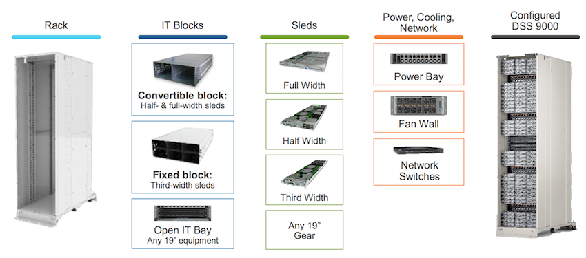
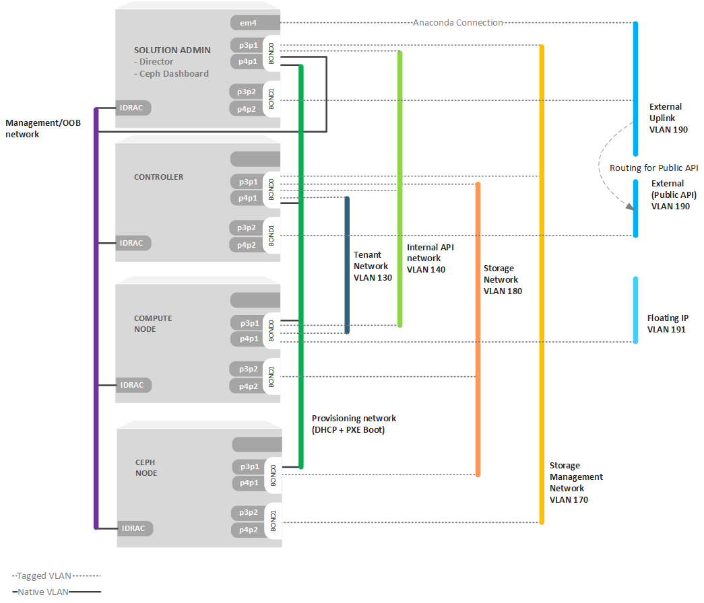
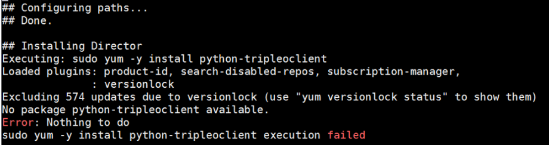

# JetPack Deployment on Dell DSS 9000

## Table of Contents 

- **[Introduction](#introduction)**
  * [About this Document](#about-this-document)
  * [About Dell DSS 9000](#about-dell-dss-9000)
  * [About JetPack](#about-jetpack)
- **[Hardware & Network Architecture](#hardware---network-architecture)**
  * [Network Architecture](#network-architecture)
  * [Nodes Details](#nodes-details)
- **[Jetpack 10.2 Deployment on DSS9000](#jetpack-102-deployment-on-dss9000)**
  * [Changes to JetPack 10.2 Python Automation Files](#changes-to-jetpack-102-python-automation-files)
  * [Sample Configuration Files](#sample-configuration-files)
- **[Jetpack 13 Deployment on DSS9000](#jetpack-13-deployment-on-dss9000)**
  * [Changes and Validation of JetPack 13 Python Automation Files](#changes-and-validation-of-jetpack-13-python-automation-files)
  * [known Issues](#known-issues)
  * [Sample Configuration Files](#sample-configuration-files-1)

## Introduction 

### About this Document

Dell EMC Ready Architecture for Redhat OpenStack Platform Version 13. Provides the an automation for the deployment of the redhat openstack platform. In addition, a validation of the deployment on specific hardware, that garentees the success of the deployment and the effeciency of the configuration for the required workloads. 

Dell EMC Ready Architecture for Redhat OpenStack has validated the deployment of Redhat OpenStack using JetPack automation scripts on Dell EMC Rack Mount servers including R640, R740, R740XD. However, the same automation can be used to deploy the platform on other hardware options. 

Dell EMC professional services team has validated the deployment on other platforms including DSS9000. This document will show the verification procedure to make sure that the deployment will run smoothly as expected. you may use the same process to validate other Dell hardware options and combinations.

For a full documentation of JetPack deployment, please refere to the deployment guide, [https://github.com/dsp-jetpack/JetPack/tree/JS-13.0/doc/deployment_guide.md](https://github.com/dsp-jetpack/JetPack/tree/JS-13.0/doc/deployment_guide.md)


### About Dell DSS 9000

The DSS 9000 comes pre-integrated and designed to customer requirements. Simply roll DSS 9000 racks into the datacenter, plug them into a power supply and manage at the rack-level as well as across the entire infrastructure to accelerate time to value and deliver a better TCO.

<iframe width="100%" height="350" src="https://www.youtube.com/embed/Ug2daFxCJdo" frameborder="0" allow="accelerometer; autoplay; encrypted-media; gyroscope; picture-in-picture" allowfullscreen></iframe>

With the DSS 9000, Dell EMC is combining the expertise it has gained by supporting the largest cloud companies with responses to the unique needs of carriers and service providers to deliver a hyperscale-influenced infrastructure that addresses their growing digital workload demands economically and efficiently.  It gives organizations a new way to address Big Data, the Internet of Things, edge computing and the emerging need for on-demand dynamic services. It is also an ideal platform for next-generation software-defined storage and NFV initiatives. 



DSS 9000 rack scale infrastructure provides compute, storage and networking as well as power and cooling and open management in a pre-integrated rack that’s built to customers’ requirements. Carriers and service providers can simply roll pre-integrated DSS 9000 racks into the datacenter, plug them into a power supply and manage at the rack level as well as across the entire infrastructure as a single entity.

### About JetPack

Dell EMC has opensourced the JetPack Automation Toolkit, which is an innovative automation package that is used to configure the infrastructure hardware and OpenStack software in a fully automated fashion. The toolkit includes programs from Dell EMC that work with Red Hat OpenStack Platform Director to automate the deployment process, not only saving time, but also ensuring the process is reliable and repeatable.

The JetPack automation toolkit is used by Dell EMC and Red Hat professional service teams, and is available on GitHub to customers who prefer to do self-deployment. 

**The following features are added in the JetPack Automation and the Ready Architecture for RedHat OpenStack Version 13:**

* Support for the lastest release of Red Hat OpenStack Platform 13 including the latest updates.
* Support for latest release of RHEL 7.6 including the latest updates.
* Support for Red Hat Ceph Storage version 3.1
* Added support for jumbo frames.
* Added support for UEFI on all Overcloud nodes.
* Added support for Cumulus Network OS..
* Added support for Dell EMC Networking S5248-ON switch.
* Added support for 25GbE networking with Intel XXV710 network interface cards.
* Added support for Red Hat Ceph Storage to use NVMe storage for OSD/Journal.
* Enhancement of Huge Pages with JetPack CSP profile.
* Enhancement of NUMA/CPU Pinning with JetPack CSP profile.
* Support of OVS-DPDK with JetPack CSP profile.
* Enhancement of SR-IOV with JetPack CSP profile.
* Added support for Distributed Virtual Router, (DVR).
* Added support for auto-generation of .ini and .properties files for use in automated deployments.*
* Added support for VLAN aware VM.

<u>**Dell EMC Ready Architecture for Red Hat OpenStack Platform v13 includes:**</u>

* [https://github.com/dsp-jetpack/JetPack/tree/JS-13.0](https://github.com/dsp-jetpack/JetPack/tree/JS-13.0) - Contains all automation deployment solution scripts
* [https://github.com/dsp-jetpack/JetPack/tree/JS-13.0/doc/deployment_guide.md](https://github.com/dsp-jetpack/JetPack/tree/JS-13.0/doc/deployment_guide.md) - Contains deployment guide according to the ready architecture for RedHat OpenStack Platform Version 13.
* [Dell EMC RedHat Ready Architecture Cumulus Switch Configurations v13.0.pdf](https://www.dellemc.com/resources/en-us/asset/technical-guides-support-information/solutions/dell_emc_ready_architecture_for_red_hat_openstack_platform_cumulus_switch_configuration.pdf)
* [Dell EMC RedHat Ready Architecture Guide_v13.0.pdf](https://www.dellemc.com/resources/en-us/asset/technical-guides-support-information/solutions/dell_emc_ready_architecture_for_red_hat_openstack_platform_architecture_guide.pdf)
* [Dell EMC RedHat Ready Architecture Release Notes v13.0.pdf](https://www.dellemc.com/resources/en-us/asset/technical-guides-support-information/solutions/dell_emc_ready_architecture_for_red_hat_openstack_platform_release_notes.pdf)


## Hardware & Network Architecture 

### Network Architecture 

Dell EMC JetPack Automation includes many configuration options. The purpose of the exercise documented in this document is to validate the automation process for the DSS9k servers with sample configurations and networking using 4 network ports. The diagram below shows the network architecture that was validated in this document.

> **Note:** The last 2 versions of JetPack (version 10.2, and version 13) where validated as part of this document. the following diagram should apply for both versions of the automation.



**VLAN Assigment**

The following tabvle shows the networking segregation used in the deployment

| VLAN ID | Description                                | Network              | Gateway Details              |
|---------|--------------------------------------------|----------------------|------------------------------|
| 110     | OOB - iDRAC                                | 192.168.110.0/24     | 192.168.110.1                |
| 120     | Provisioning                               | 192.168.120.0/24     | 192.168.120.1                |
| 130     | Tenant Tunneling                           | 192.168.130.0/24     | Enable Support for VXLAN/GRE |
| 140     | Private API                                | 192.168.140.0/24     | No gateway required          |
| 170     | Storage Network                            | 192.168.170.0/24     | No gateway required          |
| 180     | Storage Cluter Network                     | 192.168.180.0/24     | No gateway required          |
| 190     | Public API Network                         | 100.82.36.128/24     | EXT Gateway 100.82.36.129    |
| 191     | External Network for Tenants (Floating IP) | 100.82.36.192/26     | EXT Gateway 100.82.36.193    |
| 201-250 | Tenant Network                             | 192.168.201-250.0/24 | No gateway required          |

### Nodes Details

**Nodes Count**

| Role                | Number of nodes |
|---------------------|-----------------|
| Solution Admin Host | 1               |
| Controller Nodes    | 3               |
| Compute Nodes       | 3               |
| Ceph Storage Nodes  | 3               |


**Nodes Specifications Used**

| Hostname | Role                     | BMC IP         | Physical Disk                            | Virtual Disk      | Processor                    | Memory               |
|----------|--------------------------|----------------|------------------------------------------|-------------------|------------------------------|----------------------|
| sah      | Dell Solution Admin Host | 192.168.110.9  | 750 GB * 6                               | 2233 GB – RAID 10 | 2 * 2.6Ghz CPU, 12 core each | 384 GB ( 32 GB * 12) |
| cntl0    | Controller0              | 192.168.110.12 | 750 GB * 6                               | 2233 GB – RAID 10 | 2 * 2.6Ghz CPU, 12 core each | 192 GB ( 16 GB * 12) |
| cntl1    | Controller1              | 192.168.110.13 | 750 GB * 6                               | 2233 GB – RAID 10 | 2 * 2.6Ghz CPU, 12 core each | 192 GB ( 16 GB * 12) |
| cntl2    | Controller2              | 192.168.110.14 | 750 GB * 6                               | 2233 GB – RAID 10 | 2 * 2.6Ghz CPU, 12 core each | 192 GB ( 16 GB * 12) |
| nova0    | Compute0                 | 192.168.110.15 | 450 GB * 2                               | 446 GB, RAID 1    | 2 * 2.6Ghz CPU, 12 core each | 128 GB ( 64 GB * 2)  |
| nova1    | Compute1                 | 192.168.110.16 | 450 GB * 2                               | 446 GB, RAID 1    | 2 * 2.6Ghz CPU, 12 core each | 768 GB ( 64 GB * 12) |
| nova2    | Compute2                 | 192.168.110.17 | 450 GB * 2                               | 446 GB, RAID 1    | 2 * 2.6Ghz CPU, 12 core each | 192 GB ( 16 GB * 12) |
| stor0    | Storage0                 | 192.168.110.18 | 750 GB * 2 - Non RAID 7451 GB * 8 - RAID | 7451 GB , RAID 1  | 2 * 2.6Ghz CPU, 12 core each | 192 GB ( 16 GB * 12) |
| stor1    | Storage1                 | 192.168.110.19 | 750 GB * 2 - Non RAID 7451 GB * 8 - RAID | 7451 GB , RAID 1  | 2 * 2.6Ghz CPU, 12 core each | 192 GB ( 16 GB * 12) |
| stor2    | Storage2                 | 192.168.110.20 | 750 GB * 2 - Non RAID 7451 GB * 8 - RAID | 7451 GB , RAID 1  | 2 * 2.6Ghz CPU, 12 core each | 192 GB ( 16 GB * 12) |


**Network Cards**

*All nodes had 3 network cards with total number of 5 ports. these are the cards used:*

* **Embedded Nic:** Intel Gigabit i369 LOM – 1 Port 
* **Mezzanine Card:** Intel X710- DA2 – 2 Ports
* **PCI Slot 4:** Intel X710 Card – 2 Ports


**TOR Switchs Used**

the below switches were used as TOR switches:

| Model        | Firmware      | IP           |
|--------------|---------------|--------------|
| DSS9000-4810 | fw:9.11.(2.6) | 100.82.33.92 |
| DSS-S55      | fw:9.11.0.0P2 | 100.82.33.93 |


## Jetpack 10.2 Deployment on DSS9000

### Changes to JetPack 10.2 Python Automation Files

When deploying Redhat OpenStack using JetPack 10.2 the DSS Hardware details are not included in configuration files. So once the SAH node is deployed; few modifications need to be done in the JetPack Python automation file.

1.	Modify /root/JetPack/src/pilot/dell_systems.json to add the DSS 9000 model type. At the end of this file add following entries.

	``` yaml
	“DSS 9600”: {
	“pxe_nic”: “NIC.Mezzanine.3-1-1”
	```

This Will identify the system to ironic and lets it know that the pxe nics for the systems will be on the Mezzanine nic in slot 3, port1. 


2.	Since all the nodes have HBA controllers and no BOSS or H730P controllers, a modification to assign_roles.py had to be done:

	``` python
	def generate_osd_config(ip_mac_service_tag, drac_client):
	    controllers = drac_client.list_raid_controllers()
	
	    found_hba = False
	    
	    for controller in controllers:
	        if "hba330" in controller.model.lower():
	            found_hba = True
	            break
	            
	    found_boss = False
	    for controller in controllers:
	        if controller.model.startswith("BOSS"):
	            found_boss = True
	            break

		if not found_hba and found_boss:
			LOG.info("Not generating OSD config for {ip} because no HBA330 or BOSS "
	                 "present.".format(ip=ip_mac_service_tag))
	        return
			
	    if not found_hba:
	        LOG.info("Not generating OSD config for {ip} because no HBA330 is "
	                 "present.".format(ip=ip_mac_service_tag))
	        return
	
	    ....
	
	```
	 

3.	Running config_idrac.py through the automated scripts would timeout so a modification was needed to extend the time given.

	* Change directory on the SAH node to /root/JetPack/src/pilot/discover_nodes/discover_nodes/dracclient

	* Edit the client.py file. Do a search for the word “super”. It will return following:

		``` python
		Super(DRACClient, Self)._init_(host,
						   Username,
						   Password,
						   Port,
						   Path,
						   Protocol)
		```

	* Add ready_retries= to the end so it looks like:
	
		``` python
		Super(DRACClient, Self)._init_(host,
						   Username,
						   Password,
						   Port,
						   Path,
						   Protocol,
						   Ready_retries=96)
		```
 

### Sample Configuration Files

the following configuration files where used to deploy jetpack 10.2 on DSS9000 stamp

#### dss9k_v10_acme.ini

``` dosini
# Copyright (c) 2015-2018 Dell Inc. or its subsidiaries.
#
# Licensed under the Apache License, Version 2.0 (the "License");
# you may not use this file except in compliance with the License.
# You may obtain a copy of the License at
#
#     http://www.apache.org/licenses/LICENSE-2.0
#
# Unless required by applicable law or agreed to in writing, software
# distributed under the License is distributed on an "AS IS" BASIS,
# WITHOUT WARRANTIES OR CONDITIONS OF ANY KIND, either express or implied.
# See the License for the specific language governing permissions and
# limitations under the License.

######################################################################################
#                                                                                    #
#        Copy & rename this file for your own stamp.                                 #
#        Review ALL settings below, pay particular attention to paths/ip's etc..     #
#                                                                                    #
######################################################################################


[Network Settings]

# Nova public network details
public_api_network=100.82.35.0/26
public_api_vlanid=351
public_api_gateway=100.82.35.1
public_api_netmask=255.255.255.192
public_api_allocation_pool_start=100.82.35.30
public_api_allocation_pool_end=100.82.35.60
name_server=100.82.32.10

# Private API network details
private_api_network=192.168.140.0/24
private_api_vlanid=140
private_api_netmask=255.255.255.0
private_api_allocation_pool_start=192.168.140.50
private_api_allocation_pool_end=192.168.140.120

# Storage network details
storage_network=192.168.170.0/24
storage_vlanid=170
storage_netmask=255.255.255.0
storage_allocation_pool_start=192.168.170.50
storage_allocation_pool_end=192.168.170.120

# Provisioning network details
provisioning_network=192.168.120.0/24
provisioning_vlanid=120
provisioning_netmask=255.255.255.0
provisioning_gateway=192.168.120.1
provisioning_net_dhcp_start=192.168.120.12
provisioning_net_dhcp_end=192.168.120.120
discovery_ip_range=192.168.120.200,192.168.120.250

# Storage cluster network details
storage_cluster_network=192.168.180.0/24
storage_cluster_vlanid=180
storage_cluster_allocation_pool_start=192.168.180.50
storage_cluster_allocation_pool_end=192.168.180.120

# Management network details
# Make sure the SAH node idrac ip defined in the .properties
# is NOT within the allocation pool below.
management_network=192.168.110.0/24
management_vlanid=110
management_netmask=255.255.255.0
management_gateway=192.168.110.1
management_allocation_pool_start=192.168.110.30
management_allocation_pool_end=192.168.110.45

# Tenant network details
# Not used unless you wish to configure Generic Routing Encapsulation (GRE) networks.
tenant_tunnel_network=192.168.130.0/24
tenant_tunnel_network_allocation_pool_start=192.168.130.50
tenant_tunnel_network_allocation_pool_end=192.168.130.120
tenant_tunnel_network_vlanid=130

# Nova Private network details
tenant_vlan_range=201:250


[Vips Settings]

# Use static VIPs ip addresses for the overcloud
use_static_vips=true

# The following VIP settings apply if the above use_static_vips is enabled.

# VIP for the redis service on the Private API api network
# Note that this IP must lie outside the private_api_allocation_pool_start/end
# range
redis_vip=192.168.140.49

# VIP for the provisioning network
# Note that this IP must lie outside the provisioning_net_dhcp_start/end range
provisioning_vip=192.168.120.121

# VIP for the Private API network
# Note that this IP must lie outside the private_api_allocation_pool_start/end
# range
private_api_vip=192.168.140.121

# VIP for the Public API network
# Note that this IP must lie outside the public_api_allocation_pool_start/end
# range
public_api_vip=100.82.35.60

# VIP for the Storage network
# Note that this IP must lie outside the storage_allocation_pool_start/end
# range
storage_vip=192.168.170.121


# VIP for the Storage cluster network
# The Storage Clustering network is not connected to the controller nodes,
# so the VIP for this network must be mapped to the provisioning network
# Note that this IP must lie outside the provisioning_net_dhcp_start/end range
storage_cluster_vip=192.168.120.122


[Subscription Manager Settings]

# Subscription Manager account info for registering Red Hat subscriptions
subscription_manager_user=xxxxx
subscription_manager_password=xxxx

# The following pool IDs provide different collections of repositories.
# Each is labeled with possible subscription names.

# Red Hat Enterprise Linux (Physical Node)
subscription_manager_pool_sah=xxxxxx

# Red Hat Enterprise Linux OpenStack Platform (Virtual Node)
subscription_manager_pool_vm_rhel=xxxxx

# Red Hat Ceph Storage (Physical Node)
subscription_manager_vm_ceph=xxxxx

subscription_check_retries=20


[Nodes Nics and Bonding Settings]

sah_bond_opts=mode=802.3ad miimon=100 xmit_hash_policy=layer3+4 lacp_rate=1

# NIC environment file
# Note: If using 25 gig NICs, change the following to:
#       4_port/nic_environment.yaml
#       If you need to enable OVS-DPDK, then use
#       dpdk_modeX_4_port or dpdk_modeX_5_port as nic home directory
#       where X represents the mode:
#            1: Tenant-networks-only
#            2: Tenant-and-External-networks
nic_env_file=4_port/nic_environment.yaml

# Interfaces and bonding options per node type
ControllerProvisioningInterface=p3p1
ControllerBond0Interface1=p3p1
ControllerBond0Interface2=p4p1
ControllerBond1Interface1=p3p2
ControllerBond1Interface2=p4p2
ControllerBondInterfaceOptions=mode=802.3ad miimon=100 xmit_hash_policy=layer3+4 lacp_rate=1

ComputeProvisioningInterface=p3p1
ComputeBond0Interface1=p3p1
ComputeBond0Interface2=p4p1
ComputeBond1Interface1=p3p2
ComputeBond1Interface2=p4p2
ComputeBondInterfaceOptions=mode=802.3ad miimon=100 xmit_hash_policy=layer3+4 lacp_rate=1

StorageProvisioningInterface=p3p1
StorageBond0Interface1=p3p1
StorageBond0Interface2=p4p1
StorageBond1Interface1=p3p2
StorageBond1Interface2=p4p2
StorageBondInterfaceOptions=mode=802.3ad miimon=100 xmit_hash_policy=layer3+4 lacp_rate=1

# Note: the following interfaces need to be changed
# as per the server model
# R640 should use 'p2p1', 'p3p1', 'p2p2', 'p3p2'
# R740/R740xd should use 'p4p1', 'p5p1', 'p4p2', 'p5p2'
# The following lines should be commented out  if ovs_dpdk_enable is set to false
#ComputeOvsDpdkInterface1=p2p1
#ComputeOvsDpdkInterface2=p3p1
#ComputeOvsDpdkInterface3=p2p2
#ComputeOvsDpdkInterface4=p3p2
#BondInterfaceOvsOptions=bond_mode=balance-tcp lacp=active

[Dell NFV Settings]
#Provide NFV features here.

#Enter value of enable_hpg as true/false for HugePages
hpg_enable=true
#User should give this parameter in same format.
#Supported values for hpg_size(Size of hugepages) is 2MB and 1 GB.
#For 2MB (# of hugepages), hpg_num is 49152
#For 1GB (# of hugepages), hpg_num is 96
hpg_size=1GB

#Enter value of enable_numa as true/false for NUMA
numa_enable=true

# OVS-DPDK Settings
# Set the following option to true/false
ovs_dpdk_enable=false

#Enter number of cores you want to reserve for Host OS
#Supported values are 2 or 4 or 6 or 8
numa_hostos_cpu_count=4

[Performance and Optimization]

# mariadb_max_connections takes value from 1 to 100000, it is mandatory.
mariadb_max_connections = 15360

# MariaDB innodb_buffer_pool_size should be given value in GB, Example : 64G.
# Default is 'dynamic' which assigns 75% ram size of controller node.
# Note that innodb_buffer_pool_size should be less than available ram size.
innodb_buffer_pool_size = dynamic

# innodb_buffer_pool_instances takes value from 1 to 48
innodb_buffer_pool_instances = 16

[IPMI credentials Settings]

# DRAC credentials with IPMI privilege for the SAH node
sah_ipmi_user=root
sah_ipmi_password=xxxx

# DRAC credentials with IPMI privilege for the overcloud nodes
ipmi_user=root
ipmi_password=xxxx
# A password to change to on overcloud nodes if desired
new_ipmi_password=


[Deployment Settings]

profile=csp

# This pathname must be the full path to the properties file which
# describes the cluster. You should copy *this* sample settings file
# (sample.ini) and the sample properties file (sample.properties) to
# another directory, and customize them for your cluster. Then use the
# path to your customized properties file here.
cluster_nodes_configuration_file=/root/dss9k_js10.2.csp.properties

# User for the undercloud/overcloud installation
director_install_user=osp_admin
director_install_user_password=xxxx

# Name of the Overcloud.
# The nodes hostnames will be prepended with the given name and a dash
overcloud_name=dss9k-rh

# Domain name for the cluster (i.e., mycluster.lab)
domain=oss.labs

# Optional : root passord for the overcloud nodes, no password is set if left empty
overcloud_nodes_pwd=xxxx

# , separated list of ntp servers
ntp_servers=0.centos.pool.ntp.org,1.centos.pool.ntp.org,2.centos.pool.ntp.org,3.centos.pool.ntp.org
time_zone=UTC

# Use static ip adresses for the overcloud nodes if set to true (ips need to be defined in the .properties)
# Use dhcp if set to false (ips not required in the .properties)
overcloud_static_ips=true

# Set to true to enable cinder backend of Ceph for storage.
enable_rbd_backend=true

# Set to true to enable Nova usage of Ceph for ephemeral storage.
# If set to false, Nova uses the storage local to the compute.
enable_rbd_nova_backend=true

# Set to false to disable fencing
# Please refer to the following document for more details on fencing:
# Ready Bundle for Red Hat OpenStack Platform Software Deployment Guide
enable_fencing=true

# Set to true to enable instance HA
# Note : fencing must also be enabled (setting above)
# Please refer to following technical document for more details on Instance HA:
# Ready Bundle for Red Hat OpenStack Platform Software Deployment Guide
enable_instance_ha=false


[Storage back-end Settings]

# Compellent parameters. See the Software Deployment Guide for description of the parameters.
enable_dellsc_backend=false
dellsc_backend_name=compellent
dellsc_api_port=3033
dellsc_iscsi_ip_address=192.168.170.241
dellsc_iscsi_port=3260
dellsc_san_ip=100.82.32.49
dellsc_san_login=svc.cmpl
dellsc_san_password=xxxx
dellsc_ssn=43411
dellsc_server_folder=cmpl_iscsi_servers
dellsc_volume_folder=cmpl_iscsi_volumes


[Sanity Test Settings]

# If you want the sanity script to run on deployment completion (Appendix C, etc.), you may do so.
run_sanity=false

floating_ip_network=100.82.35.64/26
floating_ip_network_start_ip=100.82.35.70
floating_ip_network_end_ip=100.82.35.120
floating_ip_network_gateway=100.82.35.65
floating_ip_network_vlan=352
sanity_tenant_network=192.168.201.0/24
sanity_user_password=xxxx
sanity_user_email=someone@somewhere.com
sanity_key_name=sanity

# The number of instances to spin up in nova.
# Note that this will be limited by the instance quota in OpenStack, which is
# 10 by default.
sanity_number_instances=2
sanity_image_url=http://download.cirros-cloud.net/0.3.3/cirros-0.3.3-x86_64-disk.img


[Tempest Settings]

# If you want to run Tempest post-deployment, you may do so. The sanity script must also run to create networks for Tempest.
run_tempest=false
tempest_smoke_only=false


[Advanced Settings]

#The following settings should typically only be used by developers

# Only developers should set to false.
enable_version_locking=true

# The list of RHSM repositories to enable to access the product.  Repos should
# be comma separated.
# Note that this parameter is defaulted as shown below when commented out or
# not specified.  It should not be necessary to change it from the default in
# most cases.
rhsm_repos=rhel-7-server-openstack-10-rpms,rhel-7-server-openstack-10-devtools-rpms

# Option below is to use a custom instack.json and skip discover_nodes
use_custom_instack_json=false
custom_instack_json=n/a

# Indicates if the deploy-overcloud.py script should be run in debug mode
deploy_overcloud_debug=false

use_internal_repo=false
# Semi-colon ( ; ) separated list of internal repos to use, if needed.
internal_repos_locations=

cloud_repo_dir=/root/JetPack
rhel_iso=/root/rhel75.iso

# Overcloud deployment timeout value - default is 120mns, but can be tweaked here if required.
overcloud_deploy_timeout=120

# Default driver is DRAC.
use_ipmi_driver=false

# Default introspection method is out-of-band.
# Note that out-of-band introspection is only supported by the DRAC driver.  If
# use_ipmi_driver is set to "true" above then in-band introspection will be
# used regardless of the value below.
use_in_band_introspection=false

# RDO cloud images
# Available to download @ https://access.redhat.com/downloads/content/191/ver=8/rhel---7/8/x86_64/product-software
discovery_ram_disk_image=/pathto/discovery-ramdisk-7.1.0-39.tar
overcloud_image=/pathto/overcloud-full-7.1.0-39.tar
# if option below is enabled, images will be pulled fom the cdn (and the above x2 settings ignored)
pull_images_from_cdn=true

# Occasionally there can be problems with Subscription Manager
# and a node may be properly registered yet "subscription manager status"
# will return "Unknown"  which will cause checks to fail.
# Setting this to false will skip SM checks to get around this issue.
verify_rhsm_status=true

```


#### dss9k_v10_acme.properties

``` json
[
    {
        "is_sah": "true",
        "hostname": "dss9k-sah",
        "idrac_ip": "192.168.110.9",
        "root_password": "xxxx",

        "anaconda_ip":"100.82.35.6",
        "anaconda_iface":"p3p2.351",

        "public_bond": "bond1",
        "public_slaves": "p3p2 p4p2",
        "public_api_ip":"100.82.35.9",

        "private_bond": "bond0",
        "private_slaves": "p3p1 p4p1",
        "provisioning_ip":"192.168.120.9",
        "storage_ip":"192.168.170.9",
        "private_api_ip":"192.168.140.9",
        "management_ip":"192.168.110.109"
    },
    {
        "is_director": "true",
        "hostname": "dss9k-director",
        "root_password": "xxxx",
        "provisioning_ip": "192.168.120.10",
        "management_ip":"192.168.110.110",
        "public_api_ip":"100.82.35.10",
        "private_api_ip":"192.168.140.10"
    },
    {
        "is_dashboard": "true",
        "hostname": "dss9k-dashboard",
        "root_password": "xxxx",

        "public_api_ip": "100.82.35.11",
        "storage_ip": "192.168.170.11"
    },
    {
        "is_controller": "true",
        "idrac_ip": "192.168.110.12",

        "public_api_ip": "100.82.35.12",
        "private_api_ip": "192.168.140.12",
        "storage_ip": "192.168.170.12",
        "tenant_tunnel_ip": "192.168.130.12"
    },
    {
        "is_controller": "true",
        "idrac_ip": "192.168.110.13",

        "public_api_ip": "100.82.35.13",
        "private_api_ip": "192.168.140.13",
        "storage_ip": "192.168.170.13",
        "tenant_tunnel_ip": "192.168.130.13"
    },
    {
        "is_controller": "true",
        "idrac_ip": "192.168.110.14",

        "public_api_ip": "100.82.35.14",
        "private_api_ip": "192.168.140.14",
        "storage_ip": "192.168.170.14",
        "tenant_tunnel_ip": "192.168.130.14"
    },
    {
        "is_compute": "true",
        "idrac_ip": "192.168.110.15",

        "private_api_ip": "192.168.140.15",
        "storage_ip": "192.168.170.15",
        "tenant_tunnel_ip": "192.168.130.15"

    },
    {
        "is_compute": "true",
        "idrac_ip": "192.168.110.16",

        "private_api_ip": "192.168.140.16",
        "storage_ip": "192.168.170.16",
        "tenant_tunnel_ip": "192.168.130.16"

    },
    {
        "is_compute": "true",
        "idrac_ip": "192.168.110.17",

        "private_api_ip": "192.168.140.17",
        "storage_ip": "192.168.170.17",
        "tenant_tunnel_ip": "192.168.130.17"

    },
     {
        "is_ceph_storage": "true",
        "idrac_ip": "192.168.110.18",

        "storage_ip": "192.168.170.18",
        "storage_cluster_ip": "192.168.180.18",

        "osd_disks":[
             ":/dev/sda",
             ":/dev/sdb",
             ":/dev/sdc",
             ":/dev/sdd",
             ":/dev/sde",
             ":/dev/sdf",
             ":/dev/sdg",
             ":/dev/sdh",
             ":/dev/sdi",
             ":/dev/sdj",
             ":/dev/sdk",
             ":/dev/sdl"
             ]
    },
    {
        "is_ceph_storage": "true",
        "idrac_ip": "192.168.110.19",

        "storage_ip": "192.168.170.19",
        "storage_cluster_ip": "192.168.180.19",

        "osd_disks":[
             ":/dev/sda",
             ":/dev/sdb",
             ":/dev/sdc",
             ":/dev/sdd",
             ":/dev/sde",
             ":/dev/sdf",
             ":/dev/sdg",
             ":/dev/sdh",
             ":/dev/sdi",
             ":/dev/sdj",
             ":/dev/sdk",
             ":/dev/sdl"
             ]
    },
    {
        "is_ceph_storage": "true",
        "idrac_ip": "192.168.110.20",

        "storage_ip": "192.168.170.20",
        "storage_cluster_ip": "192.168.180.20",

        "osd_disks":[
             ":/dev/sda",
             ":/dev/sdb",
             ":/dev/sdc",
             ":/dev/sdd",
             ":/dev/sde",
             ":/dev/sdf",
             ":/dev/sdg",
             ":/dev/sdh",
             ":/dev/sdi",
             ":/dev/sdj",
             ":/dev/sdk",
             ":/dev/sdl"
             ]
    },
    {
        "is_ceph_storage": "true",
        "idrac_ip": "192.168.110.21",

        "storage_ip": "192.168.170.21",
        "storage_cluster_ip": "192.168.180.21",

        "osd_disks":[
             ":/dev/sda",
             ":/dev/sdb",
             ":/dev/sdc",
             ":/dev/sdd",
             ":/dev/sde",
             ":/dev/sdf",
             ":/dev/sdg",
             ":/dev/sdh",
             ":/dev/sdi",
             ":/dev/sdj",
             ":/dev/sdk",
             ":/dev/sdl"
             ]
    }
]

```


## Jetpack 13 Deployment on DSS9000

### Changes and Validation of JetPack 13 Python Automation Files

In JetPack 13; the modifications required for deployment on DSS9000 are already included the automation scripts. So before starting the deployment ensure below entries are updated the scripts.

1. Check following entries are updated in /root/JetPack/src/pilot/ dell_systems.json for DSS entries. This file contains the model and PXE NIC details. Usually this file contain PowerEdge server details, just make sure DSS hardware details also updated here.

	``` json 
	{
	  ....
	  ....
	  ....
	  ,
	  "PowerEdge R740": {
	    "pxe_nic": "NIC.Integrated.1-3-1"
	  },
	  "PowerEdge R740xd": {
	    "pxe_nic": "NIC.Integrated.1-3-1"
	  },
	  "PowerEdge R640": {
	    "pxe_nic": "NIC.Integrated.1-3-1"
	  },
	  "DSS 9600": {
	    "pxe_nic": "NIC.Mezzanine.3-1-1"
	  },
	  "DSS 9620": {
	    "pxe_nic": "NIC.Mezzanine.3-1-1"
	  }
	}
	
	```
 
	when the automation script communicate with IDRAC, it will retrive the model of the system and it will match for example with DSS 9600 or DSS 9620, it will then assign the pxe_nic mentioned in the JSON file as a the pxe boot interface. the function that does that is in config_idrac.py
	
	``` python
	def get_pxe_nic_fqdd_from_model_properties(model_properties, drac_client):
	    if model_properties is None:
	        return None
		
	    model_name = drac_client.get_system().model
		
	    # If the model does not have an entry in the model properties JSON file,
	    # return None, instead of raising a KeyError exception.
	    if model_name in model_properties:
	        return model_properties[model_name]['pxe_nic']
	    else:
	        return None
		
	```
	
	> Note: In case want to include a different server, and you need to change the PXE boot interface you can use the same file to do the changes.
	


2.	Since all the nodes have HBA controller ensure /root/JetPack/src/pilot/assign_roles.py are updated with below entries

	``` python
	def generate_osd_config(ip_mac_service_tag, drac_client):
	    controllers = drac_client.list_raid_controllers()
	
	    found_hba = False
	    for controller in controllers:
	        if "hba330" in controller.model.lower():
	            found_hba = True
	            break
	
	    if not found_hba:
	        LOG.info("Not generating OSD config for {ip} because no HBA330 is "
	                 "present.".format(ip=ip_mac_service_tag))
	        return
	
	    LOG.info("Generating OSD config for {ip}".format(ip=ip_mac_service_tag))
	    system_id = drac_client.get_system().uuid
	```

### known Issues


1. Before starting the deployment, make sure to clone the lastest version of JetPack; to avoid iDRAC patch issue. the latest version can be found on [https://github.com/dsp-jetpack/JetPack.git](https://github.com/dsp-jetpack/JetPack.git)

2. During director deployment in case you had the below error, that could be due to multiple deployment trials with different configuration of version locking; Add 'yum versionlock clear' to /root/JetPack/src/pilot/install-director.sh; that should clear any version locking configurations and the following error should be cleared after applying the change. 

	


### Sample Configuration Files

the following configuration files where used to deploy jetpack 13 on DSS9000 stamp

#### dss9k_v13_acme.ini

you will notice in the configuration file acme.ini that we are using 4 ports configuration as per the hardware avaiable for that you need to set the correct nic_env_file parameter as below

``` yaml 
nic_env_file=4_port/nic_environment.yaml

``` 
**Other valid options are: **

1. To enable standard XSP profile or standard CSP profile (NUMA and HugePages):
   For 5 ports, choose 5_port/nic_environment.yaml. 
   For 4 ports, choose 4_port/nic_environment.yaml.
2. To enable OVS-DPDK with 7 nic ports, choose ovs-dpdk_7_port/nic_environment.yaml.
   For 9 ports, choose ovs-dpdk_9_port/nic_enviornment.yaml.
3. To enable SR-IOV with 7 nic ports, choose sriov_7_port/nic_environment.yaml.
   For 9 ports, choose sriov_9_port/nic_enviornment.yaml.
4. To enable OVS-DPDK (2-ports) and SR-IOV (2-ports), choose ovs-dpdk_sriov_9_port/nic_environment.yaml.
5. To enable DVR, for Storage and Floating networks that share a single bond, choose 5_port/nic_environment.yaml.
   If a separate bond is required for Floating network on compute nodes, choose dvr_7_port/nic_environment.yaml.

Please find the full configuration file used below: 

``` dosini
# Copyright (c) 2015-2018 Dell Inc. or its subsidiaries.
#
# Licensed under the Apache License, Version 2.0 (the "License");
# you may not use this file except in compliance with the License.
# You may obtain a copy of the License at
#
#     http://www.apache.org/licenses/LICENSE-2.0
#
# Unless required by applicable law or agreed to in writing, software
# distributed under the License is distributed on an "AS IS" BASIS,
# WITHOUT WARRANTIES OR CONDITIONS OF ANY KIND, either express or implied.
# See the License for the specific language governing permissions and
# limitations under the License.

###########################################################################
#                                                                         #
# Copy and rename this file for your own stamp.                           #
# Review ALL settings below, pay particular attention to paths/ip's etc.. #
#                                                                         #
###########################################################################


[Network Settings]

# Nova public network details
public_api_network=100.82.35.0/26
public_api_vlanid=351
public_api_gateway=100.82.35.1
public_api_netmask=255.255.255.192
public_api_allocation_pool_start=100.82.35.30
public_api_allocation_pool_end=100.82.35.59
name_server=100.82.32.10

# Private API network details
private_api_network=192.168.140.0/24
private_api_vlanid=140
private_api_netmask=255.255.255.0
private_api_allocation_pool_start=192.168.140.50
private_api_allocation_pool_end=192.168.140.120

# Storage network details
storage_network=192.168.170.0/24
storage_vlanid=170
storage_netmask=255.255.255.0
storage_allocation_pool_start=192.168.170.50
storage_allocation_pool_end=192.168.170.120

# Provisioning network details
provisioning_network=192.168.120.0/24
provisioning_vlanid=120
provisioning_netmask=255.255.255.0
provisioning_gateway=192.168.120.1
provisioning_net_dhcp_start=192.168.120.12
provisioning_net_dhcp_end=192.168.120.120
discovery_ip_range=192.168.120.200,192.168.120.250

# Storage cluster network details
storage_cluster_network=192.168.180.0/24
storage_cluster_vlanid=180
storage_cluster_allocation_pool_start=192.168.180.50
storage_cluster_allocation_pool_end=192.168.180.120

# Management network details
# Make sure the SAH node idrac ip defined in the .properties
# is NOT within the allocation pool below.
management_network=192.168.110.0/24
management_vlanid=110
management_netmask=255.255.255.0
management_gateway=192.168.110.1
management_allocation_pool_start=192.168.110.30
management_allocation_pool_end=192.168.110.45

# Tenant network details
# Not used unless you wish to configure Generic Routing Encapsulation (GRE) networks.
tenant_tunnel_network=192.168.130.0/24
tenant_tunnel_network_allocation_pool_start=192.168.130.50
tenant_tunnel_network_allocation_pool_end=192.168.130.120
tenant_tunnel_network_vlanid=130

# Nova Private network details
tenant_vlan_range=201:250


[MTU Settings]

# The mtu_selection setting defines whether to use the "global" or "per_network" option. 
# If the mtu_selection is defined as "global", the mtu value for all networks will be set to the value provided in mtu_size_global_default. The supported value must be within the range of 1500-9000.
# If "per_network" mtu_selection is defined, the user should provide an mtu value for each network in the range of 1500-9000.
# For "public_api_network_mtu" and "floating_ip_network_mtu" networks, mtu sizes greater than 1500 is only supported if jumbo frames are enabled on upstream routers.
mtu_selection=global 
mtu_size_global_default=1500
public_api_network_mtu=1500
floating_ip_network_mtu=1500
private_api_network_mtu=1500
tenant_network_mtu=1500
storage_cluster_network_mtu=1500
storage_network_mtu=1500
tenant_tunnel_network_mtu=1500

[Vips Settings]

# Use static VIPs ip addresses for the overcloud
use_static_vips=true

# The following VIP settings apply if the above use_static_vips is enabled.

# VIP for the redis service on the Private API api network
# Note that this IP must lie outside the private_api_allocation_pool_start/end
# range
redis_vip=192.168.140.49

# VIP for the provisioning network
# Note that this IP must lie outside the provisioning_net_dhcp_start/end range
provisioning_vip=192.168.120.121

# VIP for the Private API network
# Note that this IP must lie outside the private_api_allocation_pool_start/end
# range
private_api_vip=192.168.140.121

# VIP for the Public API network
# Note that this IP must lie outside the public_api_allocation_pool_start/end
# range
public_api_vip=100.82.35.60

# VIP for the Storage network
# Note that this IP must lie outside the storage_allocation_pool_start/end
# range
storage_vip=192.168.170.121

# VIP for the Storage cluster network
# The Storage Clustering network is not connected to the controller nodes,
# so the VIP for this network must be mapped to the provisioning network
# Note that this IP must lie outside the provisioning_net_dhcp_start/end range
storage_cluster_vip=192.168.120.122


[Subscription Manager Settings]

# Subscription Manager account info for registering Red Hat subscriptions
subscription_manager_user=xxxx
subscription_manager_password=xxxx

# The following pool IDs provide different collections of repositories.
# Each is labeled with possible subscription names.

# Red Hat Enterprise Linux (Physical Node)
subscription_manager_pool_sah=xxxx

# Red Hat Enterprise Linux OpenStack Platform (Virtual Node)
subscription_manager_pool_vm_rhel=xxx

# Red Hat Ceph Storage (Physical Node)
subscription_manager_vm_ceph=xxxx

subscription_check_retries=20


[Nodes Nics and Bonding Settings]

sah_bond_opts=mode=802.3ad miimon=100 xmit_hash_policy=layer3+4 lacp_rate=1

# NIC environment file
#       1. To enable standard XSP profile or standard CSP profile (NUMA and HugePages):
#          For 5 ports, choose 5_port/nic_environment.yaml. 
#          For 4 ports, choose 4_port/nic_environment.yaml.
#       2. To enable OVS-DPDK with 7 nic ports, choose ovs-dpdk_7_port/nic_environment.yaml.
#          For 9 ports, choose ovs-dpdk_9_port/nic_enviornment.yaml.
#       3. To enable SR-IOV with 7 nic ports, choose sriov_7_port/nic_environment.yaml.
#          For 9 ports, choose sriov_9_port/nic_enviornment.yaml.
#       4. To enable OVS-DPDK (2-ports) and SR-IOV (2-ports), choose ovs-dpdk_sriov_9_port/nic_environment.yaml.
#       5. To enable DVR, for Storage and Floating networks that share a single bond, choose 5_port/nic_environment.yaml.
#          If a separate bond is required for Floating network on compute nodes, choose dvr_7_port/nic_environment.yaml.
nic_env_file=4_port/nic_environment.yaml

# Interfaces and bonding options per node type.
#ControllerProvisioningInterface=p3p1
ControllerBond0Interface1=p3p1
ControllerBond0Interface2=p4p1
ControllerBond1Interface1=p3p2
ControllerBond1Interface2=p4p2
ControllerBondInterfaceOptions=mode=802.3ad miimon=100 xmit_hash_policy=layer3+4 lacp_rate=1

#ComputeProvisioningInterface=p3p1
ComputeBond0Interface1=p3p1
ComputeBond0Interface2=p4p1
ComputeBond1Interface1=p3p2
ComputeBond1Interface2=p4p2
ComputeBondInterfaceOptions=mode=802.3ad miimon=100 xmit_hash_policy=layer3+4 lacp_rate=1

#StorageProvisioningInterface=p3p1
StorageBond0Interface1=p3p1
StorageBond0Interface2=p4p1
StorageBond1Interface1=p3p2
StorageBond1Interface2=p4p2
StorageBondInterfaceOptions=mode=802.3ad miimon=100 xmit_hash_policy=layer3+4 lacp_rate=1

# To enable standalone OVS-DPDK, two or four interfaces should be used.
# For two interfaces, uncomment 'ComputeOvsDpdkInterface1', 'ComputeOvsDpdkInterface2' and 'BondInterfaceOvsOption'.
# For four interfaces, uncomment all four interfaces and 'BondInterfaceOvsOption'.
# The following lines should be commented out  if ovs_dpdk_enable is set to false
#ComputeOvsDpdkInterface1=p2p1
#ComputeOvsDpdkInterface2=p3p1
#ComputeOvsDpdkInterface3=p2p2
#ComputeOvsDpdkInterface4=p3p2
#BondInterfaceOvsOptions=bond_mode=balance-tcp lacp=active

# To enable standalone SR-IOV, two or four interfaces should be used.
# For two interfaces, uncomment 'ComputeSriovInterface1' and 'ComputeSriovInterface2'.
# For four interfaces, uncomment all four interfaces.
# Following lines should be commented out if sriov_enable is set to false
#ComputeSriovInterface1=p1p1
#ComputeSriovInterface2=p4p1
#ComputeSriovInterface3=p1p2
#ComputeSriovInterface4=p4p2

# To enable SR-IOV and OVS-DPDK, four interfaces should be used.
# Following lines should be uncommented if both sriov_enable and ovs-dpdk_enable are set to true.
#ComputeSriovInterface1=p1p1
#ComputeSriovInterface2=p4p1
#ComputeOvsDpdkInterface1=p2p1
#ComputeOvsDpdkInterface2=p3p1
#BondInterfaceOvsOptions=bond_mode=balance-tcp lacp=active

[Dell NFV Settings]

#Enter value of enable_hpg as true/false for HugePages
hpg_enable=false
#User should give this parameter in same format.
#Supported values for hpg_size(Size of hugepages) is 2MB and 1 GB.
#The number of hugepages will be calculated dynamically.
hpg_size=1GB

#Enter value of enable_numa as true/false for NUMA
numa_enable=false

# OVS-DPDK Settings
# Set the following option to true/false
ovs_dpdk_enable=false

#Enter number of cores you want to reserve for Host OS
#Supported values are 2,4,6,8
numa_hostos_cpu_count=4

# SRIOV Settings
# Set the following option to true/false for SRIOV
sriov_enable=false

#Enter the number of VFs you want to create per port
#Supported values are between 1-64
sriov_vf_count=64

# Set to true to enable DVR
dvr_enable=false


[Performance and Optimization]

# mariadb_max_connections takes value from 1000 to 100000, it is mandatory.
mariadb_max_connections = 15360

# MariaDB innodb_buffer_pool_size should be given value in GB, Example : 64G.
# Default is 'dynamic' which assigns 75% ram size of controller node.
# Note that innodb_buffer_pool_size should be less than available ram size.
innodb_buffer_pool_size = dynamic

# innodb_buffer_pool_instances takes value from 8 to 48
innodb_buffer_pool_instances = 16

[IPMI credentials Settings]

# DRAC credentials with IPMI privilege for the SAH node
sah_ipmi_user=root
sah_ipmi_password=xxxx

# DRAC credentials with IPMI privilege for the overcloud nodes
ipmi_user=root
ipmi_password=xxxx
# A password to change to on overcloud nodes if desired
new_ipmi_password=


[Deployment Settings]

# valid values are csp, xsp and custom.
profile=xsp

# This pathname must be the full path to the properties file which
# describes the cluster. You should copy *this* sample settings file
# (sample.ini) and the sample properties file (sample.properties) to
# another directory, and customize them for your cluster. Then use the
# path to your customized properties file here.
cluster_nodes_configuration_file=/root/acme.properties

# User for the undercloud/overcloud installation
director_install_user=osp_admin
director_install_user_password=xxxx

# Name of the Overcloud.
# The nodes hostnames will be prepended with the given name and a dash
overcloud_name=dss-overcloud

# Domain name for the cluster (i.e., mycluster.lab)
domain=oss.labs

# Optional : root passord for the overcloud nodes, no password is set if left empty
overcloud_nodes_pwd=xxxx

# , separated list of ntp servers
ntp_servers=0.centos.pool.ntp.org,1.centos.pool.ntp.org,2.centos.pool.ntp.org,3.centos.pool.ntp.org
time_zone=UTC

# Use static ip adresses for the overcloud nodes if set to true (ips need to be defined in the .properties)
# Use dhcp if set to false (ips not required in the .properties)
overcloud_static_ips=true

# Set to true to enable cinder backend of Ceph for storage.
enable_rbd_backend=true

# Set to true to enable Nova usage of Ceph for ephemeral storage.
# If set to false, Nova uses the storage local to the compute.
enable_rbd_nova_backend=true

# Set to false to disable fencing
enable_fencing=true


[Storage back-end Settings]

# Compellent parameters. See the Software Deployment Guide for description of the parameters.
enable_dellsc_backend=false
dellsc_backend_name=compellent
dellsc_api_port=3033
dellsc_iscsi_ip_address=192.168.170.241
dellsc_iscsi_port=3260
dellsc_san_ip=100.82.32.49
dellsc_san_login=svc.cmp1
dellsc_san_password=xxxx
dellsc_ssn=43411
dellsc_server_folder=cmpl_iscsi_servers
dellsc_volume_folder=cmpl_iscsi_volumes


[Sanity Test Settings]

# If you want the sanity script to run on deployment completion (Appendix C, etc.), you may do so.
run_sanity=false

floating_ip_network=100.82.35.64/26
floating_ip_network_start_ip=100.82.35.70
floating_ip_network_end_ip=100.82.35.120
floating_ip_network_gateway=100.82.35.65
floating_ip_network_vlan=352
sanity_tenant_network=192.168.201.0/24
sanity_user_password=xxxx
sanity_user_email=someone@somewhere.com
sanity_key_name=sanity

# The number of instances to spin up in nova.
# Note that this will be limited by the instance quota in OpenStack, which is
# 10 by default.
# Note: One additional instance will be created for vlan-aware testing. Maximum
# number of instances can be 9 unless the quota is increased.
sanity_number_instances=2
sanity_image_url=http://download.cirros-cloud.net/0.3.3/cirros-0.3.3-x86_64-disk.img

# vlan-aware specific parameters
# address of vlan-network where subport is attached
sanity_vlantest_network=192.168.216.0/24


[Tempest Settings]

# If you want to run Tempest post-deployment, you may do so. The sanity script must also run to create networks for Tempest.
run_tempest=false
tempest_smoke_only=false


[Advanced Settings]

#The following settings should typically only be used by developers

# Only developers should set to false.
enable_version_locking=true

# The list of RHSM repositories to enable to access the product.  Repos should
# be comma separated.
# Note that this parameter is defaulted as shown below when commented out or
# not specified.  It should not be necessary to change it from the default in
# most cases.
rhsm_repos=rhel-7-server-openstack-13-rpms,rhel-7-server-openstack-13-devtools-rpms,rhel-7-server-rhceph-3-tools-rpms

# Option below is to use a custom instack.json and skip discover_nodes
use_custom_instack_json=false
custom_instack_json=n/a

# Indicates if the deploy-overcloud.py script should be run in debug mode
deploy_overcloud_debug=false

use_internal_repo=false
# Semi-colon ( ; ) separated list of internal repos to use, if needed.
internal_repos_locations=CHANGEME_INTERNAL_REPO_URL

cloud_repo_dir=/root/JetPack
#rhel_iso=/root/rhel75.iso
rhel_iso=/root/rhel76.iso

# Overcloud deployment timeout value - default is 120mns, but can be tweaked here if required.
overcloud_deploy_timeout=120

# Default driver is DRAC.
use_ipmi_driver=false

# Default introspection method is out-of-band.
# Note that out-of-band introspection is only supported by the DRAC driver.  If
# use_ipmi_driver is set to "true" above then in-band introspection will be
# used regardless of the value below.
use_in_band_introspection=false

# RDO cloud images
# Available to download @ https://access.redhat.com/downloads/content/191/ver=8/rhel---7/8/x86_64/product-software
discovery_ram_disk_image=/pathto/discovery-ramdisk-7.1.0-39.tar
overcloud_image=/pathto/overcloud-full-7.1.0-39.tar
# if option below is enabled, images will be pulled fom the cdn (and the above x2 settings ignored)
pull_images_from_cdn=true

# Occasionally there can be problems with Subscription Manager
# and a node may be properly registered yet "subscription manager status"
# will return "Unknown"  which will cause checks to fail.
# Setting this to false will skip SM checks to get around this issue.
verify_rhsm_status=true

```

#### dss9k_v13_acme.properties

``` json
[
    {
        "is_sah": "true",
        "hostname": "dss9k-sah",
        "idrac_ip": "192.168.110.9",
        "root_password": "xxxx",

        "anaconda_ip":"100.82.35.6",
        "anaconda_iface":"p3p2.351",

        "public_bond": "bond1",
        "public_slaves": "p3p2 p4p2",
        "public_api_ip":"100.82.35.9",

        "private_bond": "bond0",
        "private_slaves": "p3p1 p4p1",
        "provisioning_ip":"192.168.120.9",
        "storage_ip":"192.168.170.9",
        "private_api_ip":"192.168.140.9",
        "management_ip":"192.168.110.109"
    },
    {
        "is_director": "true",
        "hostname": "dss9k-director",
        "root_password": "xxxx",

        "provisioning_ip": "192.168.120.10",

        "management_ip":"192.168.110.110",
        "public_api_ip":"100.82.35.10",

        "private_api_ip":"192.168.140.10"
    },
    {
        "is_dashboard": "true",
        "hostname": "dss9k-dashboard",
        "root_password": "xxxx",

        "public_api_ip": "100.82.35.11",
        "storage_ip": "192.168.170.11"
    },
    {
        "is_controller": "true",
        "idrac_ip": "192.168.110.12",

        "public_api_ip": "100.82.35.12",
        "private_api_ip": "192.168.140.12",
        "storage_ip": "192.168.170.12",
        "tenant_tunnel_ip": "192.168.130.12"
    },
    {
        "is_controller": "true",
        "idrac_ip": "192.168.110.13",
        "public_api_ip": "100.82.35.13",
        "private_api_ip": "192.168.140.13",
        "storage_ip": "192.168.170.13",
        "tenant_tunnel_ip": "192.168.130.13"
    },
    {
        "is_controller": "true",
        "idrac_ip": "192.168.110.14",
        "public_api_ip": "100.82.35.14",
        "private_api_ip": "192.168.140.14",
        "storage_ip": "192.168.170.14",
        "tenant_tunnel_ip": "192.168.130.14"
    },
    {
        "is_compute": "true",
        "idrac_ip": "192.168.110.15",

        "private_api_ip": "192.168.140.15",
        "storage_ip": "192.168.170.15",
        "tenant_tunnel_ip": "192.168.130.15"

    },
    {
        "is_compute": "true",

        "idrac_ip": "192.168.110.16",

        "private_api_ip": "192.168.140.16",
        "storage_ip": "192.168.170.16",
        "tenant_tunnel_ip": "192.168.130.16"
    },
    {
        "is_compute": "true",

        "idrac_ip": "192.168.110.17",

        "private_api_ip": "192.168.140.17",
        "storage_ip": "192.168.170.17",
        "tenant_tunnel_ip": "192.168.130.17"
    },
    {
        "is_ceph_storage": "true",
        "idrac_ip": "192.168.110.18",

        "storage_ip": "192.168.170.18",
        "storage_cluster_ip": "192.168.180.18",
        "osd_disks":[
             ":/dev/sda",
             ":/dev/sdb",
             ":/dev/sdc",
             ":/dev/sdd",
             ":/dev/sde",
             ":/dev/sdf",
             ":/dev/sdg",
             ":/dev/sdh",
             ":/dev/sdi",
             ":/dev/sdj",
             ":/dev/sdk",
             ":/dev/sdl"
             ]

    },
    {
        "is_ceph_storage": "true",
        "idrac_ip": "192.168.110.19",        

        "storage_ip": "192.168.170.19",
        "storage_cluster_ip": "192.168.180.19",
	"osd_disks":[
             ":/dev/sda",
             ":/dev/sdb",
             ":/dev/sdc",
             ":/dev/sdd",
             ":/dev/sde",
             ":/dev/sdf",
             ":/dev/sdg",
             ":/dev/sdh",
             ":/dev/sdi",
             ":/dev/sdj",
             ":/dev/sdk",
             ":/dev/sdl"
             ]
    },
    {
        "is_ceph_storage": "true",
        "idrac_ip": "192.168.110.20",

        "storage_ip": "192.168.170.20",
        "storage_cluster_ip": "192.168.180.20",
	"osd_disks":[
             ":/dev/sda",
             ":/dev/sdb",
             ":/dev/sdc",
             ":/dev/sdd",
             ":/dev/sde",
             ":/dev/sdf",
             ":/dev/sdg",
             ":/dev/sdh",
             ":/dev/sdi",
             ":/dev/sdj",
             ":/dev/sdk",
             ":/dev/sdl"
             ]

    }
]

```


